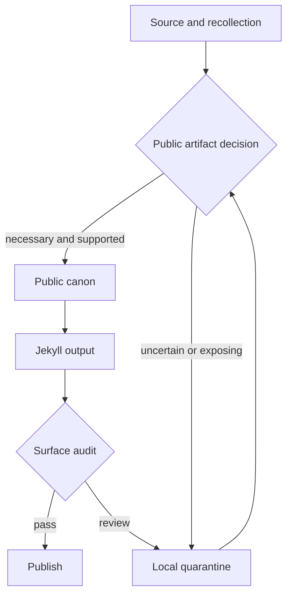

# Public Surface Auditor

Use this skill when reviewing whether a public archive, portfolio, or generated
site is safe to release. The goal is a calm, evidence-backed boundary review.

## Required workflow

1. Build the site using the repository's normal build command.
2. Run `ruby bin/audit_public_surface.rb --json` and inspect the local report.
3. Run `ruby bin/audit_public_surface.rb --strict` as the release gate.
4. Review root files, backlog routes, local paths, direct personal data, and
   missing `noindex` metadata separately. Do not treat a clean regex scan as
   proof of safety.
5. Resolve findings with `verify`, `rewrite`, `generalize`, `recorded`, or
   `hold`. Keep the report and decisions local.

## Boundary model

The tool protects the seam. It cannot establish consent, verify a memory, or
decide whether a personal detail belongs to the author to publish.
