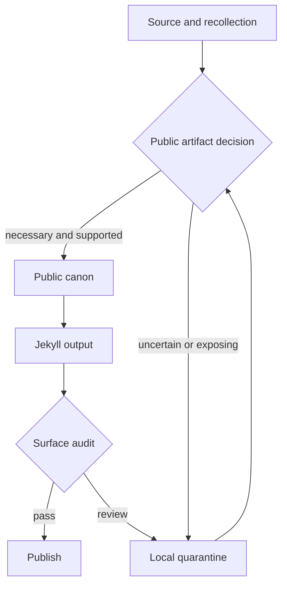

# Public Surface Auditor

Use this skill when reviewing whether a public archive, portfolio, or generated
site is safe to release. The goal is a calm, evidence-backed boundary review.
TMI is not automatically an infraction. Preserve harmless personal or
historical material when it is the author's to tell. Escalate only concrete
privacy, security, provenance, or connection risks.

## Required workflow

1. Build the site using the repository's normal build command.
2. Refresh generated data, exports, feeds, metadata, and other derived assets
   when their source contracts require it. Run freshness and archive checks.
3. Run `ruby bin/audit_public_surface.rb --json` and inspect the local report.
4. Run `ruby bin/audit_public_surface.rb --strict` as the release gate.
5. Review four boundaries independently: source and provenance; generators,
   templates, frontmatter, feeds, search indexes, and social metadata; rendered
   HTML and navigation; and reverse links back to evidence or correction paths.
6. Rotate the review by a small angle. Inspect important claims as source,
   template, generated-file, rendered-reader, and shared-preview artifacts.
7. Resolve findings with `verify`, `rewrite`, `generalize`, `recorded`, or
   `hold`. Keep the report and decisions local.

## Boundary model

The tool protects the seam. It cannot establish consent, verify a memory, or
decide whether a personal detail belongs to the author to publish.

## Decision vocabulary

- **Actual risk:** credentials, private paths, third-party medical or family
  details, private contact information, confidential workplace information,
  broken provenance, or a public route that exposes a quarantined artifact.
- **TMI:** true but unnecessary detail about the author's own life. Shorten it or
  leave it out of promotion and hiring surfaces. Do not call it misconduct, and
  do not delete archive evidence merely because it is personal.
- **Historical signal:** dates, tools, conferences, and old writing that explain
  sequence or provenance. They may remain in the archive even when omitted from
  a resume or homepage.
- **Connection barrier:** a missing contact route, broken canonical URL, hidden
  correction path, inaccessible transcript, or metadata that makes the person or
  work hard to understand.

Intentional public email or phone details should be verified as contact channels,
not blindly removed. Keep one clear route to connect and avoid repeating direct
contact details across unrelated historical pages.
