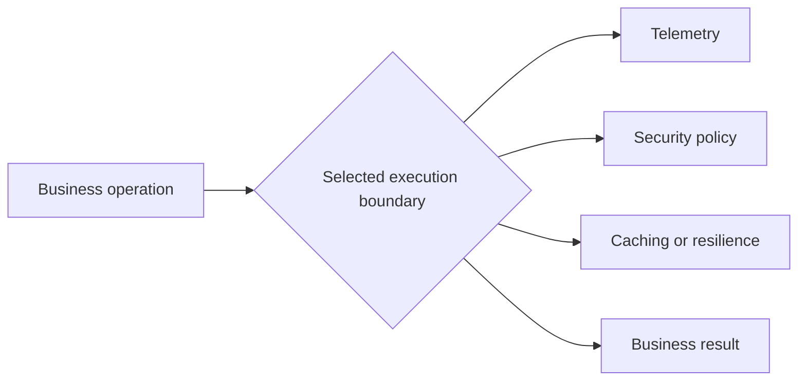
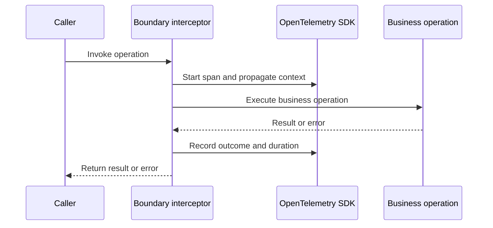
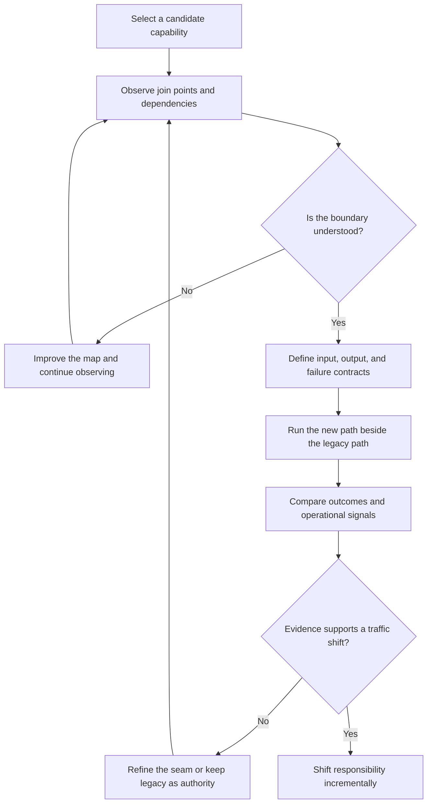

Aspect-Oriented Programming is often introduced as a way to reduce repeated
code. That description is accurate, but too small for legacy modernization.

AOP gives engineers a way to observe and apply behavior at selected execution
boundaries. That makes it a useful bridge between two practices that are often
discussed separately: OpenTelemetry and the Strangler Fig pattern.

OpenTelemetry needs consistent instrumentation at meaningful boundaries. The
Strangler Fig needs evidence about boundaries before a team moves behavior out
of a legacy system. AOP can help with both.

This article is part of a short AOP series based on my single-speaker
presentation. I am the presenter and the only speaker in the presentation.

The preserved transcript contains only two introductory turns, so the series
uses the transcript, my historical Post# article, and the other public source
material below without pretending to reproduce unpreserved sections.

The series continues with:

- [What Aspect-Oriented Programming Is](/ai/2026/09/02/what-aspect-oriented-programming-is/)
- [AOP's Uses, Misuses, and Boundaries](/ai/2026/09/02/aop-uses-misuses-and-boundaries/)
- [A Simple Ruby Block as an AOP-Shaped Boundary](/ai/2026/09/02/ruby-block-aop-shaped-boundary/)

## The original problem: behavior crosses domain boundaries

My 2009 talk, [Introduction to AOP with PostSharp](/videos/mike-hall-introduction-to-aop-with-postsharp/), focused on cross-cutting concerns in C# code. Logging, caching, and security did not belong to one business class, yet every relevant operation needed them.

The design problem was not simply duplicated code. It was the loss of a clear
boundary between business intent and operational behavior.

An aspect does not remove the need for judgment. Engineers still need to
choose the join points, define the policy, and understand the cost of adding
behavior. The benefit is that the policy has a visible home and can be applied
consistently.

## Why this matters for OpenTelemetry

Distributed tracing depends on context crossing process and service
boundaries. Instrumentation also needs to record useful events without forcing
every business method to become a telemetry implementation.

The AOP connection is conceptual and practical. An interceptor, middleware
layer, decorator, or auto-instrumentation agent can observe a boundary and
attach a span, propagate context, record an error, or measure duration.

The goal is not to instrument everything. The goal is to make important
journeys legible: requests, messages, database calls, external dependencies,
and failure boundaries that explain user impact.

This is where AOP becomes an architectural tool. It gives teams a controlled
place to add observation while they learn which boundaries matter.

## Why this matters for the Strangler Fig

The Strangler Fig pattern replaces a legacy capability in increments. The
hardest decision is often where to cut. A folder boundary is not necessarily a
runtime boundary. A class boundary is not necessarily a data boundary.

AOP-style observation helps answer the questions that must come before an
extraction:

- Which callers reach the candidate capability?
- Which data does it read and mutate?
- Which external requests and events does it trigger?
- Which errors must remain visible to the caller?
- Which side effects make the proposed seam unsafe?

The observation layer does not make an extraction safe by itself. It makes the
unknowns visible so the team can decide whether the seam is ready, what must
change first, and which failure behavior needs protection.

## The shared pattern

AOP, OpenTelemetry, and the Strangler Fig share a sequence:

1. Identify a meaningful boundary.
2. Observe what crosses it.
3. Apply a focused behavior or policy.
4. Compare the result with the intended behavior.
5. Change responsibility only when the evidence supports it.

That sequence is also the basis of System Cartography. Before proposing a
target architecture, map the interaction surface, lateral state, runtime
topology, and supply-chain boundaries. Then use feedback to choose the next
step.

## The engineering lesson

AOP is not a license to hide behavior. Poorly designed aspects can make control
flow harder to understand and debugging more difficult. The pattern works when
the cross-cutting behavior has a clear purpose, a bounded scope, and visible
signals.

Used carefully, AOP supplies an observation and policy layer. OpenTelemetry
turns selected observations into shared operational evidence. The Strangler
Fig uses that evidence to move ownership through verified intermediate steps.

The durable practice is simple: make boundaries observable before asking teams
to trust them.

The next article makes the boundary concrete in Ruby, where a block can express
the operation being surrounded by authorization, telemetry, or cleanup.

## Provenance

This is an AI-assisted exploratory draft based on Mike Hall's 2009 AOP talk,
the canonical transcript, and the public System Cartography material. It is
quarantined under `/ai/`, excluded from search indexing, and requires human
review before publication as an organic essay.
