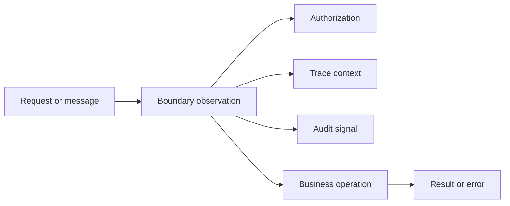
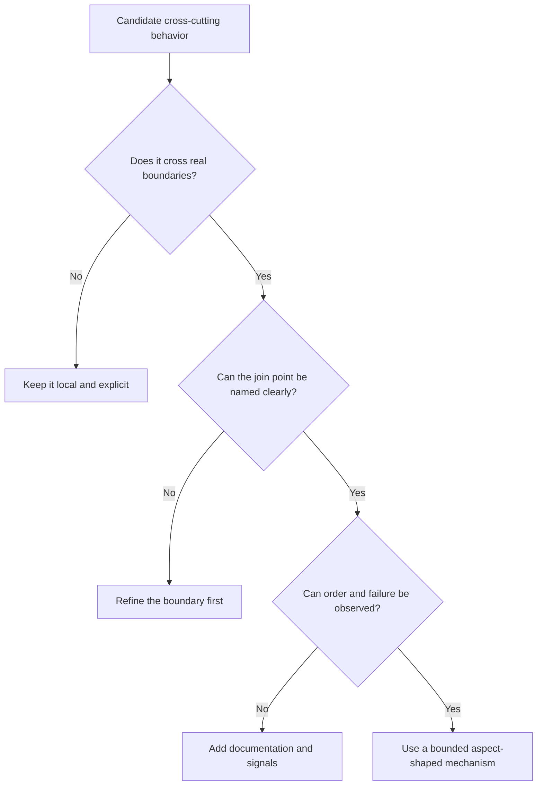
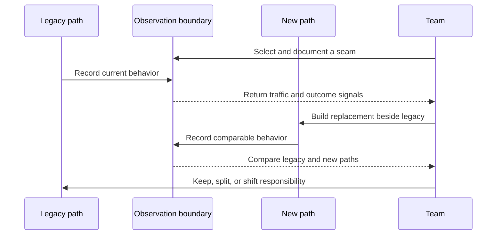

_Editorial note: This is an AI-augmented, human-led exploratory article. Mike
Hall supplied the direction, technical examples, corrections, and final
judgment. AI assistance helped organize the public archive material and draw
the diagrams. It did not become the author or fill gaps in the source._

_Source note: The canonical AOP presentation transcript is a single-speaker
transcript of my presentation by me, Mike Hall. It currently preserves only two
introductory turns. The historical Post# article and the linked public archive
material provide the concrete examples. Interpretive sections are labeled by
their language and are not presented as unpreserved transcript text._

AOP is useful when a concern genuinely crosses boundaries. It is dangerous when
the boundary is only in the programmer's head.

## Good uses

AOP-shaped mechanisms are often a good fit for behavior that needs a consistent
entry, exit, and error path:

- authorization and authentication checks;
- audit records and security events;
- timing, tracing, and operational metrics;
- transactions and resource cleanup;
- caching or retry policy with clear ownership;
- validation that belongs to a boundary rather than a domain calculation.

OpenTelemetry instrumentation is a familiar modern example. An interceptor or
middleware layer can start a span, propagate context, record an outcome, and
finish the span without making every business method construct telemetry by
hand.

The shared shape does not mean every concern should be combined into one giant
aspect. Each policy still needs a clear purpose and owner.

## Misapplied uses

AOP becomes a poor fit when it hides business decisions, changes behavior far
from the code being read, or applies too broadly.

Common warning signs include:

- an aspect changes the meaning of a business calculation;
- a pointcut matches by accident because naming is too broad;
- advice depends on execution order that nobody documented;
- an exception is swallowed or transformed invisibly;
- an authorization policy is attached to a method that has several unrelated
  meanings;
- debugging requires knowing a framework's weaving rules before understanding
  the business code;
- the aspect exists only to avoid writing a small, readable helper once.

The worst misuse is using AOP as a hiding place for decisions that deserve to
be visible in the domain model.

## Authorization needs a boundary, not a magic trick

Authorization is a useful test case. A request can be rejected before the
operation, the operation can run, and the boundary can record or translate the
result. That is an AOP-shaped sequence.

But the authorization rule itself still needs a readable home. Tools such as
CanCanCan, Devise, and Warden provide different abstractions for authentication
and authorization. Their hooks and integration points may resemble AOP, but
they are not interchangeable terminology or identical implementations.

The distinction keeps the explanation honest: recognize the shape without
claiming that every hook is a formal aspect system.

## AOP and the Strangler Fig

The same discipline applies to legacy migration. Observe a boundary before
moving responsibility across it. If the aspect or interceptor is too broad, the
map becomes noisy. If it is too narrow, the team misses the traffic that makes
the seam unsafe.

That is why AOP belongs in a migration conversation. It can supply a lens. It
does not supply the decision.

## The boundary review

Before applying an aspect-shaped mechanism, ask:

1. What is the exact boundary?
2. What behavior enters, exits, or errors there?
3. Who owns the policy?
4. What happens when the policy fails?
5. How will a maintainer discover the behavior?
6. How will we remove or narrow it later?

If those answers are not available, stop and map the seam first.

The next article uses a very small Ruby block to show the shape without a
weaver. The block is the explicit join point, and the wrapper is the advice.

## Related material

- [What Aspect-Oriented Programming Is](/ai/2026/09/02/what-aspect-oriented-programming-is/)
- [A Simple Ruby Block as an AOP-Shaped Boundary](/ai/2026/09/02/ruby-block-aop-shaped-boundary/)
- [AOP as the Bridge Between OpenTelemetry and the Strangler Fig](/ai/2026/09/01/aop-opentelemetry-strangler-fig/)
