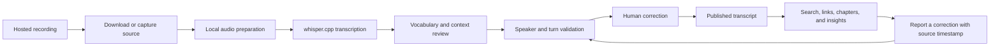

_Source note: This article is based on my recollection, the public archive, and
the published pipeline documentation. The archive is the evidence of the work
that survived. The name of one early local project is still uncertain, so I
leave it unresolved rather than invent a spelling._

## The archive began with a problem I could not solve cheaply

In the early days of UGtastic, I wanted more than a video file. I wanted a
searchable record of what people actually said.

That turned out to be a much harder request than it sounds. Transcription was
slow, lossy, and expensive. I paid people through Fiverr myself. The
results often needed so much correction that I had to redo important sections by
hand. The work was not just typing. It was recovering names, technical terms,
speaker changes, jokes, references, and the shape of an answer.

The recording was the source. The transcript was only a proposed map back to the
recording.

For years, the scale of that work stayed above my practical reach. I had the
archive, but not a reliable way to turn the archive into durable knowledge.

## Local inference changed the economics

The first meaningful turn came when local speech recognition became practical
enough to run on my own machines. `whisper.cpp` gave me a way to process the
audio without paying for every minute or sending the recordings through a
third-party service.

That did not make the work automatic. It made iteration possible.

I could run a transcription again. I could add vocabulary. I could compare an
output with the recording. I could keep intermediate files and resume from the
last completed step. A bad result became something I could improve instead of a
bill I had to accept.

The first local project in this lineage has a name I cannot currently recover.
I remember it as something like “fluffle,” but I have not found a matching
directory in the local GitHub workspace. That is a known unknown. The important
fact is not the name. The important fact is the direction of travel: local
speech recognition became the first step toward a pipeline I could own.

## A transcript needs a chain of custody

The archive now treats transcription as a sequence of evidence-preserving
transformations:

Each stage has a different responsibility. Speech recognition proposes words.
Context helps correct technical names. Human review decides whether the text
matches the recording. The hosted video and its visible timestamps remain the
independently inspectable evidence.

That distinction matters. A transcript timestamp is not automatically proof
because a program printed a number beside a sentence. The proof is the ability
to return to the recording, inspect the moment, and correct the record against
that source.

## The pipeline became part of the archive

The durable result was not just a pile of text files. It was a system for
preserving the relationship between source, transformation, review, and
publication.

The public repository documents vocabulary priming, resumable processing,
transcript staging, and audit work in [the pipeline continuity guide](/docs/pipeline-continuity.md)
and [the public-surface audit guide](/docs/public-surface-audit/).
The resulting [Interview Archive](/interviews/) lets a reader move from a
published transcript back toward the recording and its context.

This is where my current local AI work connects to the older oral history work.
The point is not to make a machine sound authoritative. The point is to make
the path from evidence to understanding easier to inspect.

## What I was trying to preserve

I was trying to preserve more than sentences. I was trying to preserve the
conditions around the sentences:

- who was speaking;
- where one turn ended and another began;
- which technical term was intended;
- what the speaker was responding to;
- when the recording reached that moment; and
- what later readers could verify for themselves.

That is why the archive is also a form of system cartography. It maps a living
conversation without pretending that the map is the territory.

The machine handles repetition. The human keeps the judgment seam open.

That is the lineage from Fiverr to `whisper.cpp`, from a frustrating manual task
to a local pipeline, and from a local pipeline to the archive we can read now.

_AI ethics note: Mike Hall led this article and supplied the recollection,
technical direction, source material, uncertainty, and final approval. AI
assistance helped organize the account and draft the prose and diagram. It did
not verify the recording, supply an independent memory, or become the author._
