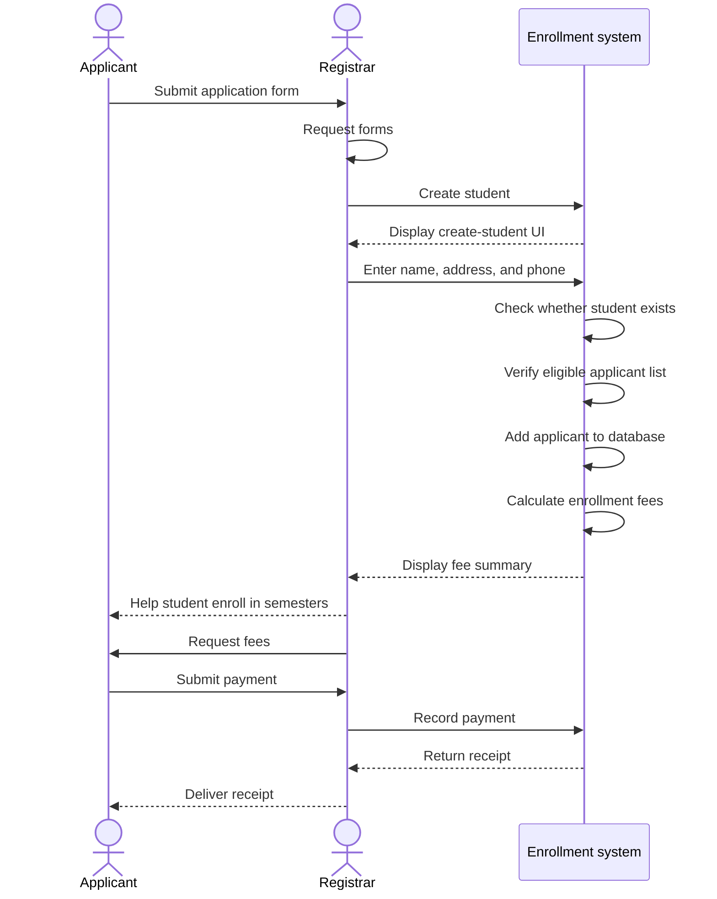
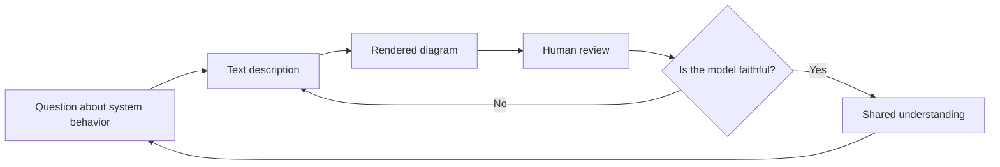
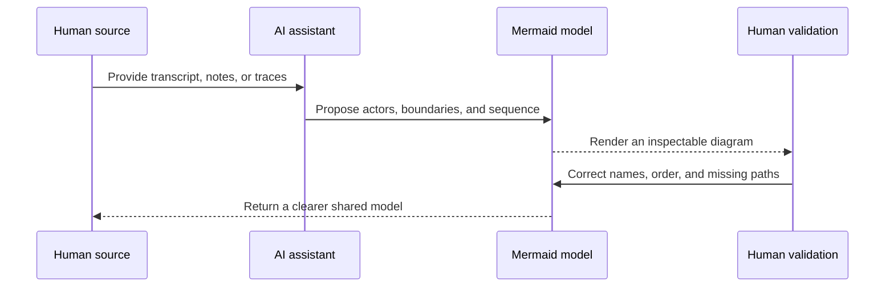
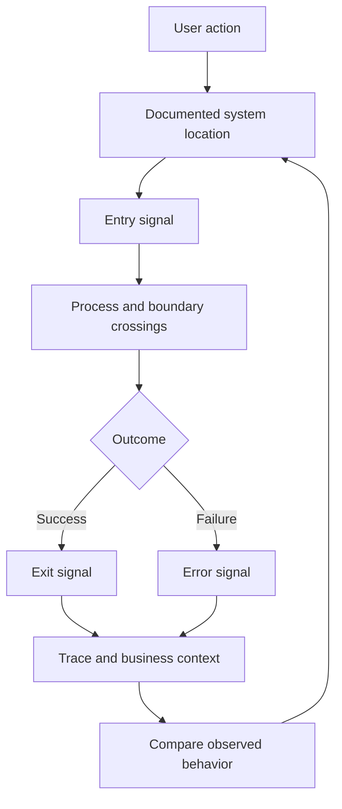

In 2008, I wrote [a short article about Quick Sequence Diagram Editor](/2008/07/31/cool-tool-quick-sequence-diagram-editor.html). The tool solved a problem I felt immediately: UML diagrams were useful, but drawing them could become a second job.

Quick Sequence Diagram Editor let me describe an interaction in a small domain-specific language and see the result as a diagram. I could think like a programmer, write the participants and messages, and let the tool handle the layout. The source could be saved and versioned. That was a meaningful shift from arranging boxes by hand.

The 2008 article still contains the part that matters most. A diagram is an assertion about a system. The tool can make the assertion easier to express, but it cannot decide whether the assertion is true. The author still has to understand the tradeoffs, name the participants, and notice when the picture is close to the system but not exact.

Mermaid feels like the next turn of that same idea.

## Doing this in 2026

The original article used a small student-enrollment interaction to show the
editor's terse syntax. The archived image is no longer available, but the
source is preserved. The old description looked like this:

```text
Applicant:Registrar.application form
Registrar:requests forms
Registrar:S.create student
S:Displays UI 89-create statement
Registrar:S.input name, address & phone number
S:check to see if student exists
S:verify person is on eligible applicant list
S:add applicant to DB
S:calculate enrollment fees
S:display UI 15-fee summary
Registrar:Applicant.help student to enroll in semesters
Registrar:Applicant.request fees
Applicant:Registrar.payment
Registrar:S.payment
S:Registrar.receipt
Registrar:Applicant.receipt
```

The notation was compact and practical. It named the participants separately,
then described caller, callee, and action on each line. In 2008, that was a
great way to remove layout work from the exercise. In 2026, I can translate the
same interaction into Mermaid and render it directly in the article:



The two descriptions are not byte-for-byte equivalent. They should not be. The
old source intentionally used terse labels and left some semantics to the
reader. The Mermaid version makes direction, response, actors, and the system
boundary more explicit. That makes it easier to review, but it also creates
more opportunities to ask whether the interpretation is faithful.

| Concern | Quick Sequence Diagram Editor | Mermaid in 2026 |
| --- | --- | --- |
| Authoring model | A dedicated Java editor with a compact DSL | Text in Markdown and other common collaboration surfaces |
| Layout | Generated by the desktop editor | Generated in the browser or documentation build |
| Review | Source could be stored as an SDX file | Source is reviewed in the same diff as the prose or code |
| Collaboration | Primarily centered on the person using the editor | Works in pull requests, documentation, issues, and AI-assisted sessions |
| Portability | Depended on the editor and a JVM | Supported by many documentation and repository tools, with a readable text fallback |
| Fidelity risk | The editor's UML rules shaped the result | The author still has to validate participants, direction, order, and omitted paths |
| Best use | Quickly sketch a sequence without hand-drawing it | Keep a living model close to the conversation and revise it as understanding changes |

The old tool was focused. Mermaid is connective. Quick Sequence Diagram Editor
helped one person make a diagram efficiently. Mermaid helps a group keep a
diagram in the same communication stream as the design, implementation, and
review.

## The diagram became part of the conversation

Quick Sequence Diagram Editor made diagram source easier to store. Mermaid makes diagram source easier to share across the places where engineering work already happens: Markdown files, pull requests, documentation sites, issue discussions, and notebooks.

The result is not just a diagramming tool. It is a compact language for discussing behavior.



The source has several advantages over an image. It can be reviewed as a diff. It can be searched. It can be edited by someone who is not a visual designer. It can be copied into a new context without losing the underlying structure. Most importantly, a person can challenge the words before accepting the picture.

That last point is easy to miss. A polished diagram can create false confidence. Text keeps the claim close to the evidence.

## Why Mermaid works well with AI

AI systems are good at proposing structure from messy material. Give an AI agent a transcript, an incident timeline, a service description, or a set of notes and it can often identify actors, boundaries, decisions, and repeated transitions.

Mermaid gives that proposed structure a useful intermediate form. The agent can produce a sequence diagram or flowchart that a human can inspect without accepting the surrounding explanation as fact.



This is where the tool becomes more than a convenience. Mermaid supports a feedback loop between language and visual structure. The AI can help with the first draft, but the human can see where the model is too tidy, where an actor has disappeared, or where the model invents a transition.

The diagram is a fidelity test.

## From pretty picture to system evidence

My recent work with OpenTelemetry and legacy modernization has made this distinction more important. When I map a system, I am not trying to create an attractive picture of the architecture. I am trying to identify the intersections where a user action enters a process, leaves it, or fails inside it.

Those boundaries can become trace attributes, span names, ownership questions, and migration checkpoints. A diagram helps people discuss the boundary before the instrumentation or extraction is complete.



This is the same basic move I appreciated in Quick Sequence Diagram Editor: describe the interaction in a form that matches how programmers reason. Mermaid extends it to a larger communication system. The source can travel with the code, the design note, the incident review, and the conversation where the next decision is made.

## More human, not less

It is tempting to describe text-native diagrams as a way to automate documentation. That is useful, but incomplete. The deeper value is that they make technical communication more accessible to the people doing the work.

Someone can start with plain words. Someone else can edit the participants. A third person can question the direction of an arrow. An AI assistant can suggest a missing branch. The group can keep refining the model until the rendered result matches what the people in the system actually know.

That is a more human workflow because it respects different ways of thinking. Some people reason through prose. Some follow a sequence. Some need to see boundaries. Some notice the missing exception path first. A shared text representation gives each person a way into the discussion.

High-fidelity communication does not mean recording every implementation detail. It means making the important claims explicit enough that another person can validate them.

## The old lesson still holds

In the 2008 article, I wrote that the computer tool could not reproduce the source diagram exactly. That remains true. Every notation makes choices. Every renderer has constraints. Every abstraction leaves something out.

The improvement is not that Mermaid eliminates those realities. The improvement is that the source is now close to the collaboration surface. It can be revised when the understanding changes. It can be rendered in the place where the decision lives. It can be generated, inspected, corrected, and rendered again.

The tool has evolved from a clever editor into part of a feedback system:

1. Ask a question about the system.
2. Describe the behavior in text.
3. Render the description.
4. Review the picture with the people who own the behavior.
5. Correct the model.
6. Carry the validated structure into implementation, observability, or migration work.

Cause becomes effect, and effect becomes the next cause. A better diagram changes the conversation. A better conversation changes the system model. The changed model tells us what to instrument, extract, teach, or hand off next.

That is why Mermaid has become such a valuable tool for me. It makes diagrams easier to write, but its real contribution is larger. It helps people and AI work on the same representation, with the human still responsible for deciding whether the representation is true.
An AI can help with the first draft, but the human can see where the model is too tidy, where an actor has disappeared, or where the model invents a transition.
