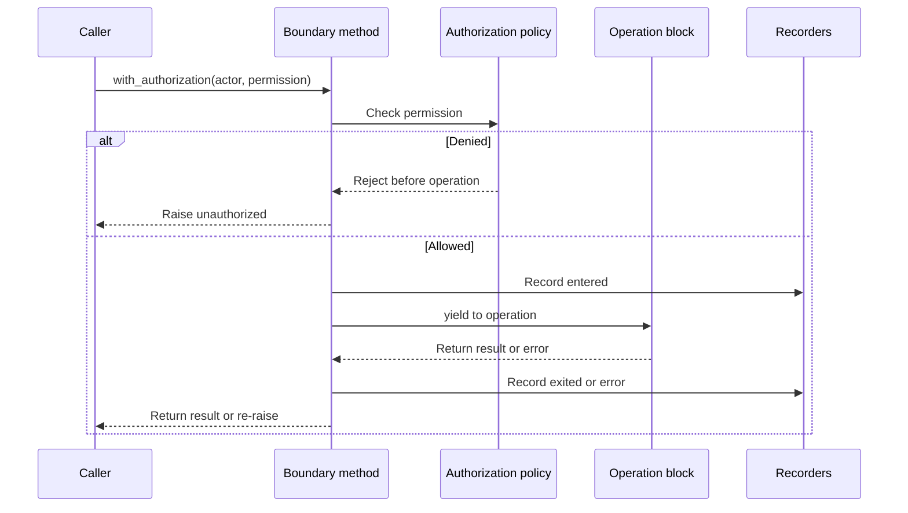
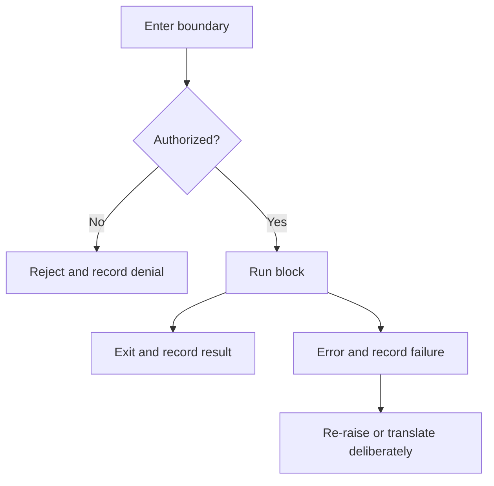
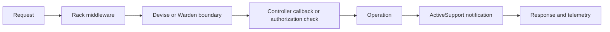
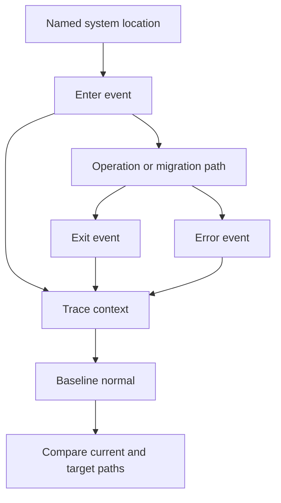

_Editorial note: This is an AI-augmented, human-led exploratory article. Mike
Hall supplied the direction, the production pattern, corrections, and final
judgment. AI assistance helped organize the explanation and draw the diagrams.
It did not become the author or claim that this small example is a framework
implementation._

The simplest AOP-shaped boundary in Ruby may be a method that accepts a block.

The block is the operation. The method around it can perform work on entry,
exit, and error. Nothing is woven into the program. The boundary is explicit in
the code.

```ruby
def with_authorization(actor, permission)
  raise "unauthorized" unless actor.allowed?(permission)

  record_authorization(actor, permission, :entered)
  result = yield
  record_authorization(actor, permission, :exited)
  result
rescue StandardError => error
  record_authorization(actor, permission, :error, error.class.name)
  raise
end
```

The business operation remains readable:

```ruby
with_authorization(current_user, :publish) do
  article.publish!
end
```



## Why this is AOP-shaped

The Ruby method expresses the same sequence that appears in a formal aspect:

- the call to `with_authorization` identifies the join point;
- the method arguments and caller choose the boundary explicitly;
- the permission check and recording are advice-like behavior;
- the block is the operation being surrounded;
- the `rescue` path handles errors at the boundary.

It is not a full AOP language. There is no pointcut selecting every matching
method, and no compiler or runtime weaver is discovering join points for us.
That difference is useful. The example teaches the shape while keeping the
control flow visible.

## Enter, exit, error

I often think in the three signals `enter`, `exit`, and `error`.



Those signals can support authorization, tracing, audit, timing, or a
migration harness. The meaning depends on the boundary and the policy. The
sequence gives the team a place to attach evidence.

## The Rails family resemblance

Rails applications provide several mechanisms with this general shape:

- controller and model callbacks run behavior around lifecycle events;
- Rack middleware surrounds request handling;
- ActiveSupport notifications publish events at meaningful operations;
- Devise and Warden participate at authentication boundaries;
- CanCanCan supplies authorization checks that can be placed at controller or
  operation boundaries.

These mechanisms are AOP-shaped in their sequence and purpose. That does not
mean they all implement formal AOP, or that they have the same failure and
ordering semantics.



The practical question is always the same: where is the seam, what crosses it,
and who should own the behavior attached there?

## A small boundary can grow into a harness

In production, a small wrapper can become a useful harness around a system
intersection. Add stable identifiers for the process location. Record the
enter, exit, and error events. Connect them to traces. Then you can see the
sequence of a real process rather than guessing from isolated metrics.



That is the connection to [AOP as the Bridge Between OpenTelemetry and the
Strangler Fig](/ai/2026/09/01/aop-opentelemetry-strangler-fig/). The block is
small, but the discipline scales: name the seam, observe the behavior, and
change responsibility only when the evidence supports it.

## Keep it explicit when explicit is better

Use the block when the boundary is local, meaningful, and easy to read. Use a
framework mechanism when it gives you reliable selection, ordering, failure
handling, and discovery. Use formal AOP only when the cross-cutting behavior
and the join-point model are worth the additional indirection.

The point is not to use AOP everywhere. The point is to recognize the shape,
choose the smallest mechanism that expresses the boundary, and keep the human
reader oriented.

## Related material

- [What Aspect-Oriented Programming Is](/ai/2026/09/02/what-aspect-oriented-programming-is/)
- [AOP's Uses, Misuses, and Boundaries](/ai/2026/09/02/aop-uses-misuses-and-boundaries/)
- [AOP as the Bridge Between OpenTelemetry and the Strangler Fig](/ai/2026/09/01/aop-opentelemetry-strangler-fig/)
