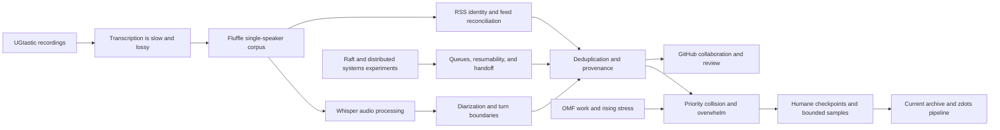
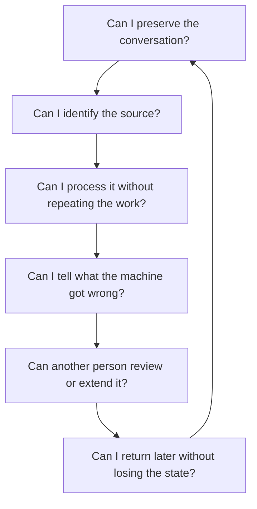
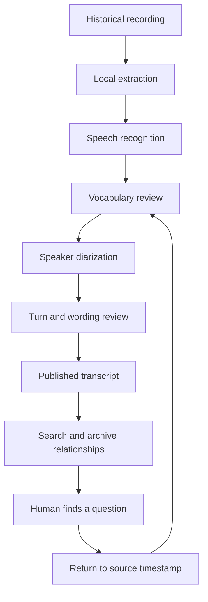

_Source note: This article combines my recollection with the current public
archive data and its published pipeline documentation. The metrics below are
measured from the repository on September 2, 2026. The Raspberry Pi cluster and
the emotional experience of hearing my own voice are personal recollections. The
local conversation archive verifies the Fluffle project, its connection to
Jason Carpenter’s *Dead Rabbit Radio*, and the planning work around it. The
public archive verifies the UGtastic video archive and the pipeline that
followed._

## The archive had two beginnings

UGtastic began as a video archive of conversations with people in the technical
community. I was recording interviews, presentations, and the communities that
were teaching one another how to practice software. The recordings were the
primary material. Transcription was the missing layer that could make the
archive searchable and reusable.

The second beginning was the Fluffle project, a fan-organized transcription
effort around Jason Carpenter’s *Dead Rabbit Radio*. The project notes describe
the podcast, its creator, the listener community called the Fluffle, and the
intention to make timestamped transcripts available for contribution. The
podcast’s single-speaker format gave me a controlled place to learn. There was
no guest to confuse with the host. I could focus on the voice, the words, the
timestamps, and the machinery required to process a growing collection.

I chose that kind of source because one person could carry an entire episode.
The host covered a wide range of subjects, used an individual vocabulary and
rhythm, and moved between serious material and humor. That made the corpus
interesting, but it also made it difficult. A recognizer had to deal with a
distinctive voice, unusual references, and speech that did not always fit a
clean template.

The hardest part was listening to my own voice while I was working on it. I have
a somewhat unusual way of speaking, and my mental state at the time made hearing
that voice difficult. The transcript was not only a technical artifact. It was
an encounter with myself, repeated sentence by sentence, while I was already
struggling to decide whether the work was good enough.

I was not trying to make a machine imitate the host or me. I was trying to keep
the shape of what had been said.

## The first lesson was that transcription is not typing

In the early days of UGtastic, transcription was slow, lossy, and expensive. I
paid people through Fiverr myself. The results often needed so much correction
that I had to redo important sections by hand.

The hard part was not producing words. It was preserving meaning. A transcript
could lose a person's name, a library name, a joke, a qualification, or the
turn where one thought became another. A technically plausible sentence could
still be the wrong sentence.

The first lesson was simple:

> A transcript is a claim about a recording. It is not the recording.

The source remained the video. The transcript was a working map back to it.

## The second lesson was that one voice is a useful laboratory

The single-speaker recordings gave me a controlled starting point. There was no
guest to confuse with the host. I could focus on speech recognition,
punctuation, vocabulary, chunking, and the difference between a fluent sentence
and a faithful sentence.

Then the real archive introduced the harder case: interviews and group talks.
Now I had to answer different questions:

- Who is speaking?
- When did one turn end?
- Did a question belong to the interviewer or the guest?
- Did the recognizer merge two voices?
- Was a strange word a mistake or a technical term?
- Can a reader return to the recording and check it?

That is the work of diarization. It is not a cosmetic label added after
transcription. It changes the structure of the record.

## The small machines made the work possible

I built a transcription cluster from Raspberry Pis to generate a corpus of
transcriptions. It was not a magic supercomputer. It was a way to turn one huge,
overwhelming task into a queue of smaller tasks that could keep moving.

That was a major operating insight for me. I did not need the entire answer in
my head before I began. I needed a durable next step, a saved output, and a way
to resume.

The first local project in this lineage was the Fluffle, the name used by the
*Dead Rabbit Radio* listener community and the fan transcription project. The
name is no longer a mystery. What remains incomplete is the recovery of every
working directory and every intermediate artifact from that effort.

The more important fact is what the experiment taught me: a personal archive
could become a system. The system could retain intermediate results. The system
could make the next correction cheaper than the previous one.

## The experiment also had a human failure mode

The fluffle experiment did not end with a neat launch announcement. I became
overwhelmed.

I was trying to implement a Raft algorithm at the same time that work at OMF was
ramping up sharply. The state of the world was stressful. The subjects I was
recording and processing carried their own weight. Too many important things
stacked up and each one appeared to be asking for priority.

The feeds made the problem worse. I was trying to reconcile too many messy RSS
feeds at once, each with its own gaps, naming, dates, and inconsistencies. I was
not working through one clearly bounded era or one kind of source. I was trying
to get everything.

That created a trap. Every time I found one more inconsistency, I found one more
possible refinement. Instead of choosing a sample, finishing it, and locking in
a known-good method, I kept searching for the next exception. Five carefully
handled records would have been enough to establish a useful first pattern. I
kept reaching for the sixth record before the first five were stable.

That matters to the history of the tooling. The system was not abandoned
because the vision was wrong. I reached the limit of what I could coordinate,
maintain, and emotionally carry at that point in time. A queue can distribute
machine work, but it cannot by itself decide which human obligation is safe to
defer. Automation can reduce friction while still leaving a person with too
many open loops.

The lesson was not that I needed to push harder. It was that a durable archive
also needs a humane operating model: visible work in progress, resumable steps,
clear stopping points, and permission to return to the work later. The map has
to include the person maintaining it.

The repository now records both sides of that lesson. It shows the persistence
of the vision, and it also shows what happens when scope, evidence cleanup, and
refinement are allowed to expand without a stable checkpoint. My local archive
holds further reflections from that period. Together, those records point to a
better sequence: select one source family, define a small representative set,
reconcile it, document the rules, and only then widen the intake.

## What the surviving record shows

The local conversation archive gives a clearer shape to the period than my
memory can hold by itself. On March 25, 2023, I was asking ChatGPT to help me
implement a five-node Ruby Raft experiment. In the same conversation, after
struggling through incomplete generated code, I switched to asking how to
convert a downloaded YouTube video into audio that Whisper could process.

The work then widened in recognizable steps. In April I was parsing podcast RSS
and extracting enclosure URLs. In May I was asking for a resumable feed-to-audio
workflow, and then asking whether Whisper could diarize speakers. By August I
was explicitly asking for an idempotent, resumable podcast processing script.
Later records return to RSS parsing, deduplication, and the problem of making
the process reliable rather than merely possible.

This does not prove that one project caused every later experiment. It does
show the pressure pattern: distributed systems, feed reconciliation, audio
conversion, transcription, diarization, and deduplication were all competing
for attention in the same stretch of time.

I also wondered whether Jason ever discussed the experiment on his show. The
transcript corpus available to me does not answer that question. I remember
speaking with him directly. He was kind and receptive, but neither of us quite
knew how to respond to the unexpected shape of the interaction. I was
embarrassed because the product was not where I wanted it to be. I was showing
the gap between the vision and the implementation: duplicate records, messy
transcripts, an unreliable distribution system, and too much time spent wiring
the network around the work.

That is a different kind of evidence from a recording transcript. It is my
present recollection of the encounter, not a claim about what Jason said on air.
The distinction belongs in the archive too.

## A public search for the missing mention

I searched the publicly indexed web for a contemporary mention of the
transcription project in *Dead Rabbit Radio*, its show notes, Jason’s public
social accounts, and related publications. I did not find an indexed 2023 post
or episode note that explicitly credits the Fluffle transcription effort or
describes my exchange with Jason.

There is adjacent evidence. A [2019 episode page](https://deadrabbitradio.libsyn.com/ep-241-1st-anniversary-special)
identifies the Fluffle as part of the show’s community. Later public episode
directories continue to identify Jason Carpenter as the host and refer to the
Dead Rabbit archive and Fluffle contributors, including the [show directory on
Listen Notes](https://www.listennotes.com/podcasts/dead-rabbit-radio-the-daily-paranormal-UCGcBH_45ON/).
Those pages support the community context. They do not verify a contemporary
public acknowledgment of the transcription project.

This is a research boundary, not a conclusion that no mention ever existed.
Social posts may have been deleted, unindexed, posted under a different name,
or preserved only in an account or archive that is not currently accessible.
The strongest evidence I have for the project remains the local 2023 planning
record, the files that survived, and the recordings themselves.

## How the threads connect

The archive does not show one tidy project plan. It shows several lines of
thought crossing one another:

The first correlation is temporal and directly documented: the Raft experiment
and the first Whisper conversion questions appear in the same March 25, 2023
conversation. The second is procedural: RSS parsing, audio preparation,
diarization, and idempotent processing appear across the following months. The
third is conceptual: the same instinct kept returning in different forms. I
was trying to turn a large, unreliable flow into identifiable units with
durable state, distributed work, and a way to recover from failure.

That instinct was useful. It helped me imagine a Raspberry Pi cluster, a GitHub
repository, a transcript contribution model, and eventually a resumable local
pipeline. It also created risk. I kept treating each newly discovered boundary
as another part of the system that needed to be solved immediately.

The collision with OMF work and the stress of that period exposed the missing
part of the design. I had modeled the machines, files, feeds, and network paths,
but I had not modeled my own finite attention. The eventual lesson was not to
stop building systems. It was to include a human capacity boundary in the
system: a sample that can be finished, a checkpoint that can be trusted, and a
next step small enough to resume.

## Timeline: from recorded conversations to a living archive

The sequence becomes easier to understand when the projects are placed beside
one another:

| Period | Work | What it contributed |
| --- | --- | --- |
| 2010 to 2015 | [UGtastic conversations](/interviews/) | A growing record of technical communities, interviews, and presentations |
| 2019 | [Dead Rabbit Radio anniversary episode](https://deadrabbitradio.libsyn.com/ep-241-1st-anniversary-special) | Public evidence of the show and its Fluffle listener community |
| March 2023 | Ruby Raft experiment, followed by Whisper audio conversion | Distributed-systems thinking colliding with the need to process speech |
| April 2023 | Podcast RSS parsing, episode identity, and the Fluffle transcription plan | Feed reconciliation, source ownership, contribution boundaries, and public collaboration |
| May 2023 | Resumable feed-to-audio processing and the diarization question | Recognition that downloading, transcription, and speaker attribution were separate stages |
| August 2023 | Idempotent and resumable podcast processing | A move from one successful run toward recoverable operations |
| Today | [UGtastic archive and transcript pipeline](/interviews/) | Searchable records with timestamps, relationships, provenance, and human review |

The dates do not describe a straight line. They describe recurrence. The same
questions kept returning in different clothing:

UGtastic supplied the original preservation impulse. The Fluffle experiment
gave that impulse a single-speaker laboratory and a community-shaped
collaboration model. The Raft experiment supplied a language for distributed
state and failure recovery. RSS exposed the difficulty of identity at the
source boundary. Whisper reduced the cost of producing a first transcript.
Diarization exposed the difference between words and speakers. GitHub offered a
way to make the work inspectable and contributable.

The current archive is the synthesis of those separate efforts. It is not proof
that I planned the whole system in 2023. It is evidence that the same underlying
need kept finding better technical forms: preserve the record, make uncertainty
visible, distribute the work, and leave a path back to the source.

## What the technical research confirms

The standards explain why this was never just a matter of downloading files.
RSS 2.0 gives an item a `guid`, a link, and an optional `enclosure` for the
attached media. Those fields are useful identity signals, but they do not make
two historical feeds agree about whether two differently named items are the
same episode. The [RSS 2.0 specification](https://www.rssboard.org/rss-specification)
describes the fields. Reconciliation still requires a policy for precedence,
normalization, and review.

The later [Podcast Namespace specification](https://github.com/Podcast-Standards-Project/PSP-1-Podcast-RSS-Specification)
adds a podcast-level `podcast:guid` intended to persist when a show moves
between hosting platforms. That is exactly the kind of durable identity the
early work was missing. It helps with future migrations. It cannot retroactively
resolve every inconsistent historical item, missing enclosure, changed title,
or duplicate download.

The speech pipeline has the same boundary. [Whisper](https://openai.com/index/whisper/)
is an automatic speech recognition system. It proposes the words. It does not
by itself establish who spoke each turn. Speaker diarization is a separate
problem involving speech segments, speaker labels, overlaps, and turn
boundaries. The [pyannote audio project](https://github.com/pyannote/pyannote-audio)
documents those building blocks, including speaker-change and overlapped-speech
detection.

That research validates the shape of the failure I was encountering. I was
trying to solve identity, retrieval, media processing, speech recognition,
speaker attribution, deduplication, distribution, and quality review as one
moving problem. Each concern had a legitimate technical solution. The mistake
was allowing all of them to become required before one narrow slice was stable.

The practical design that follows is deliberately modest:

1. Choose one source family and a sample of five records.
2. Preserve the raw feed and source URL beside every normalized record.
3. Define identity rules before attempting deduplication.
4. Convert and transcribe only that sample.
5. Validate wording, timestamps, and speakers against the recording.
6. Record the exceptions, lock the pipeline, and expand one dimension at a time.

The point of the sample is not statistical certainty. It is an executable
agreement about what the system means by a record, a duplicate, a speaker turn,
and a successful output.

## The archive today

The repository is now large enough that its shape is measurable:

| Measure | Current public value |
| --- | ---: |
| Video assets | 212 |
| Interview records | 184 |
| Transcript files with content | 212 |
| Structured transcript turns | 8,283 |
| Distinct speaker labels | 185 |
| Assets with machine-readable duration | 108 |
| Measured duration from those assets | At least 32.7 hours |

The archive spans community conversations, conference talks, software
craftsmanship, Ruby and Rails, architecture, open source, security, and the
changing tools used to preserve the material. The [archive status page](/archive-status/)
and [Interview Archive](/interviews/) provide the public surfaces. The
[pipeline continuity guide](/docs/pipeline-continuity.md) documents the
processing stages.

These numbers are not the whole archive's metaphysical truth. They are the
current repository's measurable state. That distinction is part of the method.

## The pipeline became a feedback loop

Every stage exposed another failure mode. A recognizer could mishear a proper
noun. A diarizer could assign a turn to the wrong person. A structurer could
make a conversation look cleaner while making it less accurate. A summary could
sound confident while outrunning the source.

The answer was not to trust the newest tool more. The answer was to make the
whole path easier to inspect and correct.

## Why local AI felt like a lifesaver

For a long time, this archive was one of those things I understood but
could not physically finish. The vision was present. The work was present. The
time, money, and working memory were not always present in the same moment.

I have some neurodivergent traits that make a large, ambiguous, unfinished body
of work feel overwhelming. That is my lived description, not a clinical claim.
The archive kept becoming bigger than my ability to hold it all at once.

AI-augmented tools changed that relationship. They did not give me the vision.
They gave me a way to externalize it. A local speech model could process the
next file. A parser could preserve the next state. A language model could help
organize a question across thousands of fragments. A human review step could
decide whether the result deserved to survive.

That felt like a lifesaver. On a good day, it felt like a superpower. The
superpower was not having a machine think instead of me. It was finally having
enough mechanical assistance to build the thing I had been seeing for years.

## The biggest lessons

### 1. Make the evidence easy to revisit

The recording, timestamp, transcript, speaker label, and correction path should
remain connected. When a claim matters, a reader should have a route back to the
source.

### 2. Treat errors as data about the pipeline

Mistranscriptions are not only bad outputs. They reveal missing vocabulary,
weak audio preparation, confusing speaker boundaries, or a review step that
needs better evidence.

### 3. Start with the simplest useful case

A single-speaker corpus made the first experiments possible. It gave me a place
to learn before interviews forced the diarization problem into view.

### 4. Save intermediate states

Resumable work changes the emotional shape of a large project. A failure after
one completed stage is a recoverable state, not a reason to abandon the whole
thing.

### 5. Automation should preserve the judgment seam

The machine handles repetition. The human decides what the source supports.
That seam is where fidelity lives.

### 6. A corpus becomes useful when relationships survive

Transcripts become more valuable when they retain speakers, dates, topics,
recordings, technical terms, and links to related conversations. Search is only
the beginning. The goal is a navigable body of evidence.

## This was the vision all along

I did not set out to build a fashionable AI product. I wanted to revisit the
conversations I had recorded, preserve the people who gave their time, and make
the ideas available to my future self and to other curious people.

The path ran through expensive manual transcription, bad text, Raspberry Pis,
Whisper, diarization, local inference, structured data, graphs, and human review.
It took years because the right pieces arrived at different times.

Now the archive is something I can read, query, correct, and extend. It is not
finished. It is finally alive.

_AI ethics note: Mike Hall led this article and supplied the recollection,
interpretation, archive metrics, uncertainty, and final approval. AI assistance
helped organize the account and draft the prose and diagrams. It did not verify
the recordings, recover every missing intermediate artifact, or become the
author._
