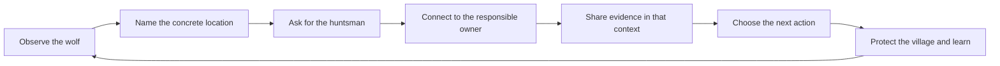

This is a continuation of [The Boy Who Told the Truth](/2025/02/01/the-boy-who-told-the-truth.html).

The earlier contemplation asked us to reconsider the story of the boy and the wolf. What if the boy was not lying? What if the village failed because it did not want to hear a warning that challenged its sense of safety?

That question still matters. It is also incomplete.

The boy can tell the truth. The village can fail to listen. The wolf can arrive. But between seeing the wolf and protecting the village, there is another design problem: how does a warning become action?

## Ask for the huntsman

Imagine the boy runs into the village and says, “I saw a wolf.” The statement may be true, but the villagers do not know what to do with it. They may not know which path to search, who has the equipment, or whether the shepherd is asking them to act now or simply sharing an observation.

The boy does not need to hide the truth. He can ask a more actionable question:

> How do I get in contact with the local huntsman?

Now the people who understand the village have a place to begin. They can identify the person, the route, and the next step. Someone may then ask why the huntsman is needed. That creates an audience for the evidence.

This is not a trick for making an inconvenient concern sound pleasant. It is an interface between different responsibilities.

## Different villages see different risks

Engineering often works from concrete observations. A tree is down. A lamp is out. A monitor shows a failed request. A trace stops at a boundary. A data process has an error path that nobody owns.

Product and marketing often work from a different evidence space. One experience outperformed another. A prediction was wrong. A customer behavior is changing. A test result is interesting but not deterministic. Their work involves deciding what to learn next while protecting the conditions that make learning possible.

Neither group is less intelligent. Their incentives ask them to notice different things. Safety lives in different places.

An engineer who carries a concrete production concern into that environment as a calamity report may be telling the truth and still fail to create movement. “I saw a wolf” communicates urgency, but it does not identify the owner, route, or decision required.

“How do I contact the huntsman?” creates a shared location. It gives the other group something they already know how to answer. Once the connection exists, the warning can be explained in terms of the village’s responsibilities.

## The messenger is still not the problem

This distinction should not become another way to blame the person who raises the alarm. The village remains responsible for listening. A person who is direct, intense, or visibly affected by a risk may be responding to information that others have not yet encountered.

The communication lesson is not “mask better.” It is “build a better channel.”

That channel can include:

- a named owner for the affected system;
- a specific location where the concern can be examined;
- a question that invites the next responsible action;
- evidence that distinguishes observation from interpretation;
- a clear statement of what remains safe while the issue is addressed.

These practices protect both sides. The engineer does not have to abandon the truth to be heard. The receiving group does not have to accept an unexplained alarm before it knows how to respond.

## From warning to shared work

The mature version of the story is not about a heroic boy or a foolish village. It is about building a route from perception to coordinated action.

The loop matters because cause becomes effect, and effect becomes the next cause. A warning changes the conversation. The conversation changes the plan. The plan changes the system. The changed system produces new evidence.

The boy was right to tell the truth. The village was wrong to ignore him. The next lesson is that durable safety requires more than truth and more than urgency. It requires a communication path that can carry truth into action.
