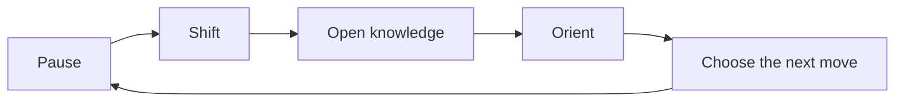

_Editorial note: This is an AI-augmented, human-led article. Mike Hall supplied
the idea, language, direction, and final judgment. AI assistance helped shape
the draft. It did not become an independent author or source._

I like the symbolism of the new keybinding.

On macOS, the command palette opens with `⌘⇧K`. On other platforms, the
equivalent gesture is `Ctrl+Shift+K`.

It is a small act, but it says something.

`K` can stand for knowledge. It can stand for a command. It can mean knowing
where to go next.

`Shift` means an intentional change. It is the moment when a familiar motion
becomes a deliberate choice.

The Command key, or Control key, anchors the gesture in the system. It says
that this is not only a thought. It is a thought connected to action.

Together, the shortcut becomes a small ritual:

> Deliberately shift the system toward knowledge.

That loop matters because capability creates its own kind of pressure. When a
tool can search, summarize, generate, connect, and act quickly, it becomes easy
to confuse motion with progress. The system can move faster than a person can
integrate what is happening.

The shortcut creates a seam.

It gives me a way to stop the current motion and ask what I need now. Maybe I
need to find an article. Maybe I need to inspect a relationship in the archive.
Maybe I need to look at the next task. Maybe I need to do nothing yet.

That last option matters. Orientation is not the same as acceleration.

The palette is a useful interface because it gathers many possible paths into a
single place. The keybinding is useful because it makes that place available
without requiring a search for the search box. Together, they support a humane
kind of speed. The system handles recall and routing. The human decides what
deserves attention.

This is part of how I think about my broader tooling. Good automation should
make intent durable, repeatable, and verifiable. It should also leave a clear
seam where a person can inspect the result, change direction, or slow the loop
down.

The binding is safe for a practical reason. Firefox uses plain `⌘K` for web
search, so the site should not pretend that keystroke belongs to the page. The
new binding respects the browser while giving the site its own intentional
entry point.

The practical choice became a little piece of language.

`⌘⇧K` is not only a shortcut to the archive. It is a reminder to shift toward
knowledge before shifting into action.

That is the signature I want at the bottom of the site.
