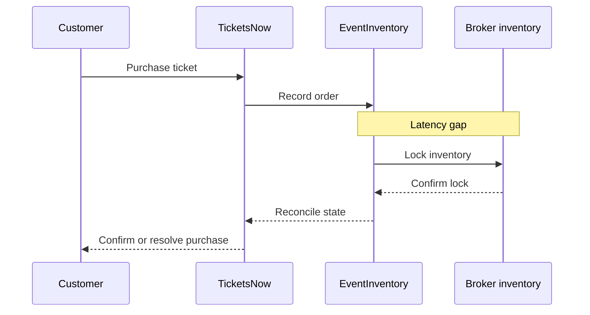
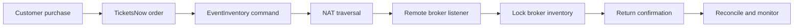
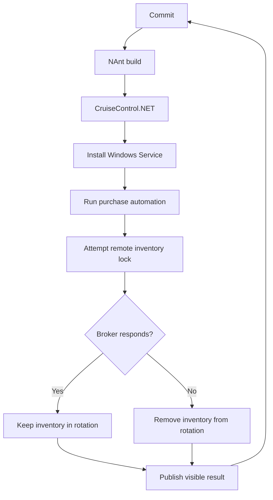

_Editorial note: A human sat down and guided the AI through this process. Mike
Hall supplied the memories, direction, corrections, and final judgment. AI
assistance helped organize the material and clarify its structure. The human
author remains responsible for the account._

I remember being made fun of by .NET developers for doing Ruby.

It was silly, but it was also how I learned that tools become part of a social
identity. People were not only arguing about syntax. They were telling one
another what kind of developer they believed themselves to be.

This was the Battle Vest era of community laptop stickers. When you opened
your lid at a meetup, you were telling the room a lot about yourself to anyone
who had eyes to read. The laptop was a workstation, but it was also a social
map. A sticker could tell somebody where you had been, what you cared about,
and which conversation might be worth starting.

I got one of those stickers from Corey Haines at Geekfest. I had come to the
Obtiva office from Crystal Lake, where I lived near the train station. I had
optimized my life around working in Chicago because working in the Loop felt
like making it. I was commuting to Evanston every day for the Leapfrog
Marketing engagement. That was no trivial commute. I digress, but the commute
is part of the story. I was spending a lot of energy getting to the place where
the work happened.

Then I put the sticker on my Dell Studio XPS laptop. I was running Windows
Server and was annoyed that I had to upgrade to Windows 7 or something like
that. I do not remember the exact version. I remember the laptop, the sticker,
and the feeling that my tools were saying something about me.

My first automation work at TicketsNow used WatiN. That was how Ruby entered my
field of view. Matt Deiters was there doing consulting work through
ThoughtWorks, and he was doing this Ruby thing I was just hearing about. This
was before Coderwall, and before Matt and I eventually met through that part of
the community.

I was still working primarily in .NET. The language was not the point. The
problem was the point. I was leading the Real Time project, and the business
had a problem that did not care which language I preferred.

## The business problem was a race

TicketsNow operated around a large synchronous model. Many brokers managed
their own inventory through the EventInventory client. A customer could buy a
ticket on TicketsNow, but there was a delay before the inventory system captured
that purchase and locked the inventory at the broker.

That delay was a race.

The ticket could be sold on TicketsNow while the broker's inventory still
looked available. The system needed a way to reach the broker's inventory and
lock the item before another sale could get through the gap.

I am remembering this from roughly twenty years ago, so I am going to leave
some of the inside baseball out. The shape of the problem is what matters:
there was a business promise, a distributed system, and a latency gap between
two authorities that both believed they knew the truth.

The challenge was announced to the organization by the new Chief Architect,
under a new CTO, or something close to that. I do not remember the exact title.
I do remember the tension. Two Enterprise Architects had probably hoped one of
them would receive the role. Then someone new arrived and announced a problem
for the organization to solve.

I was competitive. I dug into it and fought like hell. That did not mean I had
the answer. It meant I was willing to keep learning until I could explain a
credible path to people who owned the parts I did not.

## The skunkworks approach

I wrote a presentation. I taught myself more about NAT, STUN, Windows Services,
TCP, and UDP. I learned how to sell an idea that crossed every boundary in the
organization.

This was not a neat application owned by one team. It needed software, network
configuration, remote broker coordination, operational testing, and business
confidence. Every new answer created another question somewhere else.

The architecture needed to work through a reverse firewall negotiation. I built
NStun, a .NET integration with the STUN protocol, to help establish the path
between systems behind network address translation. I worked with the
networking team on load testing. At one point, they observed that the system
could support a broker's inventory even when the broker was sitting behind a
Panera Wi-Fi connection.

That was the moment the architecture stopped being a presentation.

I was learning the technology while building the case for the technology. The
technical work and the organizational work were the same project. I had to make
the architecture understandable to networking, operations, analysts, business
leaders, and the engineers who would keep it running.

## Build the lab before asking people to trust it

I learned NAnt and CruiseControl.NET. I took old desktop machines from a round
of upgrades and built a continuous integration lab.

Every morning, and really at any time, there was a monitor open where people
could see the latest automation test results. CruiseControl.NET built the code
and deployed a self-installing Windows Service. The service registered a
listener, submitted purchase automations, and routed lock commands to the
remote broker's inventory.

If a broker disappeared for too long, the system could take that broker's
inventory out of rotation. The lab made the behavior visible. The monitor made
the work discussable.

The important thing was not that I had built a clever test rig. The important
thing was that the organization could see the system learning. A failed test
was not a private embarrassment. It was a new fact that the team could work
with. The monitor created a shared understanding without requiring everyone to
stand in the lab and ask me for a status report.

## When the number became real

I remember leadership asking how many transactions per minute the endpoint
could handle. The analyst answered that the endpoint measured into the
millions.

I remember watching the faces in the room change.

The number mattered, but the larger shift mattered more. We had moved from
arguing about whether the architecture might work to asking how much work it
could handle. The system had become measurable enough for other people to make
decisions with it.

The canonical project record summarizes the result as a real-time inventory
locking and transaction reconciliation service that prevented race conditions
on concurrent ticket sales and protected more than $2 million in revenue. That
is the concise version. The lived version included the pitch, the networking
meetings, the test lab, the weird edge cases, and a lot of explaining.

## I taught myself Scrum because the work needed a rhythm

I taught myself the Scrum methodology and used it to run the project. I needed
a way to turn a large, cross-organizational problem into a series of visible
decisions.

The work was not predictable because the problem was not small. But the next
question could be made small. We could choose a behavior, build a test, measure
the result, and bring the evidence back to the group.

That rhythm gave the project a shared heartbeat:

1. Choose the next risk.
2. Build the smallest useful experiment.
3. Show the result.
4. Learn what the result changed.
5. Choose the next risk.

My team partially disassembled our cubicles so we could work together more
efficiently. For a time, before the acquisition, the team was united. For a
time, it was very good.

Then the business changed. Incentives changed. Alliances changed. We moved on.

That is not a footnote. It is part of the architecture. A system can be
technically sound and still depend on communication patterns that do not last.

## What the project taught me

I was the skunkworks guy. I did not have the perfect title or a complete plan
when I started. I had a concrete business problem, enough curiosity to keep
pulling the thread, and the willingness to make the system visible while it was
still becoming real.

Skunkworks did not mean working alone. It meant creating enough room to move
while building the relationships needed to make the result belong to the wider
organization. The lab, the meetings, the presentation, the load tests, and the
Scrum rhythm were all part of that work.

The project taught me several things that I still use:

- Learn the neighboring discipline when the system crosses its boundary.
- Make the first working behavior visible to the people who must trust it.
- Turn arguments into measurements when possible.
- Use a delivery rhythm to reduce the size of the next decision.
- Treat networking, operations, business, and software as one system when the
  outcome depends on all of them.
- Design the communication and ownership model at the same time as the
  technical architecture.

I later took one of my last vacations for a very long time. I went to
California and visited the Monterey Defense Language Institute, where I had
not quite made it through the Russian language program about a decade earlier.
That is another digression, but it belongs here. The same person who had once
struggled through one path was now building a lab for a problem nobody had
solved in quite that shape before.

The tools changed. The system changed. The people changed. What stayed was the
practice of finding the seam, learning what it required, and carrying the idea
from pitch to production with enough evidence that other people could help.
