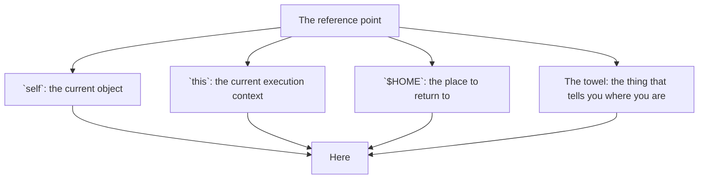
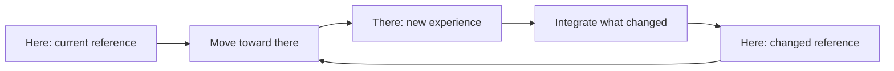
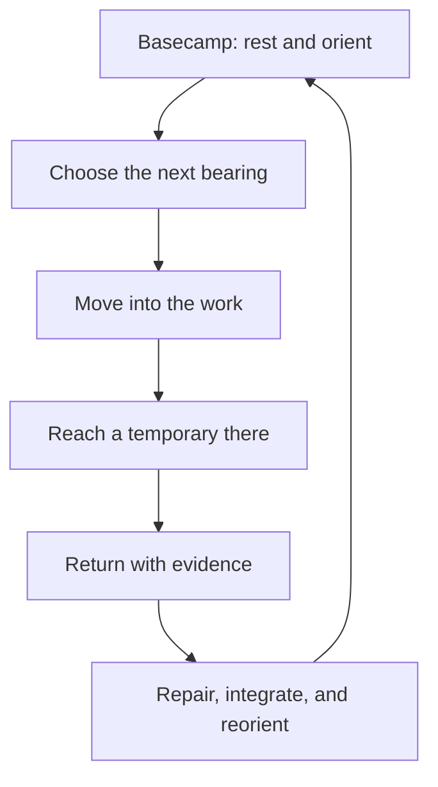

_Editorial note: A human sat down and guided the AI through this process. Mike
Hall supplied the memories, direction, corrections, and final judgment. AI
assistance helped organize the material and clarify its structure. The human
author remains responsible for the account._

There is a word in every system that means, “the place I am starting from.”

In Ruby, it is `self`. In JavaScript, it might be `this`. In a Unix shell, it
can be `$HOME`. In a long trip, it is the place where the towel is. You know
where your towel is, even if you cannot explain why that matters yet.

These are not the same thing, but they perform a similar job. They give us a
reference point.

The names change with the system. The need does not. Before I can decide where
to go, I need some honest answer to the question, “Where am I?”

## Here becomes there

Here is now. Then here becomes motion, and now becomes then. For a little while,
there is a new now, and that becomes the place from which the next movement
starts.

This is the loop behind the painted rock on the trail. You put the rock down
far enough ahead that you can run to it. Then you walk until you catch your
breath. When you are ready, you pick it up and throw it again.

The rock is not the destination. It is a temporary reference point that lets
you move without losing the trail.

Life works this way. Work works this way. A system changes while we are trying
to understand it, so the map we return to is never exactly the map we left.

## Basecamp is not failure

I think of home as basecamp. It is where I rest, repair the equipment, and
remember what I am carrying. It is not the opposite of progress. It is part of
the route.

There is a temptation, especially when tools make motion cheap, to stay at the
red line. Keep going. Run the next command. Start the next conversation. Turn
the next idea into an artifact before the last one has become knowledge.

That is how a system outruns the person trying to remain oriented inside it.

The useful rhythm is closer to a waveform:

The amplitude matters, but so does the recovery. A system that only measures
whether it is running hot misses the period when it is running unexpectedly
cold. The goal is not maximum output. The goal is the right amount of motion
for the conditions.

## The reference changes, but there is still a reference

There is a part of this that reminds me of *The Good Place*. I could explain
the Jeremy Bearimy shape of time, but I will not explain the dot.

The point is that the path is not a straight line. It loops, doubles back,
passes through places that look familiar, and still changes over time. The
“here” at the end is not the “here” at the beginning, because the traveler has
changed.

That does not make the return meaningless. It makes the return useful. I bring
back evidence, a better map, and a clearer sense of what the next bearing might
be.

Eventually, the “there” becomes part of the map of “here.” The unfamiliar place
is incorporated. The distance between them gets smaller. There may be a point
where there is barely a distinction between the two.

Ultimately, there is only here.

That is not a command to stop moving. It is a reminder that the current place
deserves to be inhabited before it is abandoned for the next one. Contentment
with here is a way to survive the oscillation. It gives the loop somewhere to
settle before it begins again.

## The engineering version

This is also how I want to work with powerful tools.

The terminal can turn intent into durable, repeatable, and verifiable tooling.
An AI system can help search, organize, draft, diagram, and run a great deal
of the route. But a human still needs to choose the bearing, notice when the
map is wrong, and decide when it is time to return to basecamp.

The system needs a clear seam for judgment. The person needs time to slow down
enough to use it.

That seam is also the ethical boundary in this article. A human sat down and
guided the AI through this conversation. I supplied the memories, images,
connections, corrections, uncertainty, and final judgment. AI assistance helped
organize the material, suggest structure, and express the diagrams. It did not
conduct the experience, verify memories it was not given, or become the author.

Where I do not remember, the article should say so. Where a claim needs an
external source, it should be checked. Where a sentence is only an
interpretation, it should remain recognizable as interpretation. The point of
using the tool is to make the human judgment seam clearer, not to hide it.

Here is the reference. There is always another there. The practice is learning
how to move between them without losing the way home.
