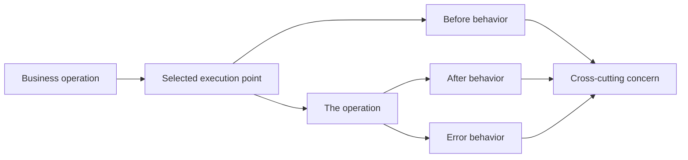
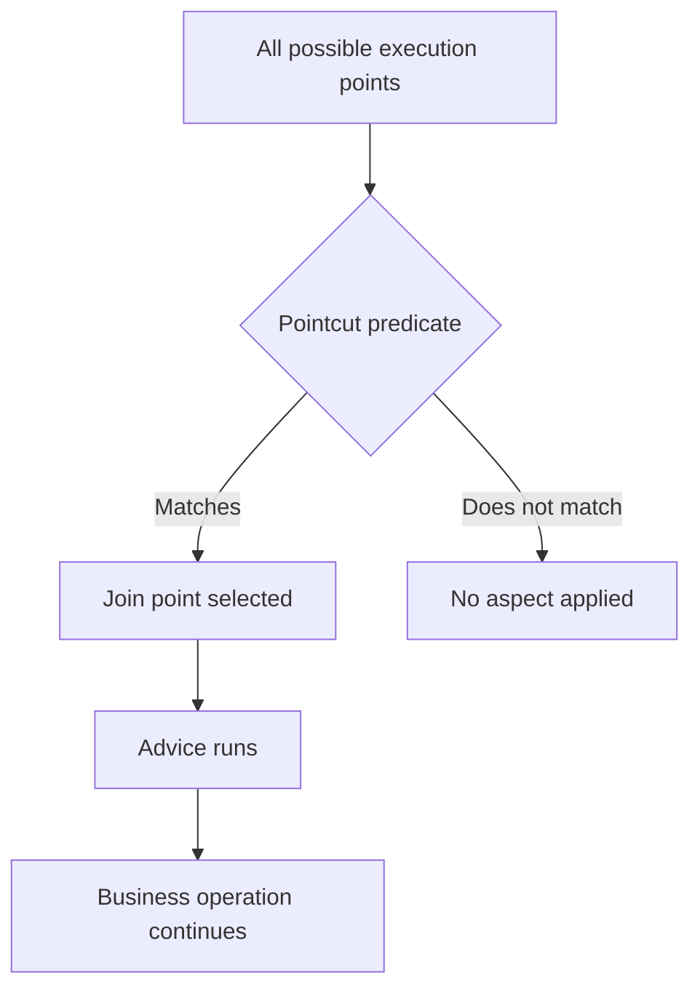
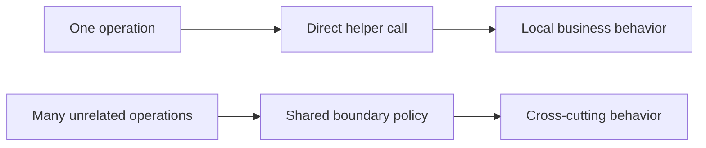
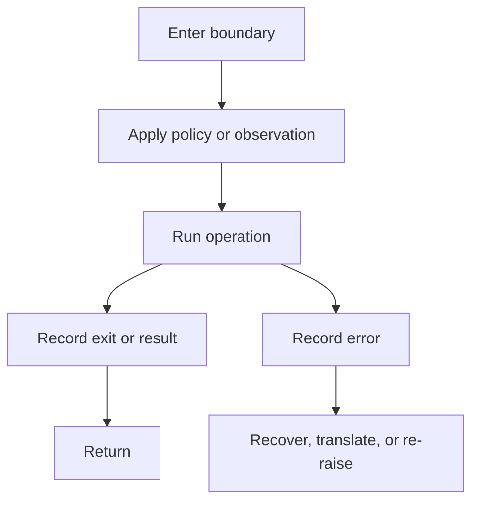

_Editorial note: This is an AI-augmented, human-led exploratory article. Mike
Hall supplied the direction, technical examples, corrections, and final
judgment. AI assistance helped organize the public archive material and draw
the diagrams. It did not become the author or fill gaps in the source._

_Source note: The canonical archive transcript is a single-speaker transcript
of my AOP presentation by me, Mike Hall. It currently preserves only two
introductory turns. This explanation also draws on my 2009 Post# article and
the public AOP and OpenTelemetry material linked below. The historical items
are lineage references, not claims that separate talks or posts were the same
event. This is not a verbatim reconstruction of unpreserved sections._

When I introduced AOP with PostSharp, I was talking about a problem that shows
up as soon as a codebase becomes large enough: some behaviors matter in many
places, but do not belong to any one business object.

Logging is one example. Caching is another. Security checks, timing, auditing,
transactions, and telemetry often have the same shape.

These are cross-cutting concerns. They cross the boundaries that object-oriented
design usually uses to organize business behavior.

## The basic idea

AOP gives those cross-cutting concerns a vocabulary and a place to live.

The aspect surrounds a selected operation. The operation still represents the
business purpose. The aspect adds behavior that must be consistent across many
operations.

That is the simple shape. The details vary by language and tool.

## Join point, pointcut, advice

The terms can make AOP sound more mysterious than it is.

- A **join point** is a place where the program can be observed or changed,
  such as entering a method or handling an exception.
- A **pointcut** selects which join points matter, such as methods matching a
  namespace or naming pattern.
- **Advice** is the behavior applied at the selected point. It may run before,
  after, or around the operation.
- An **aspect** packages the pointcut and advice into a reusable concern.

PostSharp made this concrete for .NET by allowing aspects to be applied to
methods and, through multicast syntax, selected across an assembly. My 2009
example used a greeting aspect to show the difference between writing the same
behavior in every implementation and declaring where the behavior should be
applied.

## Why not just call a helper?

Sometimes a helper is exactly the right answer.

The distinction is about ownership and repetition. If one business operation
needs a calculation, put the calculation in the domain code. If many unrelated
operations need the same audit or timing policy, a shared boundary may express
the design more honestly.

The goal is not to hide code. The goal is to put each kind of behavior where a
reader can find it and a maintainer can change it safely.

## AOP is a family resemblance

Not every mechanism with this shape is formally AOP. A Rails callback,
middleware layer, notification subscriber, decorator, interceptor, or method
wrapper may use the same before, operation, after, and error sequence without
using AOP terminology.

That family resemblance is useful. It lets us recognize the design shape across
languages instead of treating every framework vocabulary as an unrelated idea.

## The practical test

Ask four questions:

1. What behavior cuts across more than one business boundary?
2. Where can that behavior observe or surround execution?
3. Which operations should receive it, and which must not?
4. Can a new engineer discover the behavior without tracing invisible magic?

If the answer to the last question is no, the aspect has become a maintenance
problem.

The next article looks directly at the tradeoff: where AOP helps, where it gets
misapplied, and how to keep the seam visible.

## Related material

- [Introduction to AOP with PostSharp](/videos/mike-hall-introduction-to-aop-with-postsharp/)
- [Clean AOP using Post# Multicast Syntax](/2009/12/27/clean-aop-using-post-multicast-syntax.html)
- [AOP as the Bridge Between OpenTelemetry and the Strangler Fig](/ai/2026/09/01/aop-opentelemetry-strangler-fig/)
