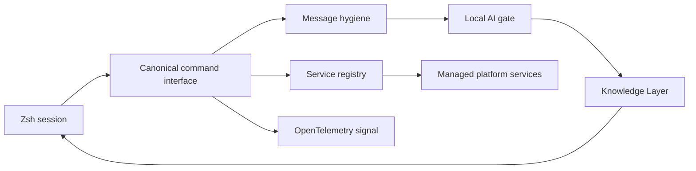
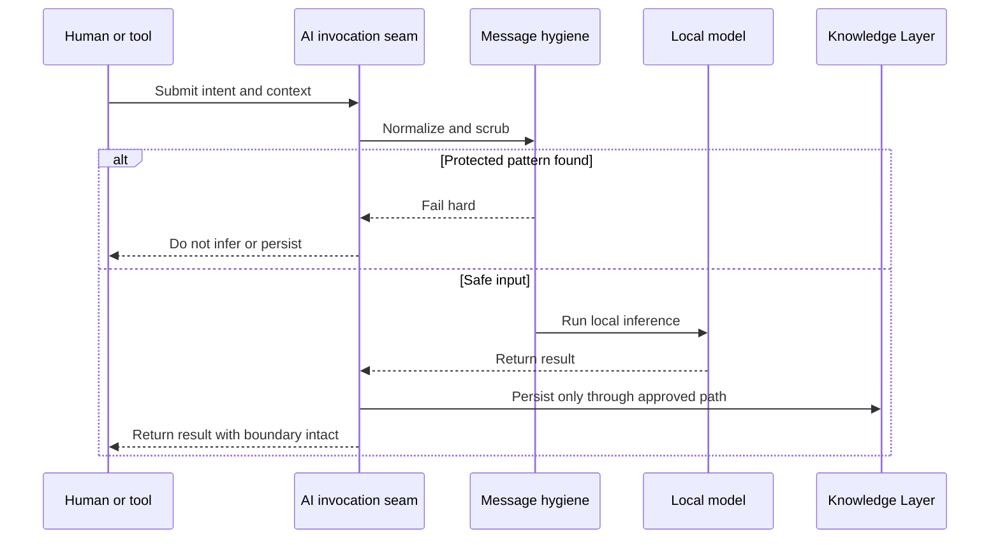
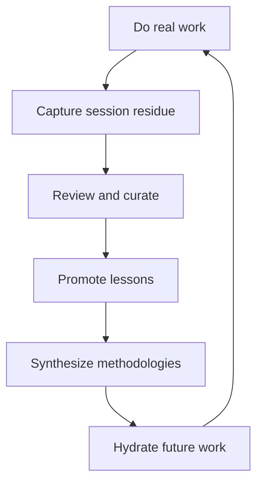

_Editorial note: A human sat down and guided the AI through this process. Mike
Hall supplied the source material, memories, direction, corrections, and final
judgment. AI assistance helped organize the public-safe documentation and
express the diagrams. It did not witness the system or become the author._

I used to think of dotfiles as the place where aliases lived.

That description stopped being large enough. The shell became the place where
I decide how work starts, how services are found, how commands are observed,
how local AI is allowed to run, and how useful residue comes back into the
knowledge layer.

That is what zdots is now: a control plane for the machine where I work.

## Put the seam in one place

The service registry is one of the ideas I keep returning to. A service needs
a name, a lifecycle, a health check, a log, and an endpoint. If every caller
has to know those details separately, the system accumulates small copies of
the same truth.

The registry gives the platform one place to resolve that information. The
per-service control scripts remain adapters, but the orchestration layer can
ask the same questions of each service.

That is not glamorous work. It is the kind of work that lets a person stop
remembering five slightly different commands.

## Local AI needs a boundary

The local AI interface is not just a convenience wrapper. It is a gate. Input
passes through normalization and PHI protection before inference or persistence.
If a protected pattern is detected, the operation stops.

The point is not that local means automatically safe. The point is that the
system has an explicit place where safety can be checked.

## Capture is not curation

The virtuous loop begins with real work. A shell session can produce residue.
Residue can become a lesson. Lessons can become a methodology. Future work can
then retrieve the curated material.

The loop does not close at capture. Uncurated residue is only raw material.
Someone has to decide what survived contact with reality and what should be
carried forward.

That is the larger lesson of zdots. Automation handles repeatable movement.
The human keeps choosing the bearing.
