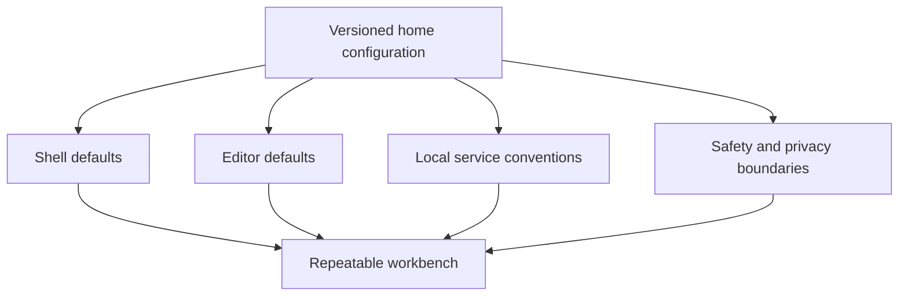
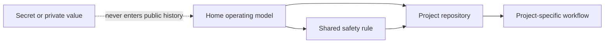
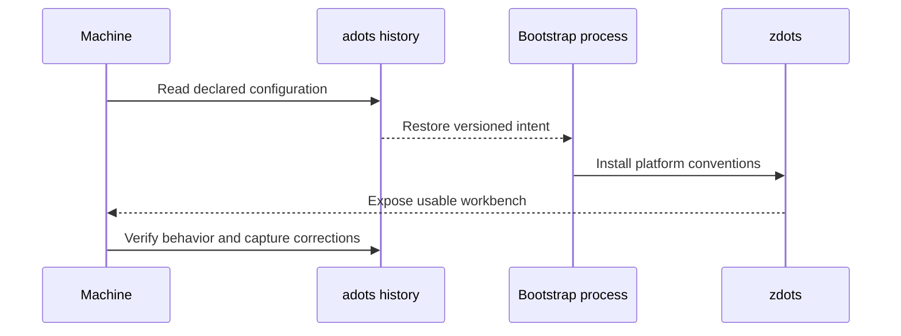

_Editorial note: A human sat down and guided the AI through this process. Mike
Hall supplied the source material, memories, direction, corrections, and final
judgment. AI assistance helped organize the public-safe documentation and
express the diagrams. It did not witness the system or become the author._

In a Unix environment, `$HOME` is more than a path. It is the place I return
to.

That makes the configuration under it more consequential than a collection of
preferences. Shell settings, editor settings, credentials boundaries, local
service conventions, and command-line habits all meet there.

I call the home configuration layer adots. It is the versioned memory of how my
working environment is supposed to be assembled.

## The home directory is a system boundary

The useful question is not “Which dotfile should I edit?” It is “Which part of
the operating model owns this decision?”

That question keeps the configuration from becoming a pile of convenient but
unrelated tricks. A home-level rule should be durable across projects. A
project-specific rule should remain with the project. A secret should not be
versioned into either one.

This is why a bare repository and a work-tree can be useful. The mechanism can
track the home system without pretending that every file in the home directory
belongs to the same public story.

## Restore is a test of the model

The strongest configuration is not the one that works only on the machine where
it was born. It is the one whose intent can be recovered.

The restore path exposes hidden assumptions. A missing tool, an undocumented
environment dependency, or a safety rule that lives only in memory becomes
visible.

That is the point of versioning the place I return to. Home is not static. It is
basecamp, and basecamp needs maintenance.
