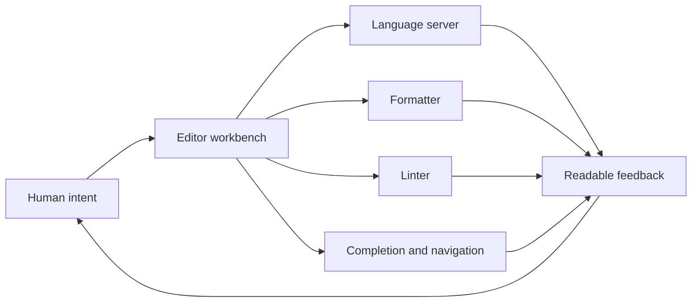
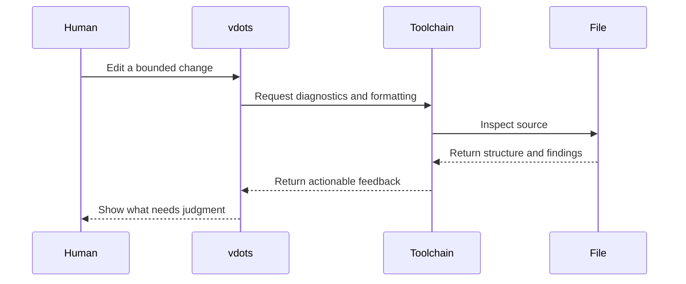
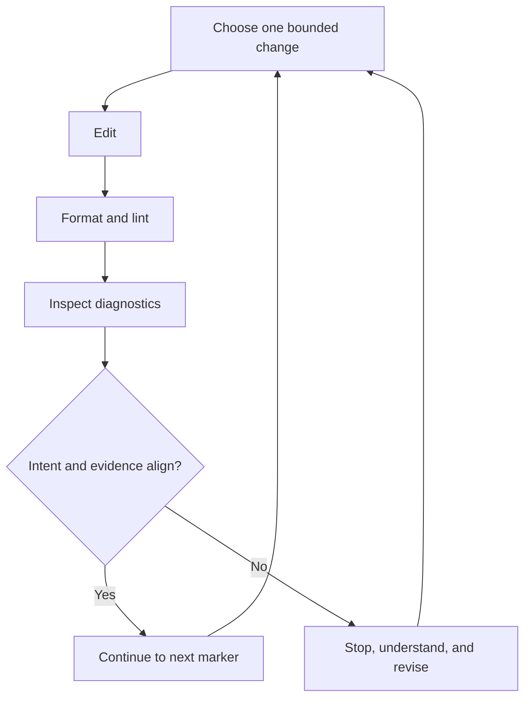

_Editorial note: A human sat down and guided the AI through this process. Mike
Hall supplied the source material, memories, direction, corrections, and final
judgment. AI assistance helped organize the public-safe documentation and
express the diagrams. It did not witness the system or become the author._

An editor is where thought meets the file.

That sounds obvious, but the seam has changed. My Neovim configuration, vdots,
does not only choose colors and keymaps. It connects language servers,
completion, formatters, linters, embedded-language tooling, and deliberate
feedback to the act of making a change.

## Make the feedback arrive where the work happens

The value of a language server is not that it is clever. The value is that a
definition, diagnostic, rename, or code action appears near the decision that
needs it.

Formatters and linters do something similar. They remove some decisions from
the repeated path, then return attention to the decisions that still need a
human.

The editor is not the authority. It is the place where evidence becomes
available early enough to change the next move.

## Embedded work is still one conversation

Real files often contain more than one language. Templates, configuration, and
application code cross boundaries. Embedded-language tooling lets the editor
carry the right feedback into the place where the code actually lives.

That matters to a systems thinker because a boundary is not automatically a
seam. The seam is where the right information can cross with enough context to
be useful.

## The editor needs a stopping point

More automation can make the work faster, but it can also make the feedback
arrive faster than it can be integrated. A good workbench supports the painted
rock rhythm: make a bounded move, inspect the result, and decide whether the
next move is clear.

The editor is a workbench because it supports both motion and rest. It helps
me move quickly when the route is clear and gives me a place to stop when it is
not.
