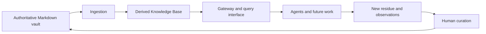
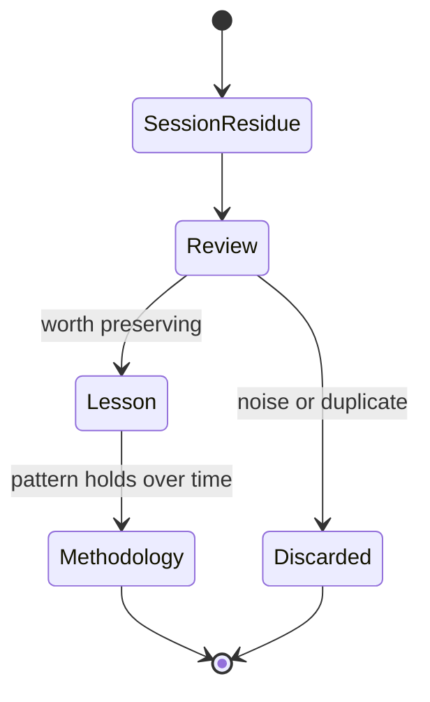
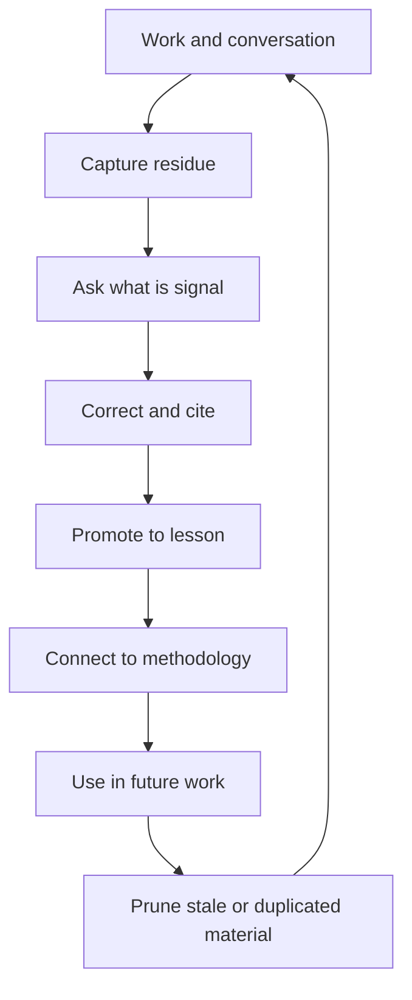

_Editorial note: A human sat down and guided the AI through this process. Mike
Hall supplied the source material, memories, direction, corrections, and final
judgment. AI assistance helped organize the public-safe documentation and
express the diagrams. It did not inspect private vault content or become the
author._

The knowledge layer has a simple rule: the source document is authoritative and
the database is derived.

That rule keeps the system honest. The Markdown in the vault is where a lesson
or methodology is corrected. The database makes that material searchable and
available to tools. The gateway owns the database boundary.

## Capture is not the same as knowing

A shell session can produce useful residue. That residue is not automatically a
lesson. A lesson is a curated unit with context, tags, and a source lineage. A
methodology is a higher-level artifact that has survived enough review to guide
future work.

This is where the human matters. Search can find relationships. A model can
propose a grouping. Neither one can decide that a memory is safe, accurate,
useful, and ready to carry into the future without an accountable review.

## Curation closes the loop

The purpose of a second brain is not to store everything forever. It is to
remember the right things at the right level of abstraction.

I like the image of bonsai pruning. The goal is not a larger pile of notes. The
goal is a living shape that remains useful as new growth arrives.

Private material stays private. Public writing needs its own publication gate.
AI can help with the search, organization, and diagrams. A human supplies the
intent, correction, uncertainty, and final decision about what belongs in the
public record.
