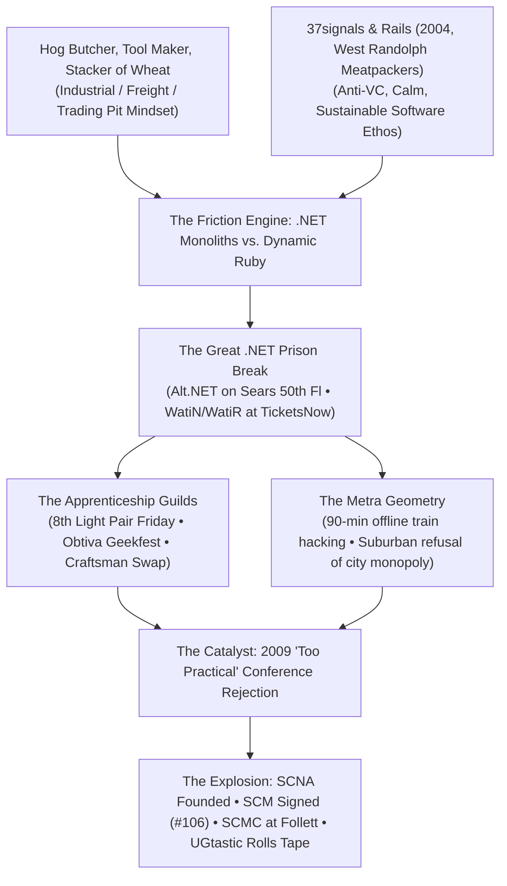

_Editorial note: Mike Hall supplied the primary recollections, community context, oral history archives, and cultural framing for this essay. The events, meetings, and interviews described are grounded in the lived archives on just3ws.localhost._

---

Silicon Valley had the venture capital. Seattle had the operating systems. Boston had the academic research labs. Austin had the semiconductors. New York had the media agencies.

None of them gave birth to the **Software Craftsmanship Movement**.

It happened in Chicago—and in the suburban satellite towns strung along the heavy commuter rail lines: Libertyville, Crystal Lake, McHenry, and Evanston.

To understand why, you have to look past the superficial conference schedules and examine the collision between industrial history, blue-collar pride, enterprise friction, and a dynamic language insurgency that could only have detonated in Midwestern soil.

---

## 1. Carl Sandburg’s Ghost: Tool Makers, Not Pitch-Deck Flippers

In Silicon Valley, software by 2007 was already dominated by the **"flip."** Build an audience, burn angel money, move fast and break things, get acquired by Google or Yahoo, cash out, repeat. The code was treated as disposable wrapping paper around user acquisition metrics.

Chicago doesn't have a disposable culture. It is Carl Sandburg’s city:

> _"Hog Butcher for the World, Tool Maker, Stacker of Wheat, Player with Railroads and the Nation's Freight Handler; Stormy, husky, brawling, City of the Big Shoulders."_

Chicago software did not live in the ethereal realm of social feeds; it lived in the **physical and financial machinery of the continent**:
* It ran the options and futures pits at the Chicago Board of Trade (CBOT) and Chicago Mercantile Exchange (CME).
* It ran catastrophic supply chains and inventory logistics for Sears, Walgreens, Abbott Laboratories, and United Airlines.
* It ran real-time ticketing platforms where a database race condition meant double-selling a row at Soldier Field ([TicketsNow](/ai/2026/09/02/the-skunkworks-lab-real-time-inventory/)).

If code broke in Chicago, trains stopped in Cicero, freight sat stranded on rail sidings, options contracts expired worthless, and millions of dollars evaporated in microseconds. You didn't build software to throw it away; you built it like a union ironworker riveted a bridge across the Chicago River. **Workmanship was a moral and economic obligation.**

---

## 2. The 37signals Gravity Well & The West Randolph Meatpackers

In 2003–2004, David Heinemeier Hansson and Jason Fried built Basecamp on West Randolph Street. At that time, the West Loop was not Michelin-starred tasting rooms; it was literal wholesale meatpackers and cold-storage warehouses where forklifts rattled across cobblestones at 5:00 AM.

Out of that gritty room came **Ruby on Rails**.

Crucially, 37signals preached an unapologetic gospel that acted as a cultural shield across Chicagoland:
* **No Venture Capital:** Taking VC money was a drug that turned developers into metric-farming cattle for institutional investors.
* **Calm Software:** Small teams, readable prose, high aesthetic standards, and sustainable customer-funded revenue.
* **Software as Writing:** Code was literature to be read by humans, not opaque binary slurry for compilers.

This established a cultural counterweight against Silicon Valley FOMO. Midwest developers had living proof that you did not have to grovel on Sand Hill Road. You could stay in the Midwest, write elegant code, charge real money for value delivered, and go home to your family at 5:30 PM.

---

## 3. The Friction Engine: The Great .NET Prison Break

This is the great unwritten truth of the movement: **If Chicago had been a pure Ruby monoculture from day one, Software Craftsmanship would never have existed.**

Craftsmanship was forged by **friction**. Chicago was the ultimate Microsoft/.NET and Java enterprise fortress:
* Developers spent their working hours trapped inside Visual Studio, battling SOAP envelopes, BizTalk schemas, endless XML configuration blocks, and heavyweight Microsoft Enterprise Library wrappers.
* Management adopted "Agile" as a certified bureaucratic whip: daily standups where project managers demanded hourly burndown estimates, but automated testing, refactoring, and code reviews were banned as "unbillable overhead."

When enterprise .NET developers like Sergio Pereira ([Chicago Alt.NET](/interviews/sergio-pereira-chicago-alt-net-software-craftsmanship-north-america-2011/)) or Mike Hall at TicketsNow encountered Ruby (via [WatiN/WatiR](/timeline/community/), Cucumber, and IronRuby), it was not a trendy lifestyle choice. **It was a prison break.**

They realized:
> _"I can test an entire domain model in 3 seconds without spinning up IIS or waiting 15 minutes for a compile? Why am I being forced to work like an assembly-line clerk?"_

Chicago Alt.NET was an insurgent cell inside the enterprise. When they met at Redpoint Technologies on the 50th floor of the Sears Tower, they were not talking about syntax; they were reclaiming engineering autonomy. They were dragging TDD, BDD, and NHibernate into corporate shops by sheer force of will.

---

## 4. The Guilds: Obtiva, 8th Light, and the "Craftsman Swap"

Silicon Valley built tech campuses with ping-pong tables and free dry cleaning to keep developers at their desks 16 hours a day.

Chicago built **Guilds**.

Firms like **Obtiva** (Dave Hoover, Kevin Taylor) and **8th Light** (Micah Martin, Robert "Uncle Bob" Martin, Doug Bradbury, Paul Pagel) explicitly resurrected medieval craft terminology:
* You were not hired as a "Junior Developer." You became an **Apprentice**.
* You studied under a **Journeyman** or **Master Craftsman**.
* You practiced deliberate katas: the Bowling Game, Prime Factors, Roman Numerals.
* At Obtiva, Dave Hoover launched **Geekfest** in 2007 around sandwiches from Jimmy John's, studying draft manuscripts of Martin Fowler's refactoring books.
* At 8th Light in Libertyville, Micah Martin ran **Pair Friday** (which later grew into **8th Light University / 8LU**), opening their office doors to anyone with a laptop to sit side-by-side with craftsmen and write open-source code.

And in what other city on earth would competing commercial consulting firms initiate the **"Craftsman Swap"**? 8th Light and Obtiva literally traded developers between their offices to cross-pollinate TDD habits, Vim configurations, and pairing styles—because raising the standard of the entire regional talent pool mattered more than hoarding proprietary secrets.

---

## 5. Metra Geometry: The Radial Commute and the Suburban Forge

Look at a transit map of northeastern Illinois. It is not a campus grid. It is an explosive radial starburst of heavy commuter rail (Metra lines) firing 50 to 60 miles outward into the prairie:
* **Union Pacific Northwest (UP-NW):** Crystal Lake, McHenry, Woodstock.
* **Milwaukee District North (MD-N):** Libertyville, Deerfield.
* **Union Pacific North (UP-N):** Evanston.

This geographic reality forced two cultural behaviors:
1. **The 90-Minute Offline Hacking Session:** Developers sat on the bilevel commuter train twice a day. In 2008, there were no reliable mobile hotspots. You opened your laptop, booted Vim, and ran unit tests completely offline against local code. You read technical monographs. It bred radical self-reliance.
2. **The Refusal of Urban Monopolies:** Engineers in Crystal Lake, McHenry, or Libertyville had families, backyards, and mortgages. They asked a radical question:
   > _"Why do I have to ride a train for two hours into the Loop to talk to people who care about good code?"_

That refusal is why **8th Light set up shop in Libertyville**. It is why Mike Hall and Ryan Gerry launched **CDG (Cloud Developers Group)** in a Crystal Lake Panera Bread and public library, and why Ryan anchored **SCMC for 17 continuous years at Follett Software Company in McHenry**. The suburbs were not a passive bedroom community; they were the engine rooms where practitioners lived and built.

---

## 6. The "Too Practical" Insult: The Spark That Lit SCNA

The movement went from local meetups to a global manifesto because of a singular, unforgivable insult.

In 2009, local Chicago practitioners submitted talk proposals to mainstream enterprise conferences (including the upcoming Agile 2010 conference scheduled for downtown Chicago).

The conference review committees sent back rejection notices with feedback that became legendary:
> _"Your talks are too practical. Showing live pairing, TDD refactoring, and code katas on stage is too tactical for an executive engineering conference."_

In the Midwest, telling an engineer their work is **"too practical"** is like telling a carpenter that knowing how to hammer a nail is beneath them. It crystallized everything that had gone rotten with commercial Agile: it had become a lucrative racket for Scrum masters, certification peddlers, and project managers who couldn't read a stack trace.

The response was immediate and visceral:
* **"If you won't give practical code a stage, we will build our own stage."**
* 8th Light and Obtiva teamed up to launch **Software Craftsmanship North America (SCNA 2009)**. Slides-only talks were deprioritized; live pairing, terminal execution, and architectural debate took center stage.
* The **Software Craftsmanship Manifesto** was drafted in Libertyville and published on March 6, 2009, declaring: _Not only working software, but well-crafted software._

---

## 7. What's Missing from the Standard Lore? The Pastiche

The conference history books only remember the celebrity keynotes: Uncle Bob Martin, Gary Bernhardt, Corey Haines, Michael Feathers.

What they forgot was the **pastiche**—the unsung connective tissue that made the rooms possible:
* **Ray Hightower ([ChicagoRuby](/interviews/ray-hightower-chicagoruby-software-craftsmanship-north-america-2011/)):** The indispensable ambassador who met .NET refugees at restaurant tables, showed them Cucumber, and demystified the community.
* **Sergio Pereira ([Chicago Alt.NET](/interviews/sergio-pereira-chicago-alt-net-software-craftsmanship-north-america-2011/)):** Who gave Mike Hall his first audience on the 50th floor of the Sears Tower, showing that community curation was about encouraging members to step up and speak.
* **Charley Baker ([Watir](/interviews/charler-baker-denver-community-software-craftsmanship-north-america-2011/)):** Who proved that testing automation was not a QA afterthought, but a core developer discipline.
* **The Zero-Dollar Infrastructure:** Running **Chicago Code Camp** for 500 people with static Rails apps and blind CFPs on spotty venue Wi-Fi; building **UGl.st** to protect independent meetups from corporate rent-seekers.
* **UGtastic Itself:** The roving camera that refused to let these ephemeral moments vanish, capturing 184 oral histories before the era washed away.
* **Ryan Gerry ([SCMC](/scmc/)):** Who kept the projector running and the room open at Follett in McHenry for 17 continuous years, long after the conference spotlights had moved on.

---

## The Lesson for the Age of AI

Why does this matter in 2026?

Because we have entered the fourth wave. Generative AI and LLMs now produce boilerplate code instantly. The commercial tech industry is once again rushing toward "fast, disposable, unexamined" software—the exact same trap that commercial Agile fell into twenty years ago.

The lesson of Chicago in 2009 was that **the code is not disposable**. When generation is free, the value shifts entirely to the **editor-craftsman**: the person who understands systemic constraints, verifies deterministic state, preserves institutional memory, and takes personal responsibility for the rules that run the world.

That discipline was born in Chicago. Rewatching Sergio Pereira is not nostalgia; it is picking up the tools of the guild to build the next twenty years.

---

### Connected Records & Further Exploration
* **Interactive Timeline:** [The Community Pastiche Timeline (2005–2026)](/timeline/community/)
* **Series Episode 1:** [Sergio Pereira Interview Verbatim Transcript & Video Stage](/interviews/sergio-pereira-chicago-alt-net-software-craftsmanship-north-america-2011/)
* **Foundational Monograph:** [The Chicago Software Craftsmanship Movement (2006–2015)](/chicago-craftsmanship/)
* **Community Hub:** [Software Craftsmanship McHenry County (17-Year Canon)](/scmc/)
* **Forensic Audit:** [Signatory Ledger Forensics](/reports/software-craftsmanship-forensics/)
* **Philosophical Essay:** [The Four Waves of Craft: DHH, Uncle Bob, and Writing Software in the Age of AI](/ai/2026/10/02/the-four-waves-of-craft-dhh-uncle-bob-ai/)
