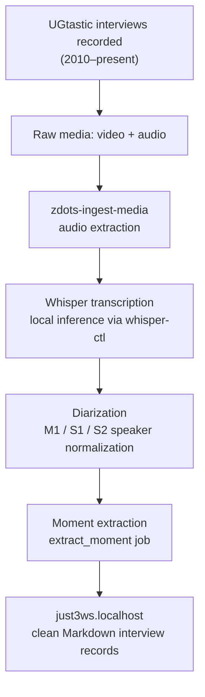
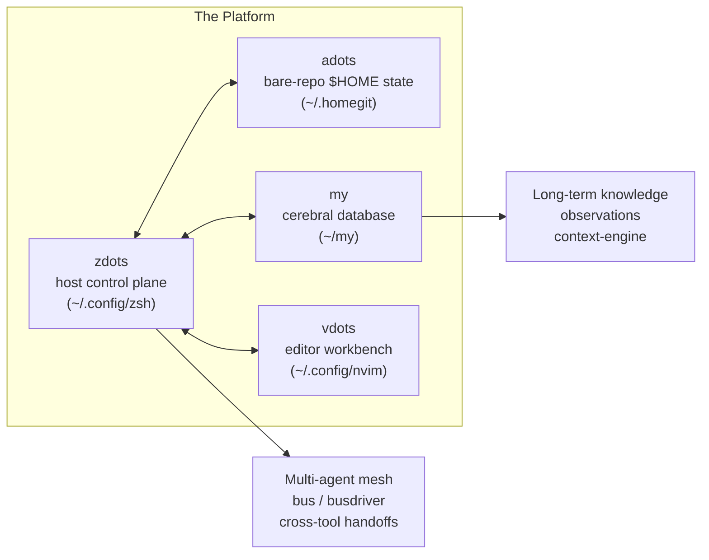

_Editorial note: Mike Hall supplied the source material, memories, direction,
corrections, and final judgment for this post. AI assistance helped organize
the documentation and draw out the narrative thread. The events described are
real. The framing is Mike's._

---

When people ask what made the local AI stack possible, they are often asking
about the model weights, the inference engine, or the prompt engineering.

Those are not the answer.

The answer is that the machine already knew how to work. The environment
already had contracts. The services already started and stopped cleanly.
The commands already did one thing and provided a help page for it. The
observations already flowed. The secrets already had a fence around them.

By the time a language model entered the machine, it entered a machine that
was already legible.

That is what zdots is. That is what it took seventeen years to build.

## Software Craftsmanship, 2009

In March 2009, Mike was the 106th signatory of the Software Craftsmanship
Manifesto. That same spring, he founded the Software Craftsmanship McHenry
County user group, a practitioner community in the northern Illinois suburbs.

He was working at 8th Light and Obtiva during that period. The manifesto was
not a credential; it was a commitment: to well-crafted software, to steadily
adding value, to productive partnerships, to a community of professionals.

The principles showed up in how Mike built tools for himself. A command
should do one thing. It should tell you what it does when you ask. It should
fail loudly and clearly when something goes wrong. It should leave the
environment cleaner than it found it.

These are not complicated rules. They are the kind of rules that compound over
seventeen years into a machine a language model can reason about.

## UGtastic, 2010

In 2010, to amplify the craftsmanship community, Mike founded UGtastic.

The idea was to record in-depth developer interviews at conferences and
distribute them freely. Over the next several years, hundreds of hours of
real conversations with working software engineers were captured across events
like RailsConf, RubyConf, and regional gatherings.

The archive lived on Vimeo and Tumblr originally. The recordings held, even
when the curation infrastructure did not.

What UGtastic actually produced, though not by design at the time, was a
pressure test. Hundreds of video files, hours of raw audio, hundreds of
speakers who needed to be identified and normalized, timestamps that needed
to anchor to the right content, recordings that needed to survive format
changes and platform migration.

That real-world mass is what drove zdots to grow the tools it grew.

The background worker queue that zdots runs today exists because there was
real work to do. The resumable job architecture exists because real jobs
failed. The PHI fence exists because real recordings contained information
that should not travel to a cloud inference endpoint.

Real data pressure produced real engineering. This is Gall's Law applied
to personal infrastructure: the complex system that works evolved from a
simple system that worked.

## The Return, 2026

In 2026, Mike returned to the Software Craftsmanship McHenry County user group
to demonstrate what the platform had become.

The demonstration covered three things:

- **just3ws.localhost** — the fully preserved, diarized UGtastic archive, now
  queryable and navigable as a static Jekyll site served over local HTTPS.
- **phalanxduel.com** — a real-time multiplayer tactical game engine that drove
  live tournament telemetry, OpenObserve dashboards, and full observability
  tooling into the zdots core.
- **The local control plane itself** — OpenTelemetry traces flowing from shell
  commands into a local Jaeger and OpenObserve backend, live in the browser,
  during the demonstration.

The room was the same kind of room that signed the manifesto seventeen years
earlier. Practitioners. People who build things and think carefully about how
they build them.

The thesis Mike brought was simple: real AI-augmented development is not magic
prompt engineering. It is Software Craftsmanship principles applied to
multi-agent fleets. TDD. Deterministic contracts. Relentless observability.
Red-green verification. The Blink Test.

When Claude or Gemini entered the machine years later, the machine already had
immune defenses.

## The Four Pillars

zdots is the host control plane. But it does not operate alone.

Each pillar exists because real work demanded it:

- **adots** exists because Mike's $HOME configuration is a seventeen-year
  artifact that needed version control without a conventional working tree.
- **my** exists because the knowledge residue of real work needed a persistent,
  queryable home that was not a language model's context window.
- **vdots** exists because the editor is also infrastructure, and infrastructure
  needs to be versioned and reproducible.

zdots holds the seams between all of them together.

## What the Video Series Will Show

The platform story is being documented in a five-part technical screencast
series. The arc:

1. **The Bedrock** — Pre-LLM personal OS and the UGtastic ingest forge.
   How the machine was built before the machines arrived.
2. **The Real-Time Crucible** — Phalanx Duel, tournament operations, and OTel
   telemetry. How a game pushed observability into the platform core.
3. **Sovereign Inference** — llama.cpp on loopback and the PHI fortress.
   How local inference works without touching cloud infrastructure.
4. **The Agentic Highway** — Message bus, transit driver, and cross-tool
   handoffs. How agents communicate and coordinate on the platform.
5. **The Blink Test in Action** — Refactoring, gate defense, and multi-agent
   pairing. How to verify a claim is actually true, not just plausible.

Each episode starts from a real problem. UGtastic produced the ingest pipeline.
Phalanx Duel produced the telemetry stack. The PHI boundary produced the local
inference gate. Real-world pressure produced the engineering.

That is the through-line.

## The Discipline Behind the Platform

The disciplines that govern zdots today are the same ones that built it:

- **The Schrute Test**: Before every action, ask whether an idiot would do that.
  If yes, stop.
- **Snake in a Can**: Probe before committing. `--dry-run` before destructive
  operations. Read before writing. Secret-scan before pushing.
- **Cook Ding's Blade**: Follow the grain. Pass the blade through the spaces
  that already exist. The nineteen-year knife stays sharp because it does not
  hack through bone.
- **The Blink Test**: Green, then red, then green again. A claim of fixed is
  not evidence until the fix has failed in isolation and passed with the
  change applied.
- **The Ponytail Principle**: Do not build scaffolding for a house that has not
  been designed. Stop at the lowest rung that works.

These are Software Craftsmanship principles with different names. The names
came from working with the system long enough to know what it actually needed
to say.

---

_The UGtastic archive is available at [just3ws.localhost/interviews](/interviews/).
The SCMC community history lives at [just3ws.localhost/scmc](/scmc/).
The platform source is at [github.com/just3ws/zdots](https://github.com/just3ws/zdots)._
