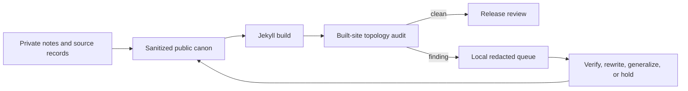

# bin/ Directory Command Index

This directory contains executable tools and drivers for building, validating, and ingesting data for the site.

## Primary Human Drivers

| Command | Usage | Description |
| :--- | :--- | :--- |
| [`./bin/server`](server) | `./bin/server` | Launches local Jekyll development server on `http://127.0.0.1:4000/` with live-reload. |
| [`./bin/pipeline`](pipeline) | `./bin/pipeline <command>` | Unified runner (`generate`, `build`, `test`, `validate`, `smoke`, `ci`). |
| `audit_public_surface.rb` | `ruby bin/audit_public_surface.rb --help` | Scan publishable prose and built output for privacy, provenance, quarantine, and topology risks. |

---

## Command Categories & Naming Conventions

All scripts in `bin/` follow standard prefix naming conventions:

The preferred public driver names use a domain prefix. `www-graphify` is the
repository wrapper for Graphify and supplies the local model alias, loopback
endpoint, one-worker limit, and conservative token budget. Override those
defaults with `GRAPHIFY_MODEL`, `GRAPHIFY_ENDPOINT`,
`GRAPHIFY_CONCURRENCY`, or `GRAPHIFY_TOKEN_BUDGET` when needed.

```sh
./bin/www-graphify extract --mode deep --no-cluster
graphify query "Which archive themes connect to OpenTelemetry?"
```

### 1. Unified Drivers & CLI Tools
- `server`: Local dev server launcher.
- `pipeline`: Main pipeline CLI (`./bin/pipeline build`, `./bin/pipeline ci`, etc.).
- `deploy_status`: Check deployment status.

### 2. Executive Pitch & Resume Generators (`generate_*`)
Scripts that read `_data/*.yml` sources and compile pages/artifacts into Jekyll source:
- `generate_executive_brief.rb`: Generates custom 1-page executive pitch briefs (`ruby bin/generate_executive_brief.rb "Company" "Title"`).
- `generate_pdf_resume.js`: Playwright script that renders print-optimized `exports/resume.pdf`.
- `generate_timeline_data.rb`
- `generate_speakers_data.rb`
- `generate_resume_position_pages.rb`
- `generate_context_summaries.rb`

### 3. Validators & MCP Verification (`validate_*`, `verify_*`)
Quality checks executed by CI (`./bin/pipeline ci`):
- `verify_mcp_spec.js`: Stdio MCP protocol self-verification runner.
- `validate_exports.rb`: Verifies JSON, Markdown, Text, and PDF resume exports.
- `validate_repo_hygiene.rb`: Enforces repo file tracking policies.
- `validate_seo_output.rb`: Checks structured metadata and SEO tags.
- `validate_data_uniqueness.rb`: Checks for duplicate records in YAML data.

### 4. Archival & Ingestion Tasks (`import_*`, `enrich_*`, `audit_*`)
Automated data processing and archival tools:
- `import_transcripts_from_outbox.rb`: Batch ingest transcripts.
- `enrich_speaker_profiles.rb`: Deep research and speaker enrichment.
- `audit_metadata.rb`: Comprehensive metadata completeness audit.
- `audit_public_surface.rb`: Redacted editorial and built-site publication gate. Use `--strict` before release.

The public-surface auditor is intentionally conservative. It does not prove that
content is safe. It finds review boundaries that require a human decision.


