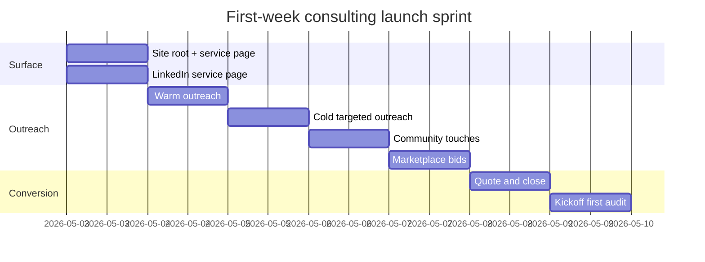

# Revenue-first launch plan for a Rails and Postgres consultancy

**Executive summary.** The shortest path to paid consulting is not an AI product, a general “fractional engineering” pitch, or a broad Rails agency offer. It is a fixed-scope diagnostic service for expensive, already-visible problems inside Rails/Postgres systems: broken production behavior, upgrade blockers, slow queries, lock contention, broken sync jobs, and funnel or data-integrity anomalies. That market is real right now. The official Rails Job Board is active with senior Rails roles; current startup hiring on Wellfound spans both 11–50 and 51–200 employee companies; founder-led startups on Y Combinator’s jobs platform explicitly expose founders as the hiring contact; and current freelance listings show buyers paying for urgent short-term Rails/Postgres work, including expert fixed-price integration work and legacy rescue projects. citeturn14view3turn13view10turn13view12turn14view1turn14view0

The practical plan is to sell one main productized offer and one narrower add-on. The main offer should be a **48-hour System Behavior Audit** priced to close quickly, not optimized for lifetime margin on day one. A secondary **Query and Data Integrity Triage** should exist for buyers whose problem is visibly in Postgres, Sidekiq-style background processing, or third-party sync paths. Current market rates support that packaging: Upwork’s current Rails cost guide shows typical historical hourly ranges, its same page shows intermediate and expert bands, and Arc’s 2026 rate data puts Rails freelancers at a median of \$61–80/hr and an average of \$81–100/hr. A \$2,500 entry audit and a \$4,000 deeper triage are therefore inside market, especially when the alternative is continued revenue leakage, downtime, or blocked delivery. citeturn22view1turn23view1turn14view6turn21view0

AI belongs in the workflow, but not in the liability boundary. Use it locally to compress logs, summarize `EXPLAIN` output, cluster anomalies, and produce first-pass system maps. Keep human judgment on scope, evidence selection, root-cause calls, risk ranking, and the final recommendation memo. That division is consistent with the current market: Stack Overflow’s 2025 survey shows 84% of respondents using or planning to use AI in development, but 46% said they do not trust the accuracy of AI output. The winning message is therefore not “I do AI consulting.” It is “I tell you what your system is actually doing, fast, with evidence.” citeturn14view7turn14view8turn15view0

A first paid engagement inside one to three weeks is plausible, not guaranteed, if you treat the launch like a sales sprint. Put the service at the site root, create a free LinkedIn Service Page, send direct outreach to founders and heads of engineering at companies already hiring for Rails, post short high-signal messages in Rails/Postgres communities, and bid only on the newest expert-level marketplace jobs. Current platform structure supports that sequence: LinkedIn already has a service marketplace, Rails communities are open and active, YC exposes founders directly, and Upwork/Toptal already aggregate current freelance demand. citeturn13view7turn13view5turn13view6turn14view9turn13view12turn13view9turn3search1

## Market reality

This is not a “will anyone still pay for Rails?” problem. The official Rails Job Board currently lists senior and staff Rails roles with salaries in the six figures, and it explicitly supports contract and freelance terms. On Wellfound, current Rails openings appear at both 11–50 and 51–200 employee companies. One active Rails-board posting from a mature, founder-owned company describes a Rails monolith with Postgres, heavy third-party integration work, live-issue debugging, careful concurrency control, and production-data analysis as core engineering work. Another current posting from a profitable telehealth company ties Rails/Postgres directly to acquisition-funnel revenue, event-sourced state, background jobs, and a Head of Engineering reporting line. In plain English: companies are still running serious revenue-bearing Rails/Postgres systems, and the problems they hire for match your skill set unusually well. citeturn14view3turn13view10turn17view0turn17view1

Buyers spend fastest when the pain is attached to money, downtime, or a deadline they cannot move. A 2025 outage analysis found that 54% of respondents said their most recent significant outage cost more than \$100,000, and one in five said it cost more than \$1 million. The same report found that four in five operators believed better management or processes would have prevented their most recent downtime incident. That matters here because your offer is not “general advice”; it is a short operational intervention for problems buyers already perceive as costly and embarrassingly unresolved. citeturn20view0turn21view0turn21view1

The other important signal is that external specialist spend is already normalized in the Postgres market. The official PostgreSQL professional-services directory includes firms serving early-stage startups, mid-market customers, and enterprises with offerings around database audits, tuning, migrations, HA/DR, and 24x7 support. That means “bring in a PostgreSQL specialist for a narrow, production problem” is already a familiar buying motion rather than a strange category you must invent. citeturn16view0

| Priority | Buyer | Company profile | Trigger that opens budget | Why this buyer is first |
|---|---|---|---|---|
| High | Founder or CEO | 11–50 employee SaaS or founder-led product company | One broken path affects revenue, launch date, or investor confidence | Founder access is explicit on entity["organization","Y Combinator","startup accelerator"], and Wellfound shows many Rails companies in this size band. |
| High | Head of Engineering or CTO | 20–200 employee growth or mature SaaS | Recurring incidents, blocked upgrades, “nobody understands this path” | This role directly owns engineering risk, delivery, and vendor spend. |
| High | Growth or acquisition engineering lead with budget cover | 20–200 employee subscription or ecommerce business | Checkout/CVR anomalies, user-state drift, event/funnel mismatch | The pain maps directly to money, so diagnostics are easier to justify. |
| Medium | Database or platform owner | 15–100+ product company with meaningful Postgres load | Slow queries, lock waits, migration risk, integrity issues | The Postgres services market already treats tuning and audits as normal purchases. |
| Medium | Marketplace client | SMB to 10–99 employee company | Acute short-term problem with a visible symptom | Fastest short-term cash path, but more price competition and noisier demand. |

The priority order above is an inference from current startup/company size signals, direct-founder access, active Rails hiring, and the existing market for specialist Postgres support. The sweet spot is the company that is too small to have a dedicated internal “legacy systems” person, too real to ignore production weirdness, and too busy to fund a rewrite. citeturn13view10turn13view12turn17view0turn17view1turn16view0

| Channel | What is there now | Best primary target | Priority in first week |
|---|---|---|---|
| entity["company","LinkedIn","professional network"] Services | Free Service Page; request flows that let prospects compare proposals | Warm network, second-degree founder/engineering leads | Very high |
| Rails Job Board | Current senior Rails roles; contract and freelance terms explicitly supported | Heads of engineering, CTOs, hiring managers at active Rails shops | Very high |
| entity["organization","Ruby on Rails Link","rails slack community"] | 23,470 members and 42 channels | Rails founders, engineering leads, senior ICs | High |
| entity["organization","Ruby Central","ruby nonprofit"] Slack | Open to all | Ruby practitioners and referrals | Medium |
| entity["organization","PostgreSQL Slack","postgres community slack"] | Self-invite community listed on PostgreSQL wiki | DBAs, platform owners, referrals | Medium |
| entity["company","Wellfound","startup jobs platform"] | Active Rails roles across 11–50 and 51–200 employee companies | Growth-stage startup buyers | High |
| entity["company","Upwork","freelance marketplace"] | Public short-term Rails/Postgres work, including fixed-price expert jobs | Immediate-cash buyers with acute issues | High, but selective |
| entity["company","Toptal","talent marketplace"] | Vetted freelance jobs and mission-critical buyer positioning | Backup channel for higher-end clients | Medium |

The channel scores come directly from current platform structure: LinkedIn offers a free Service Page; Rails Job Board supports contract and freelance roles; Rails Link publishes member and channel counts; Ruby Central says its Slack is open to all; PostgreSQL’s wiki publishes a self-invite community link; Wellfound shows active Rails roles at 11–50 and 51–200 employee companies; Upwork lists current short-term jobs; and Toptal positions itself around on-demand top-tier developers and current Ruby on Rails freelance jobs. citeturn13view7turn14view3turn13view5turn13view6turn14view9turn13view10turn14view1turn13view8turn13view9

| Market signal | Current evidence | What it means for your pricing |
|---|---|---|
| Commodity cleanup work exists | A current Upwork Rails/Postgres deploy-and-fix job is a short-term 5–15 hour project, not a build-from-scratch engagement | Ignore this lane unless you need pure emergency cash. |
| Expert fixed-price work exists | A current Upwork Rails/Postgres integration job is \$4,000 fixed-price and explicitly asks for data integrity, retries, and background job handling | A specialist triage at \$4,000 is not unrealistic. |
| Legacy rescue work exists | A current Upwork posting frames a 15-day “legacy rescue” as digital archaeology for a 10-year-old Rails CMS | “Legacy rescue” is language buyers already understand. |
| Rate benchmarks support premium diagnostics | Upwork lists historical Rails cost at \$20–40/hr, but the same guide shows intermediate \$50–200/hr and expert \$200+/hr; Arc shows median \$61–80/hr and average \$81–100/hr for Rails | A fixed price of \$2,500–\$4,000 is defensible for short, expert-led diagnostics. |
| Urgency supports rush pricing | Upwork itself says you can adjust rates for project urgency and prioritization | Add a rush fee without apology. |

These pricing bands should be read as launch guidance, not permanent pricing law. They are grounded in current rate pages and live project examples, then translated into fixed-scope packages that are easier to buy quickly than open-ended hourly work. citeturn14view2turn14view1turn14view0turn22view1turn23view1turn13view1

## Problem-offer fit

Do not sell “consulting.” Sell diagnosis of one painful, expensive, specific failure mode. The right buyer is not trying to buy your general intelligence. They want one part of their system to stop behaving like a haunted house. The offer has to meet that mental state. citeturn17view0turn17view1turn13view21turn13view22

| Concrete problem | Why it is urgent | Why teams stall | Best offer | AI-enabled advantage |
|---|---|---|---|---|
| Silent record loss in a signup, checkout, import, or sync path | Revenue loss, support load, trust damage | Ownership crosses app code, jobs, and DB state | 48-hour System Behavior Audit | Cluster logs, reconstruct event sequence, summarize likely breakpoints |
| Slow query or lock contention under production load | User-facing slowness, incidents, deploy hesitation | Teams argue about app code vs DB cause | Query and Data Integrity Triage | Rank query pain from `pg_stat_statements`; summarize `EXPLAIN` JSON fast |
| Retry storms or stale background jobs causing duplicate or missing side effects | Money, messaging, or state corruption | Job framework behavior is asynchronous and distributed | Query and Data Integrity Triage | Cluster retry classes, payload shapes, and timing windows |
| Rails/Ruby/Postgres upgrade blocked by hidden coupling | Security and delivery risk accumulates | Fear of regressions blocks movement | 48-hour System Behavior Audit | Build a dependency/risk map from code, logs, and schema faster |
| Third-party integration drift | Finance or ops teams lose confidence in the data | Internal teams lack time to trace both ends | Query and Data Integrity Triage | Compare event logs, payload samples, and DB state across the sync path |
| Same incident keeps recurring with no agreed root cause | On-call fatigue and leadership distrust | Tests pass; production still misbehaves | 48-hour System Behavior Audit | Compress previous incident artifacts into hypothesis clusters |
| Event-sourced, callback-heavy, or command-pattern behavior diverges from the team’s mental model | Product and engineering start arguing about “expected” state | State is emergent, not obvious from one file | 48-hour System Behavior Audit | Produce first-pass state machine summaries from traces and code |
| Key engineer left and nobody knows the behavior envelope | Key-person risk becomes a business risk | Knowledge is trapped in history, not docs | 48-hour System Behavior Audit | Use local retrieval over logs/schema/code to rebuild operating context |

The table is not theoretical. Those shapes are visible in current market signals: legacy rescue and modernization work, fixed-price integrations that explicitly require Rails/Postgres/Redis/background job reliability, current growth-funnel ownership in Rails teams, and founder-owned Rails products that emphasize corner cases, concurrency control, and production-data analysis. Public Rails audit offerings also repeatedly frame the value as surfacing “surprises,” upgrade blockers, and hidden risk rather than selling rewrites. citeturn14view0turn14view1turn17view1turn17view0turn13view21turn13view22turn15view1

The selection rule is simple: if the problem can be framed around one path, one symptom, and one owner, it belongs in the launch offer. If it needs roadmap ownership across multiple teams, it does not. That distinction keeps the first deal small enough to close and concrete enough to deliver. citeturn13view21turn13view22

## Minimal service design

The market already understands audit-style work. Multiple specialist Rails and Postgres consultancies publicly sell code audits, application reviews, upgrade roadmaps, performance tuning, and database consulting, and publicly describe those engagements in days, not quarters. Your launch version should be narrower than a full code audit and much easier to buy. citeturn13view21turn13view22turn13view23turn15view1

| Offer | Exact scope | Deliverables | Timebox | Launch price | Standard price | Explicit exclusions |
|---|---|---|---|---:|---:|---|
| 48-hour System Behavior Audit | One app, one DB, one critical path, one visible symptom; read-only production access preferred | Two-to-four page report, behavior map, top three risks, evidence appendix, prioritized next steps, 30-minute walkthrough | 2 business days | \$2,500 | \$3,500 | No code changes, no on-call, no rewrite plan, no multi-service estate review |
| Query and Data Integrity Triage | One query cluster, lock/contention pattern, or one sync/data-integrity path | Ranked query pain list, `EXPLAIN` pack, contention findings, integrity checks, remediation sequence, 45-minute walkthrough | 3 business days | \$4,000 | \$5,500 | No migration implementation, no warehouse work, no full observability rollout, no feature shipping |

The price logic is straightforward. Current marketplace data supports expert Rails work far above commodity gig pricing, and urgent buyer problems justify fixed fees that are easy to compare to the cost of continued breakage. Your launch numbers are intentionally below the pain-adjusted value of the problem and low enough to remove scope anxiety for the first two or three sales. After those first wins, raise to standard pricing and keep only one discounted launch slot open at a time. citeturn22view1turn23view1turn14view1turn13view1

The sellable copy needs to fit inside half a minute:

> **48-hour System Behavior Audit**  
> I reconstruct what your Rails/Postgres system is actually doing in production, show where it diverges from the team’s mental model, and give you the three highest-leverage fixes in 48 hours.

> **Query and Data Integrity Triage**  
> I isolate the specific queries, waits, jobs, and data mismatches behind a production issue and give you an evidence-backed remediation sequence in 72 hours.

A buyer should also see a simple tiering rule:

| Tier | Use when | Price rule |
|---|---|---|
| Launch | First two wins or first 30 days | Keep intentionally easy to buy |
| Standard | After proof and at least one testimonial | Raise to sustainable rate |
| Rush | Buyer wants slot bumped ahead of other work | Add \$1,000 to Audit or \$1,500 to Triage |

Rush pricing is defensible because rate negotiation already moves with project urgency and prioritization on mainstream marketplaces; you do not need to apologize for charging more when the buyer wants you to drop everything. citeturn13view1

## AI leverage

The operating rule is blunt: use AI for compression, pattern clustering, and draft synthesis; do not use it as the final arbiter of truth. That stance matches the current developer market. AI use is already mainstream, but trust is not. Your differentiation is therefore not “I used a model.” It is “I used local models to move faster and still made human evidence calls.” citeturn14view7turn14view8turn15view0

| Input | Why you want it | Local transformation | Human decision that remains |
|---|---|---|---|
| `schema.rb` or `structure.sql` plus a few representative models/jobs/controllers | Rebuild the real data and behavior surface fast | Chunk and summarize relationship and lifecycle hotspots | Decide which path is in scope and which coupling is actually risky |
| `pg_stat_statements` top queries | Surface real query cost by planning/execution stats | Rank and cluster by total time, mean time, and calls | Decide what is causal vs incidental |
| `EXPLAIN (ANALYZE, BUFFERS, FORMAT JSON)` output | Compare planner estimates to reality and inspect IO/cache behavior | Convert JSON plans into terse natural-language summaries | Decide query/index/transaction remediation order |
| `pg_stat_activity` snapshots and wait events | See lock, IO, IPC, and wait patterns live | Group waits and likely blockers | Decide whether the root problem is transaction design, workload shape, or deployment timing |
| Rails logs with request IDs / correlated IDs | Reconstruct the actual execution path | Deduplicate, cluster, and summarize divergent paths | Decide which anomalies are real, not noise |
| Targeted Rails instrumentation if current logs are thin | Add evidence for one hot path without standing up a new observability program | Generate event timelines from custom Notifications hooks | Decide what to instrument and when the evidence is sufficient |

Those exact primitives are all current, official, and stable: PostgreSQL’s docs describe `pg_stat_statements`, `EXPLAIN` with `ANALYZE`, `BUFFERS`, and `FORMAT JSON`, plus `pg_stat_activity` wait events; Rails’ guides cover its debugging model and `ActiveSupport::Notifications` subscriptions and custom instrumentation. citeturn13view16turn18view1turn18view0turn18view2turn13view20turn18view3

Keep the toolchain minimal:

| Layer | Recommendation | Why |
|---|---|---|
| Extraction | `psql`, Zsh, Ruby, `jq`, `rg` | Native, fast, local, easy to script |
| Local model runtime | `llama.cpp` for GGUF models; optionally entity["company","Ollama","local model platform"] for local chat and embeddings APIs | Both run locally and expose simple HTTP surfaces |
| Retrieval | Grep/SQL first; embeddings only if the corpus is too large for direct chunk review | Minimal dependencies and less system complexity |
| Output | Markdown report templates and plain-text evidence packs | Easy to ship, diff, and turn into site collateral |

`llama.cpp` requires GGUF and ships a lightweight HTTP server; Ollama exposes local chat and embeddings endpoints under its local API. Those are exactly the qualities you want for a local-first, low-dependency workflow. citeturn13view13turn13view14turn19search2turn13view15

A workable pipeline looks like this:

```zsh
# export hot queries
psql "$DATABASE_URL" -c "\copy (
  select queryid, calls, total_exec_time, mean_exec_time, rows, query
  from pg_stat_statements
  order by total_exec_time desc
  limit 50
) to 'tmp/pg_stat_statements.csv' csv header"

# snapshot active waits
psql "$DATABASE_URL" -c "\copy (
  select pid, usename, state, wait_event_type, wait_event, query
  from pg_stat_activity
  where wait_event is not null
) to 'tmp/pg_stat_activity.csv' csv header"

# capture JSON plan for a hot statement
psql "$DATABASE_URL" -c "EXPLAIN (ANALYZE, BUFFERS, FORMAT JSON) SELECT ... ;" > tmp/plan.json
```

```text
Prompt: You are assisting with a production incident review.
Input files:
- plan.json
- pg_stat_statements.csv
- correlated request log slice
Goal:
1. Summarize the top two likely bottlenecks in plain English.
2. Quote the exact evidence fields you used.
3. List three hypotheses, ordered by confidence.
4. Do not recommend a fix unless the evidence supports it.
```

```ruby
# targeted instrumentation for one hot path
ActiveSupport::Notifications.subscribe(/process_action|sql\.active_record/) do |event|
  Rails.logger.info(
    event: event.name,
    duration_ms: event.duration,
    payload: event.payload.slice(:controller, :action, :sql, :name)
  )
end
```

What remains human is the part buyers are actually paying for: picking the right evidence, rejecting bad hypotheses, understanding business impact, sequencing safe remediation, and writing a report a head of engineering can act on without an hour of translation. citeturn15view0turn14view8

## Customer acquisition

Use direct outreach first and marketplaces second. Direct wins because the buyer is easier to frame around a symptom and a fixed outcome. Marketplaces are secondary because good Rails/Postgres jobs attract fast competition; current Upwork examples show 20–50 proposals on fresh jobs. Meanwhile, YC exposes founders directly, Rails communities are open, LinkedIn already has a service surface, and the official Rails board points you straight at companies already admitting they run Rails in anger. citeturn13view12turn13view7turn13view5turn13view6turn14view3turn10search0turn10search2turn10search6

| Day | Objective | Exact actions | Exit condition |
|---|---|---|---|
| Day 1 | Build the conversion surface | Replace site root with the offer, publish LinkedIn Service Page, prepare one-page PDF summary, build target list of 40 names | Site is live and the target list exists |
| Day 2 | Warm outreach | Send 15 direct emails/DMs to former colleagues, founders, and engineering leads; ask for referral if not a fit | At least 5 replies or referral paths |
| Day 3 | Cold targeted outreach | Send 10 short messages to Rails-company founders/heads from Rails Job Board, YC, and Wellfound | At least 2 live conversations |
| Day 4 | Community touches | Post one concise offer note in Rails/Postgres communities where allowed; reply to existing “help needed” or hiring threads | At least 3 direct contacts from community touchpoints |
| Day 5 | Marketplace capture | Bid on 5 newest expert-level Upwork jobs; apply to Toptal only if you can spare the screening overhead | At least 1 scoped opportunity with explicit pain |
| Day 6 | Quote and close | Send fixed-price proposals with exclusions, ask for payment before kickoff, cap scoping call at 15 minutes if needed | One signed or verbally committed engagement |
| Day 7 | Start delivery | Collect evidence pack, begin analysis, and front-load confidence-building communication | Buyer sees momentum within 24 hours |



That schedule deliberately biases toward channels with current, open access and observable demand rather than long-funnel tactics like SEO or content marketing. The first-week goal is not “brand.” It is “one paid diagnostic.” citeturn13view7turn13view5turn13view6turn14view9turn14view3turn13view12turn13view10turn14view1

These message templates are plain Markdown so you can drop them into Jekyll includes or content files.

```md
<!-- _includes/outreach/warm-email.md -->
Subject: Quick Rails/Postgres diagnostic

I’m doing a small number of fixed-price audits for Rails/Postgres systems that feel unpredictable in production.

Scope is narrow: one path, one symptom, 48-hour turnaround.
Deliverable is a short report showing what the system is actually doing, the top risks, and the next moves.

If you have anything that feels like recurring incidents, weird state drift, slow queries, or an upgrade blocked by uncertainty, send it over.
If not, a referral to anyone sitting on that kind of mess would help.
```

```md
<!-- _includes/outreach/cold-linkedin-dm.md -->
I work on legacy Rails/Postgres systems when one production path stops making sense.

I’m offering a fixed-price 48-hour audit:
- reconstruct the actual behavior
- isolate likely failure points
- hand back an evidence-based next-step memo

If you have a recurring incident, upgrade blocker, or data path that the team does not trust, I can scope it in one reply.
```

```md
<!-- _includes/outreach/slack-post.md -->
I’m taking on a few fixed-scope Rails/Postgres audits.

Best fit:
- one production path that behaves differently than the team expects
- recurring incidents with no agreed root cause
- slow query / lock / integrity weirdness
- upgrade work blocked by hidden coupling

Turnaround is 48–72 hours. Fixed price. Happy to reply in thread if someone has a live case.
```

```md
<!-- _includes/outreach/upwork-cover-letter.md -->
You do not need a generalist here. You need someone to reconstruct one production path and tell you exactly where it is going wrong.

I work in Rails/Postgres systems with legacy coupling, background jobs, and data-integrity issues.
For this job I would:
1. isolate the path and evidence set
2. rank the likely failure points
3. validate with SQL/log/plan evidence
4. hand back a remediation sequence, not a vague review

If helpful, I can work fixed-price against a very tight scope and start with read-only analysis.
```

Use this qualification checklist before you spend time on a call:

| Question | Good answer | Walk-away answer |
|---|---|---|
| Is there one visible symptom? | “Yes, this one flow drops records / locks / drifts.” | “The whole codebase is bad.” |
| Is there one owner? | Founder, head of engineering, or tech lead is in the thread | “I need to ask around.” |
| Can they supply data fast? | Logs, sample IDs, schema, DB stats within 24 hours | “Maybe in a week.” |
| Is the pain worth at least 5–10x your fee? | Revenue, downtime, deadline, or compliance exposure | “It’s annoying but not urgent.” |
| Is write access required? | No, read-only start is fine | “We need you to jump in and ship features now.” |

The conversion step should be brutally simple: reply with five scoping questions, send a fixed-price quote, collect payment, and only then open the evidence request. Anything more elaborate slows the deal and invites free consulting. citeturn17view0turn13view7turn13view1

## Delivery workflow

The delivery workflow should feel more like incident response than like a consulting engagement. The buyer should see movement inside the first day, not a discovery deck. That is how you justify fixed pricing and fast turnaround. Public Rails audit services already normalize audits measured in days, while your narrower version cuts that down further by limiting scope to a single path and symptom. citeturn13view21turn13view22turn15view1

| Step | What you do | Time budget | Output |
|---|---|---:|---|
| Intake lock | Confirm one path, one symptom, one owner, one deadline | 20 min | Written scope paragraph |
| Evidence request | Request logs, schema, top queries, plans, sample IDs | 20 min | Evidence checklist completed |
| Fast surface map | Review routes/models/jobs/schema and recent incidents | 60 min | First-pass behavior map |
| DB pass | Rank hot queries, inspect waits, review plans, sanity-check integrity | 2–3 hr | Bottleneck or integrity findings |
| Flow reconstruction | Correlate request IDs, job IDs, or business IDs through logs/data | 2 hr | Timeline of actual behavior |
| Hypothesis test | Write validation SQL and reject weak explanations | 60–90 min | Confirmed root-cause candidates |
| Report draft | Write summary, evidence, risks, remediation order | 2 hr | Final memo |
| Walkthrough | 30-minute screen share, questions, next-step options | 30 min | Buyer alignment |

For the 48-hour audit, that is roughly a 9–12 hour working block. The 72-hour triage adds depth on plans, queries, waits, and validation SQL rather than expanding the scope into more systems. That is the whole point: keep the promise short by keeping the boundary tight. citeturn13view16turn18view1turn18view2turn13view20

The intake fields should be a tiny data file, not a survey monster:

```yaml
# _data/audit_intake.yml
fields:
  - name: company
    label: Company
    required: true
  - name: contact_name
    label: Contact name
    required: true
  - name: role
    label: Role
    required: true
  - name: app_summary
    label: What does the app do
    required: true
  - name: symptom
    label: What is not making sense
    required: true
  - name: affected_path
    label: One path in scope
    required: true
  - name: business_impact
    label: Business impact
    required: true
  - name: deadline
    label: Deadline or trigger event
    required: false
  - name: stack_notes
    label: Rails / Ruby / Postgres versions
    required: false
  - name: access
    label: Available access
    required: true
  - name: sample_ids
    label: Example record IDs or request IDs
    required: true
  - name: recent_changes
    label: Recent deploys or config changes
    required: false
```

The evidence request should ask for exactly the things your analysis can consume with little friction: `schema.rb` or `structure.sql`, a 24–72 hour log slice around the incident, top queries from `pg_stat_statements`, `EXPLAIN (ANALYZE, BUFFERS, FORMAT JSON)` for the hottest queries, a `pg_stat_activity` snapshot during the issue if available, sample business IDs that reproduce the symptom, and any existing instrumentation notes. Those requests line up directly with the current Rails/Postgres observability primitives described in official docs. citeturn13view16turn18view1turn18view0turn18view2turn18view3

The report outline should be standard every time:

```md
<!-- _includes/audit-report-outline.md -->
## Executive summary
- one-paragraph diagnosis
- confidence level
- why it matters now

## Scope
- system/path reviewed
- evidence reviewed
- what was out of scope

## What the system is actually doing
- step-by-step observed behavior
- where that diverges from expected behavior

## Findings
### Finding one
- evidence
- impact
- likely cause

### Finding two
- evidence
- impact
- likely cause

### Finding three
- evidence
- impact
- likely cause

## Recommended next steps
- first move
- second move
- validation plan
- rollback or safety notes

## Evidence appendix
- query references
- plan references
- log references
- sample IDs
```

Every finding should have an evidence trail. If you cannot point back to a log line, a plan field, a query metric, a wait event, or a code path, it does not go into the paid memo. That rule is what keeps the AI acceleration useful instead of dangerous. citeturn14view8turn15view0

## Risk analysis

The launch risk is not mainly technical. It is commercial discipline. The most common failure is slipping from “small, expensive diagnostic” into “generic senior contractor.” The table below exists to stop that slide early. citeturn14view1turn14view0turn17view0

| Failure mode | Early signal | Corrective action |
|---|---|---|
| No replies | People say “interesting” but do not engage with a concrete problem | Rewrite copy around one trigger: recurring incident, data drift, slow query, upgrade blocker |
| Replies ask for feature work | Prospects think you are a dev shop | Lead with audit deliverable and exclusions, not your resume |
| Lots of calls, no closes | Buyers do not understand what they are buying | Send a one-page sample deliverable and fixed price before a live call |
| Scope creep during sale | Buyer keeps adding systems and symptoms | Enforce one-path rule; sell the second path as a second engagement |
| AI introduces weak findings | Memo contains plausible but unsupported claims | Require every finding to cite evidence from logs, SQL, or plans |
| Marketplaces consume time | Fresh jobs quickly show large proposal counts | Cap bids to newest expert/urgent jobs and keep direct outreach primary |
| Buyer cannot provide evidence | Kickoff stalls immediately | Make data availability a qualification gate before payment |
| You underprice too long | Work lands but cash flow does not improve | End launch pricing after two wins or one testimonial |

Marketplace competition and AI trust are real external constraints: current Upwork jobs show fast proposal volume, and current survey data shows heavy AI use alongside materially weak trust in output accuracy. Pricing also moves with urgency. Those are precisely the reasons to keep the offer narrow, evidence-backed, and direct-response oriented. citeturn10search0turn10search2turn10search6turn14view8turn13view1

## Scaling after first revenue

Do not optimize before the first sale. After the first sale, optimize hard. The scaling path is about raising certainty, price, and reuse—not adding service sprawl. Current specialist markets already support hourly and project-based premium work, so your next moves should be packaging and selectivity rather than volume-chasing. citeturn22view1turn23view1turn13view8

| Milestone | Move | Why |
|---|---|---|
| After first paid audit | Ask for one testimonial and one referral immediately | Proof matters more than polishing |
| After two paid audits | End launch pricing; move Audit to \$3,500 standard | You now have evidence the offer closes |
| After three to four audits | Add a follow-on “Fix Sprint” or “Upgrade Readiness Sprint” | Capture implementation work without bloating the base offer |
| After five audits | Turn scripts, queries, prompts, and templates into a private playbook | Reduce delivery time per engagement |
| After six or more audits | Split landing pages by pain: upgrade blockers, revenue-path drift, query triage | Better conversion from specific pains, not broader branding |
| After consistent demand | Add a small retainer only for previous audit clients | Retainers make sense after trust, not before |

The end state is a compact ladder. Audit first. Triage second when the DB is clearly the problem. Optional sprint next if the buyer wants execution. Retainer only after you have already diagnosed something real. That sequence preserves your positioning as high-signal specialist help instead of collapsing into unbounded staff augmentation. citeturn13view23turn13view8turn14view5