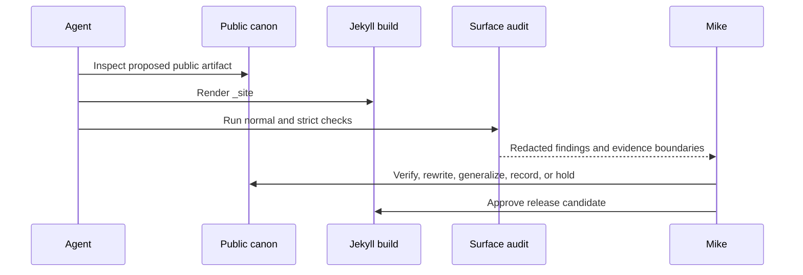

# Public Surface Audit Agent Guide

Use `ruby bin/audit_public_surface.rb` before changing public personal history,
archive metadata, transcripts, or generated site surfaces.

## Agent sequence



Agents must not treat a regex match as proof of a violation, and must not treat
a clean report as proof that no privacy concern exists. Explain each high-risk
finding in plain language. Keep `tmp/public-surface-audit/` local.

## Capability contract

The tool supports text and JSON reports, a strict gate, local decisions, a man
page, and generated Bash and Zsh completion definitions:

```sh
ruby bin/audit_public_surface.rb --help
ruby bin/audit_public_surface.rb --completion bash
```
