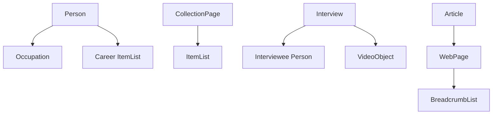



# Semantic Graph Snapshot

Snapshot generated from rendered `_site` JSON-LD artifacts.

- Generated at (graph): `2026-02-12T01:07:36Z`
- Generated at (coverage): `2026-02-12T01:07:28Z`
- Nodes: `1559`
- Edges: `1760`
- Connected components: `588`
- Isolated nodes: `583`
- Unresolved references: `434`

## Typed Nodes

| Type | Count |
|---|---:|
| `Article` | 4 |
| `BreadcrumbList` | 583 |
| `CollectionPage` | 4 |
| `Interview` | 258 |
| `Person` | 1 |
| `VideoObject` | 275 |

## Pages With Type

| Type | Pages |
|---|---:|
| `Article` | 4 |
| `BreadcrumbList` | 583 |
| `CollectionPage` | 4 |
| `Interview` | 258 |
| `Person` | 2 |
| `VideoObject` | 275 |

## Route Contracts

### `/`
- `person_has_career_item_list`: `true`
- `person_json_ld_count`: `1`
- `person_required_fields_non_placeholder`: `true`
- `person_required_fields_present`: `true`

### `/home/`
- `person_absent`: `true`
- `person_json_ld_count`: `0`

### `interviews/index.html`
- `has_breadcrumb_list`: `true`
- `has_collection_page`: `true`

### `oneoffs/index.html`
- `has_breadcrumb_list`: `true`
- `has_collection_page`: `true`

### `scmc/index.html`
- `has_breadcrumb_list`: `true`
- `has_collection_page`: `true`

### `videos/index.html`
- `has_breadcrumb_list`: `true`
- `has_collection_page`: `true`

## Sample Orphan Nodes

- `anon:2012/09/26/360-learning-at-user-groups.html#2.2`
- `anon:2015/02/25/improve-case-insensitive-queries-in-postgres-using-smarter-indexes.html#2.4`
- `anon:2015/02/25/using-postgres-regex-expressions-to-find-very-specific-matches.html#2.6`
- `anon:2015/04/27/leverage-the-j-in-jruby-for-powerful-concurrency.html#2.8`
- `anon:about/index.html#1.9`
- `anon:contact/index.html#1.10`
- `anon:docs/architecture/content-pipeline.html#1.11`
- `anon:docs/architecture/overview.html#1.12`
- `anon:docs/architecture/semantic-graph.html#1.13`
- `anon:docs/architecture/semantic-model.html#1.14`
- `anon:docs/architecture/styling-system.html#1.15`
- `anon:docs/archive-philosophy/index.html#1.16`
- `anon:docs/domain-migration.html#1.17`
- `anon:docs/index.html#1.18`
- `anon:docs/interview-data-model.html#1.19`
- `anon:docs/pipeline-grammar/index.html#1.20`
- `anon:docs/retrospectives/index.html#1.21`
- `anon:docs/tasks.html#1.22`
- `anon:docs/taxonomy/index.html#1.23`
- `anon:home/index.html#1.24`

## Sample Unresolved References

- `https://www.just3ws.com/`
- `https://www.just3ws.com/2012/09/26/360-learning-at-user-groups.html`
- `https://www.just3ws.com/2015/02/25/improve-case-insensitive-queries-in-postgres-using-smarter-indexes.html`
- `https://www.just3ws.com/2015/02/25/using-postgres-regex-expressions-to-find-very-specific-matches.html`
- `https://www.just3ws.com/2015/04/27/leverage-the-j-in-jruby-for-powerful-concurrency.html`
- `https://www.just3ws.com/id/community/anglebracket`
- `https://www.just3ws.com/id/community/chicago-software-craftsmanship`
- `https://www.just3ws.com/id/community/chipy`
- `https://www.just3ws.com/id/community/gathers-us-and-chicagodb`
- `https://www.just3ws.com/id/community/geekfest`
- `https://www.just3ws.com/id/community/general`
- `https://www.just3ws.com/id/community/goto-conference-and-community`
- `https://www.just3ws.com/id/community/lake-county-net-user-group-lcnug`
- `https://www.just3ws.com/id/community/refresh-chicago`
- `https://www.just3ws.com/id/conference/chicagowebconf-2012`
- `https://www.just3ws.com/id/conference/goto-conference-2013`
- `https://www.just3ws.com/id/conference/goto-conference-2014`
- `https://www.just3ws.com/id/conference/goto-conference-2015`
- `https://www.just3ws.com/id/conference/railsconf-2014`
- `https://www.just3ws.com/id/conference/scna-2011`

## Artifacts

- `tmp/schema-graph.dot`
- `tmp/schema-graph-summary.json`
- `tmp/schema-coverage-report.json`
