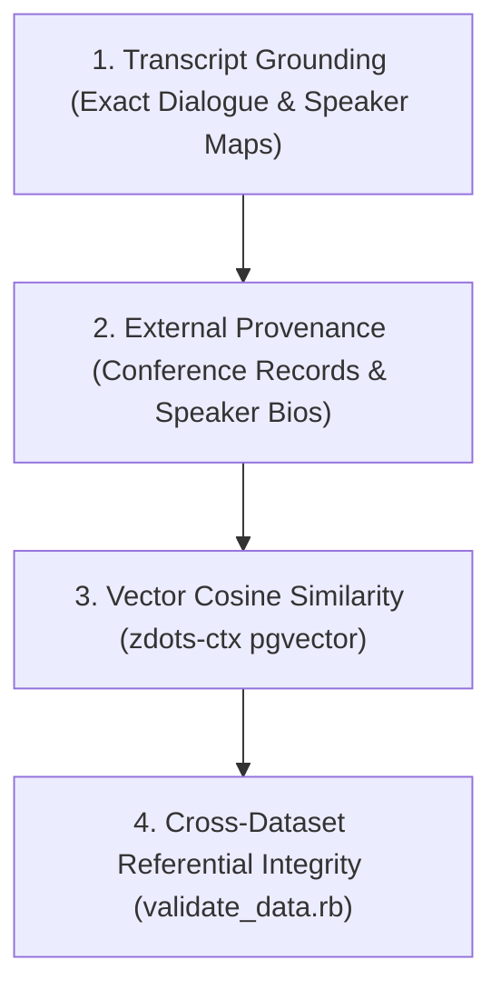

# Archival Deep Research & Historical Insights Strategy (2009–2026 Canon)

## Executive Summary

The **UGtastic Oral History Archive** represents a unique, high-value 17-year canon spanning **207 developer interviews (~456,000 words)**. Recorded by Mike Hall between 2009 and 2026, this dataset captures the foundational evolution of modern software engineering: the rise of Software Craftsmanship, the TDD movement, early .NET open source, the Ruby on Rails ecosystem explosion, Continuous Delivery, and modern polyglot/AI systems.

This strategy document outlines our methodology for conducting deep archival research, entity profiling, historical contextualization, and derivative content synthesis.

---

## 1. Archival Movements & Historical Eras

### Era 1: The Early Blogging & .NET Era (2009–2010)
- **Key Themes:** Dynamic Language Runtime (DLR), IronRuby, ASP.NET MVC skinning, early developer podcasts, and HTTP module customization.
- **Key Figures:** Shay Friedman, Brian Hogan, Jeff Hardy, Scott Seely, Clark Sell, Pat Paasch.
- **Key Communities:** Chicago ALT.NET, Lake County .NET User Group (LCNUG), Refresh Chicago.
- **Historical Significance:** Documented the migration of Microsoft developers toward open-source principles, TDD, and dynamic scripting languages.

### Era 2: The Software Craftsmanship Dawn (2011–2012)
- **Key Themes:** Software Craftsmanship North America (SCNA), apprenticeship models, clean architecture, CodeRetreat, unit testing discipline.
- **Key Figures:** Micah Martin, Paul Pagel, Robert C. Martin (Uncle Bob), Sandro Mancuso, Corey Haines, Ray Hightower, Justin Searls, Leon Gersing.
- **Key Communities & Events:** SCNA (Libertyville / Chicago), ChicagoRuby, WindyCityRails, ChicagoWebConf.
- **Historical Significance:** Codified professional software standards, mentorship models, and the 5K run / Jeopardy traditions that defined SCNA culture.

### Era 3: SCNA & Community Scaling (2013)
- **Key Themes:** 24-month user group playbook, conference organization mechanics, front-end craftsmanship, empathetic leadership.
- **Key Figures:** Angelique Martin, Sarah Gray, Stuart Halloway, Jason Cranford Teague, Jennifer Jones, Billy Whited.
- **Key Communities & Events:** SCNA 2013, WebVisions 2013.
- **Historical Significance:** Captured behind-the-scenes event logistics, speaker curation conflicts, and the transition from desktop/web to mobile-first architectures.

### Era 4: The Rails Boom & GOTO Chicago (2014)
- **Key Themes:** Continuous Delivery, Lean manufacturing in software, Ruby on Rails 4, static security analysis, log aggregation, graph databases.
- **Key Figures:** Jez Humble, Obie Fernandez, Rich Hickey, Justin Collins (Brakeman), Kiyoto Tamura (Fluentd), Rafael França, Tim Bray, Michael T. Nygard.
- **Key Communities & Events:** RailsConf 2014 (Chicago), GOTO Chicago 2014.
- **Historical Significance:** The peak polyglot era—linking Lean manufacturing principles (Jez Humble) with modern open-source tool maintainers (Brakeman, Fluentd, Ember.js).

### Era 5: Polyglot Architecture & Modern AI (2015–2026)
- **Key Themes:** Jepsen distributed systems testing, V8 engine internals, C# language evolution, AI-augmented developer pairing and vector search.
- **Key Figures:** Kyle Kingsbury (Aphyr), Vyacheslav Egorov, Mads Torgersen, Trisha Gee, Justin Meyer, Rebeca Parsons.
- **Key Communities & Events:** GOTO Chicago 2015, modern personal OS / zdots AI pairing workflows.
- **Historical Significance:** Tracing the trajectory from early manual unit tests to automated distributed correctness and LLM-assisted pair programming.

---

## 2. Research Methodologies & Verification Standards

To maintain historical fidelity across all 207 interviews and derivative artifacts, all research follows a strict 4-tier verification workflow:



1. **Transcript Grounding:** All statements and quotes are verified directly against canonical turn YAMLs in `_data/transcripts/`.
2. **External Provenance:** Speaker roles, organization affiliations, and event dates are cross-referenced with public archives (SCNA 2008–2013, ChicagoRuby, RailsConf, GOTO Conference records).
3. **Vector Cosine Similarity:** Semantic topic relationships are calculated using `zdots-ctx` pgvector embeddings over `postgresql:///my`.
4. **Referential Integrity:** Validated via `bundle exec rake validate:data_uniqueness validate:data_integrity`.

---

## 3. Deep Entity Profiles

### Profile 1: Jez Humble (Lean & Continuous Delivery)
- **Conference:** GOTO Chicago 2014
- **Key Insight:** *"Lean is not about cutting costs. Lean is about reducing waste."*
- **Context:** Discussed how organizations misinterpret Lean principles as cost-reduction mandates rather than focusing on lead time reduction, psychological safety, and continuous delivery feedback loops.

### Profile 2: Robert C. Martin / Uncle Bob (Software Craftsmanship & Architecture)
- **Conference:** SCNA 2012 / Vimeo 30083598
- **Key Insight:** *"Architecture is about intent. Software architectures are frameworks that allow your application to defer decisions."*
- **Context:** Championed the Software Craftsmanship manifesto, clean architecture, and the necessity of rigorous unit testing as a professional ethical obligation.

### Profile 3: Obie Fernandez (The Rails Way & Hashrocket)
- **Conference:** RailsConf 2014 Chicago
- **Key Insight:** *"Opinionated frameworks win because they eliminate decision fatigue for pragmatic engineering teams."*
- **Context:** Detailed the early days of Hashrocket, writing *The Rails Way*, and building high-velocity consulting practices on top of Ruby on Rails.

### Profile 4: Justin Collins (Brakeman & Static Security Analysis)
- **Conference:** RailsConf 2014 Chicago
- **Key Insight:** *"Security tooling must integrate into CI without blocking developer flow."*
- **Context:** Created Brakeman, the canonical static security scanner for Ruby on Rails, demonstrating how developer-first security tools prevent vulnerabilities before production deployment.

---

## 4. Derivative Content Production & Remix Roadmap

```
+-----------------------------------------------------------------------------------+
|                        UGTASTIC CONTENT DERIVATIVE MATRIX                         |
+-----------------------------------------------------------------------------------+
| Format              | Target Platform        | Pipeline Tool / Output             |
+---------------------+------------------------+------------------------------------+
| WebVTT Captions     | YouTube Closed Caption | bin/export_subtitles.rb            |
| YouTube Shorts      | YouTube Shorts / Reels | bin/generate_content_studio.rb     |
| Interactive Graph   | /taxonomy/             | bin/generate_knowledge_graph.rb    |
| Era Scrubber        | /timeline/             | bin/generate_timeline_data.rb      |
| Speaker Matrix      | /speakers/             | bin/generate_speakers_data.rb      |
| Instant Search      | /ask/                  | _data/archive_intelligence.json   |
| Editorial Remix Lab | /studio/               | studio/index.html                  |
+-----------------------------------------------------------------------------------+
```

---

## 5. Next Execution Steps

1. **Continuous Daemon:** Keep `bundle exec rake transcript:daemon` active in background.
2. **YouTube Subtitle Upload:** Run `ruby bin/sync_youtube_captions.rb --upload` when YouTube API OAuth token is configured.
3. **Editorial Publishing:** Publish long-form articles generated in `/studio/` to `/writing/`.
