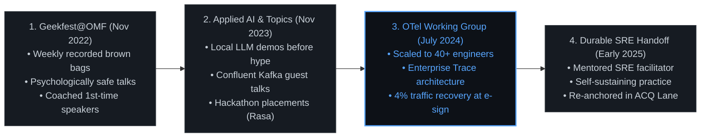
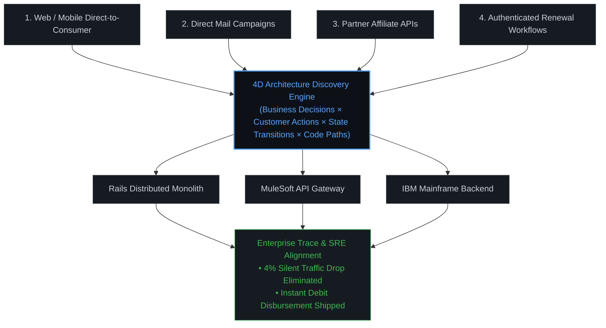

# The "Drop-In" Engineering Ethos: 20-Year Career Narrative & Community Architecture

## 1. The Core Ethos: Skater Grit & "Dropping In" on Systems

In skateboarding, dropping in on concrete requires complete commitment: you cannot hesitate on the coping, make excuses about the steepness of the transition, or second-guess your footing. You stomp your front foot, lean into the slope, trust your balance and muscle memory, take the slams when they happen, dust off your elbows, and carve the line clean.

In software engineering, Mike Hall operates by that exact discipline:

* **No Coping Hesitation:** When handed a 15-year-old tangled distributed monolith, missing documentation trails, or multi-million-dollar silent production failures, he does not freeze or write 40-page theoretical slide decks. He drops straight into the runtime chaos, maps the terrain under his feet, and establishes safety for the rest of the team.
* **Resilience Under High Entropy:** High-consequence legacy systems carry scar tissue from years of corporate reorganizations and technical debt. Navigating them requires grit, empirical evidence, and fearlessness in the face of ambiguity.
* **Legibility Over Concealment:** Solving dark system failures is not about heroics: it is about illuminating the execution paths, instrumenting boundaries, and turning opaque failure modes into deterministic, observable signals.

---

## 2. The Discipline: Building High-Trust Community Wherever You Operate

Technical mastery alone does not transform organizations. Mike has paired deep
individual technical execution with a continuous practice of founding and
nurturing open, high-trust engineering communities:

| Era / Company | Community & Enablement Initiative | Impact & Durability |
| :--- | :--- | :--- |
| **2009–2010 (Chicago Roots)** | Founded **Software Craftsmanship McHenry County (SCMC)** & McHenry County Cloud Developers; organized for **Chicago Code Camp** and **Chicago Alt.NET**. | Built regional grassroots developer communities centered on TDD, software craftsmanship, and continuous learning. |
| **2011–2013 (Groupon / Obtiva)** | Talent Development Business Partner for Engineering & Senior IC. | Redesigned technical onboarding curricula, mentored junior engineers, and bridged technical execution with management training during hyper-growth. |
| **2022–2023 (OneMain Financial: Year 1)** | Founded & Coordinated **Geekfest@OMF**. | Hosted and recorded weekly open brown-bag sessions across the enterprise for 1 year straight; introduced local LLMs, Go, deep Rails debugging, and coached first-time speakers. |
| **2024–2025 (OneMain Financial: Years 2–3)** | Founded & Led the **OpenTelemetry Working Group**. | Scaled voluntary weekly attendance to 40+ engineers across the organization; aligned monitoring, SRE, Cybersecurity, and Incident Command around distributed tracing, recovering 4% dropped origination traffic. |
| **2025 (OneMain Financial: Handoff)** | Sustainable SRE Transition. | Coached and mentored an SRE engineer over 6 months to assume permanent operational facilitation, establishing a durable practice while pivoting back to Acquisition Lane architecture. |
| **2026 (Local-First AI Era)** | Local AI Orchestration & CareerOS Platform. | Building open, deterministic agent runtimes, semantic career datalakes, and privacy-conscious local developer tooling. |

---

## 3. The 3-Year OneMain Transformation Arc





### Key Milestones Recovered from Historical Archives
1. **Geekfest Inception (Nov 1, 2022):** Weekly forum designed to dismantle engineering silos and create psychological safety for peers and contractors. Dedicated sessions coached junior engineers through their first technical talks.
2. **Applied AI & Hackathon Placement:** Placed in two enterprise hackathons, building conversational agents with **Rasa** and a schema-inference prototype with a small team. Demonstrated local LLMs and prompt engineering before commercial enterprise tooling was widely available.
3. **The "Panoramic View" Virtuous Loop:** Connected Product, QA, Application Engineering, Analytics, EMC, and SRE into a closed feedback loop: simulating business scenarios in lower environments, validating alerts, and feeding real-time trace context to Incident Command.
4. **Platform Stewardship Warning:** Authored the architectural warning framework when vertical lanes threatened shared horizontal platforms, designing the two-tier "Internal Open Source" and "Implementation Service" models.
5. **Durable Handoff:** Engineered the OTel WG so that it was never contingent on a single individual, successfully transitioning leadership to SRE.

### The Modernization Lesson

Mike's retrospective recollection of the OMF Tech ELT presentation, recorded
November 20, 2025, is direct:

> “Fix what’s broken, upgrade the stuff that works, and stabilize the system to allow change. That is the real path to modernization.”

The recollection refers to the presentation. A May 15, 2025 record independently
confirms the event and its substance. This is Mike's quote, preserved as a later
recollection rather than rewritten as an artificial slogan.

The related framing is:

> “Innovation is repairing broken systems so they can be understood, improved, and moved forward.”

This is a faithful recollection and synthesis of the idea. The related modernization synthesis is a loop:

```text
Stabilize → Understand → Improve → Measure again → Increase confidence → Enable safer change
```

Each step has a gate. Stabilize restores enough signal to investigate. Understand
maps customer journeys, dependencies, ownership, and runtime behavior. Improve
applies a bounded intervention. Measure again checks the result against reality.
Increased confidence becomes shared documentation and ownership. That evidence
defines what can be changed safely next.

This is why modernization is not synonymous with replacement. It is the
disciplined creation of conditions in which systems can be safely changed.

The public case-study evidence follows four linked interventions: Geekfest@OMF
made shared technical learning routine; ACQ mapping and the Inventory, Evaluate,
and Address loop improved confidence in customer journeys and event data; the
OpenTelemetry Working Group created a common model of behavior across
heterogeneous systems; and the Rails remediation path used that understanding
to support safer change. The result is a repeatable operating model, not a tool
adoption story.

---

## 4. The Staff+/Principal Value Proposition

When hiring managers, VP of Engineering, or Chief Architects evaluate Mike Hall, this is the distilled signal:

1. **You make the dark legible:** Turning multi-service opaque legacy systems into observable, testable, and maintainable architectures.
2. **You build high-trust culture from the ground up:** Establishing voluntary, high-engagement communities of practice that raise the technical baseline of the entire organization.
3. **You build for durability:** Designing systems, documentation, and working groups that thrive long after the initial handoff.
4. **You drop in with grit:** Bringing authentic courage, hands-on depth, and zero pretense to the hardest technical problems in the enterprise.
