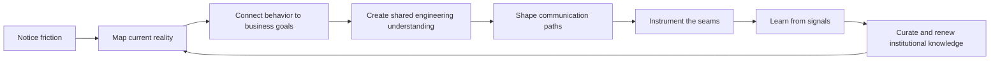
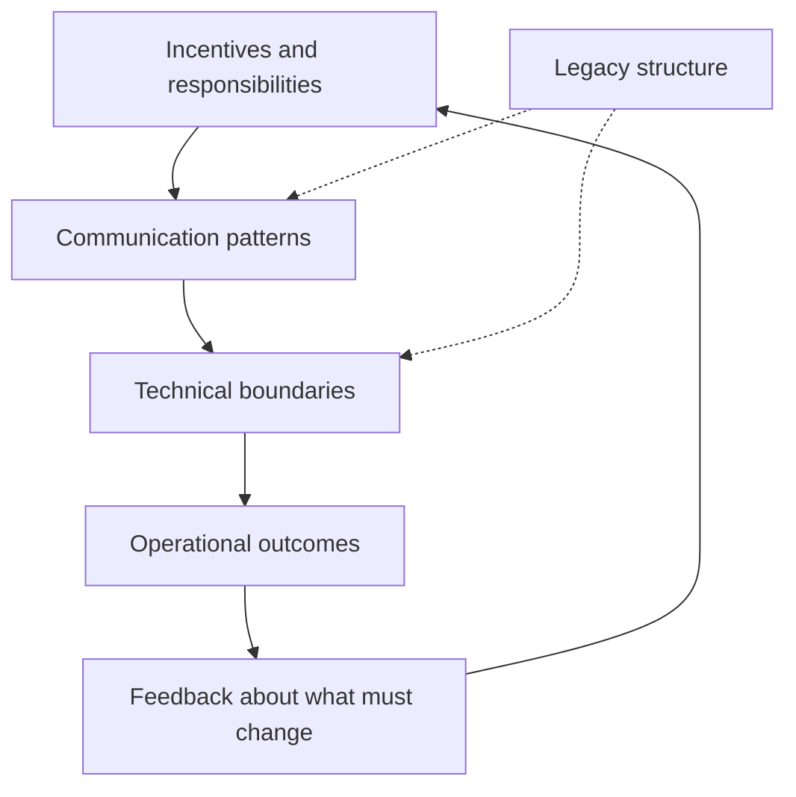
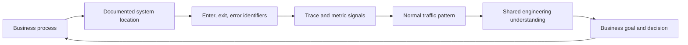
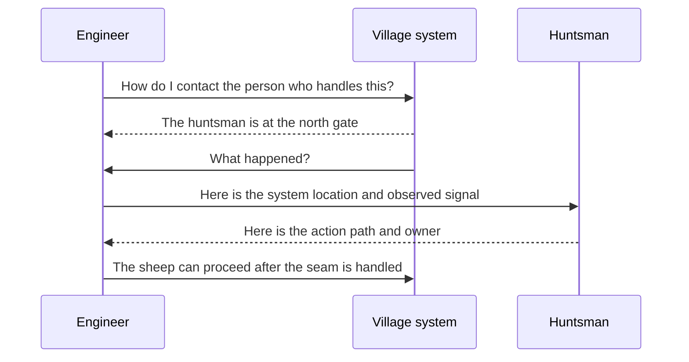
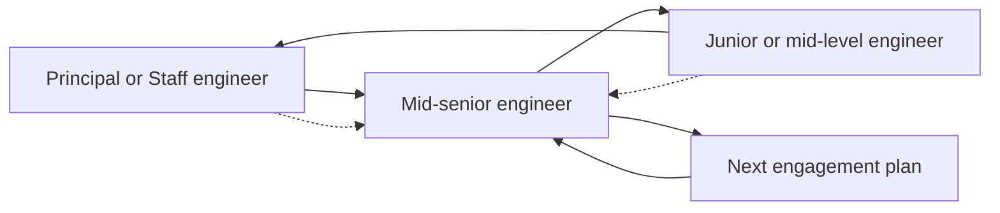
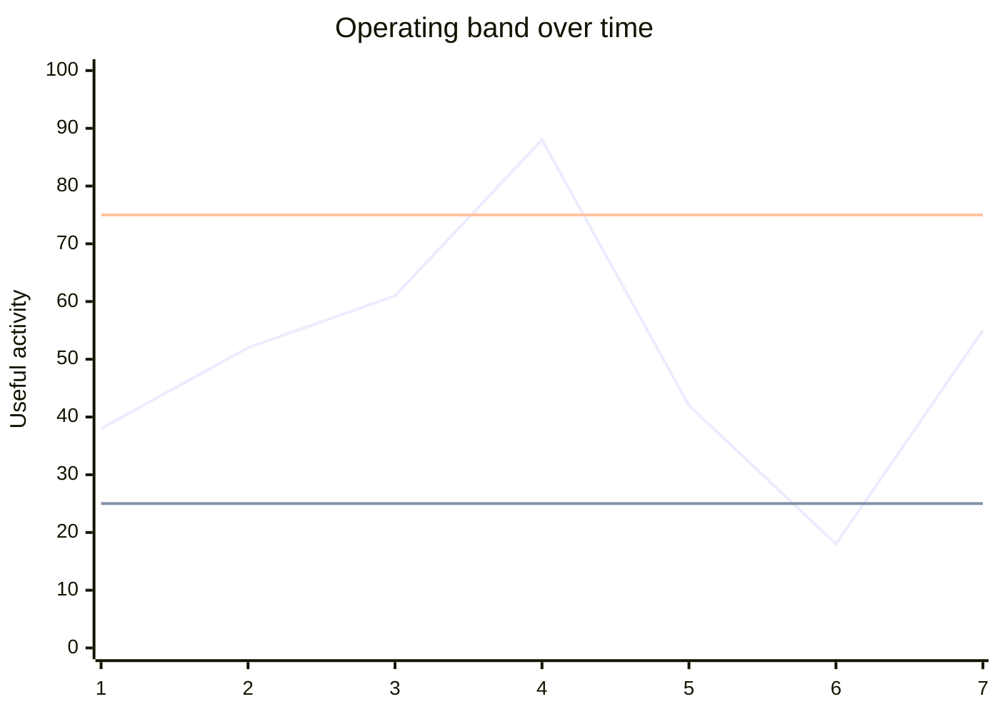
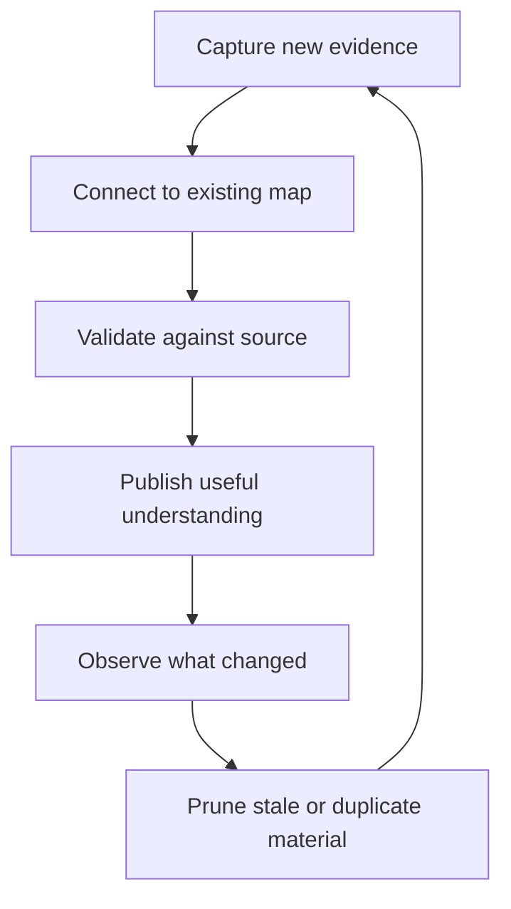
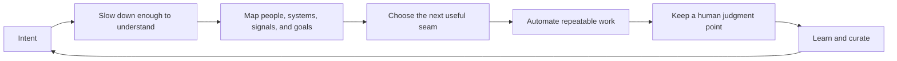

# Content Sequence: Human Systems and Sustainable Engineering

This sequence explains a practical engineering discipline for organizations in
transition. The central claim is simple: technical systems and human systems
both need clear boundaries, useful signals, feedback, ownership, and care over
time.

The sequence should help a reader move from a familiar failure mode to a useful
operating model:

## The organizing thesis

Principal and Staff engineering work includes programming the coordination
system around the software. That system includes incentives, decision paths,
communication channels, shared vocabulary, technical boundaries, and the
people who carry context between them.

The goal is not maximum activity. The goal is the right amount of useful
activity inside a healthy operating band. An SLO should reveal both overload
and underload. A system can run too hot, too cold, or within its target zone.

The same principle applies to collaboration. Too much process creates drag. Too
little structure hides important work. The right model gives people enough
clarity to act and enough slack to think, inspect, and adjust.

## Voice and shape

The writing should sound like a person thinking carefully in public. Mike's
digressions are not noise to strip away. They often contain the evidence that
leads to the principle.

Use this rhythm:

1. Start with a concrete thing: a sticker, a train ride, a laptop, a system
   signal, or a conversation.
2. Follow the association when it reveals how the idea was learned.
3. Mark the turn plainly: “I digress,” “Here is the part that matters,” or
   “What I was learning was...”
4. Land the paragraph on one useful claim.
5. Give the reader a map, diagram, or question before moving on.

The editor's job is to make the path visible, not to flatten the voice into a
polished executive summary. Keep the first-person account where it carries
earned authority. Shorten repeated clauses. Preserve the surprising detail.
Name the system principle only after the reader has seen it in the field.

A possible opening for the first article:

> I got the sticker at Geekfest. Corey Haines was handing them out at the
> Obtiva office, and I put mine on a Dell Studio XPS laptop. This was the Battle
> Vest era of community stickers. With the lid up, you were telling the room a
> lot about yourself to anyone who had eyes to read.
>
> I had come in from
> Crystal Lake, where I lived near the train station, because I had optimized my
> life around working in Chicago. Working in the Loop felt like making it.
>
> I was commuting to Evanston every day for the Leapfrog Marketing engagement.
> That was not a trivial commute. I digress, because the commute is part of the
> lesson. I was already spending a lot of energy getting to the place where the
> work happened. Then Corey gave me a sentence that stayed with me: typing was
> never the bottleneck.
>
> I did not understand the full size of that sentence yet. I understand it now.
> The hard part is not producing keystrokes. The hard part is deciding what
> should happen, making the decision understandable to someone else, and
> building a system that can keep carrying the decision after you leave.

This opening gives the reader the human scene, the digression, the remembered
line, and the thesis. The later articles can use the same pattern with a field
event from ACQ Mapping, OTel WG, mentorship, incident review, or migration work.

## Recommended article sequence

### 1. Typing Was Never the Bottleneck

**Purpose:** Establish the human starting point.

**Anchor:** A sticker from Corey Haines at the Obtiva office during Geekfest.
Mike had traveled daily from Crystal Lake to Evanston while working on the
Leapfrog Marketing engagement. The sticker went onto a Dell Studio XPS laptop
running Windows Server during the transition to Windows 7.

This was the Battle Vest era of community laptop stickers. With the lid up, a
speaker was telling the room a great deal about their tools, affiliations,
values, and interests. People who knew how to read those signals could find
one another before the conversation began. The laptop was part workstation and
part social map.

**Lesson:** Tools do not remove the need for judgment. Faster typing does not
solve unclear intent, missing context, poor feedback, or a system nobody can
maintain.

**Open question:** Add the sticker photograph when it is found.

**Connects to:** AI-assisted development, deliberate pacing, and the painted
rock orienteering metaphor.

### 2. The Organization Is Part of the System

**Purpose:** Introduce Conway's Law as an operating observation.

**Lesson:** Communication patterns appear in system boundaries. When an
organization changes, older boundaries can preserve a communication structure
that no longer matches the desired way of working.

**Key distinction:** The resulting dysfunction does not mean that intelligent
people stopped caring or stopped doing good work. It can mean that the system
still encodes an earlier incentive structure.

**Diagram:**

### 3. Reverse Conway Is a Map, Not a Mandate

**Purpose:** Explain how to move from the current system to a desired one.

**Lesson:** A Reverse Conway Maneuver is useful when it expresses a clear
target communication structure. It cannot, by itself, resolve conflicting
incentives, inherited responsibilities, or the Iron Law of Bureaucracy.

**Practical sequence:**

1. Describe the current communication and ownership map.
2. Describe the desired business and technical outcome.
3. Name the gaps between them.
4. Create interval steps that allow people to learn the new model.
5. Review the map as incentives and responsibilities change.

### 4. From Current State to Shared Engineering Understanding

**Purpose:** Make system mapping concrete.

**Lesson:** A useful map connects documented system locations to observable
behavior and business meaning. ACQ Mapping provides the model: identify where a
known process enters, exits, or errors, then connect those identifiers to traces,
metrics, and coordinated sequences across system boundaries.

This is stronger than watching isolated metrics. It lets a team describe the
normal sequence of a process, compare the current state with the target state,
and make the consequences visible to people outside engineering.

### 5. Ask for the Huntsman

**Purpose:** Show how to translate an engineering warning into action.

**Anchor:** The continuation of “The Boy Who Told the Truth.” Instead of
declaring that a wolf has appeared, ask how to contact the local huntsman. The
question creates a location in the village's operating system. It gives people
who understand the village a way to help.

**Lesson:** Translate the concern into the other group's map. Product and
marketing teams often reason from uncertain outcomes and customer behavior.
Engineering often reasons from concrete system evidence. The bridge is a shared
question connected to a place, owner, or process.

### 6. Build the Human Communication Layer

**Purpose:** Present the operating models from mentorship, OTel WG, ACQ
Enablement, and Communities of Practice.

**Lesson:** Delegation is not disappearance. It is an explicit communication
design with interfaces, ownership, feedback, and a handoff path.

**Models to cover:**

- Iterative mentorship relay: the junior or mid-level engineer teaches the
  coach back under the senior engineer's supervision. This validates whether
  the original coaching arrived intact.
- SME delegation: named people represent slices of team interest in related
  communities and return useful context to the team.
- Community durability: roles such as meeting facilitation, coordination, and
  reporting move into the community before the original organizer steps away.

### 7. Instrument the Seam Before You Strangle the Monolith

**Purpose:** Connect AOP, OpenTelemetry, and the Strangler Fig pattern.

**Lesson:** Before extracting a subsystem, instrument the intersection between
the legacy path and the proposed replacement. Use enter, exit, and error events
to establish the baseline. Then compare the delta as traffic moves to the new
path.

**Outcome:** The team owns factual knowledge about service behavior that maps
to a business process. It can evaluate whether the new path is better, worse,
or simply different before completing the handoff.

### 8. Operate Inside the Right Band

**Purpose:** Expand the SLO idea beyond one red line.

**Lesson:** A healthy operating model has an upper threshold, a lower threshold,
and a target zone.

The low period is not automatically healthy. It may indicate reduced demand,
a broken producer, stalled workers, a routing failure, or missing telemetry.
The high period may indicate overload. Both conditions deserve questions.

### 9. Make the Best Outcome Financially Legible

**Purpose:** Connect engineering choices to durable business value.

**Lesson:** A technical map becomes useful to the business when it shows the
cost, risk, timing, and options associated with each path.

The article should compare choices such as continued maintenance, targeted
extraction, platform investment, and full replacement. The comparison should
include operational risk, learning value, migration cost, staffing needs, and
reversibility. The best outcome is not always the most ambitious architecture.
It is the path that creates the strongest durable result for the investment.

### 10. Keep the Corpus Evergreen

**Purpose:** Describe institutional knowledge as maintained infrastructure.

**Lesson:** Year-over-year knowledge work needs a renewal loop. New information
must be captured, connected to existing knowledge, checked against primary
sources, and curated so the corpus stays useful.

“Bonsai prune the corpus” is the image: remove dead growth, preserve the shape,
and keep making room for new growth. AI can make discovery, comparison,
classification, and drafting more accessible. A human still supplies intent,
judgment, boundaries, and the decision to change the system.

## The complete reader journey

The sequence should close by returning to the original sticker. Typing was
never the bottleneck. The bottleneck was the distance between intent and shared
understanding. The work is to build humane mechanisms that let people slow
down, inspect the map, make a judgment, and then let automation carry the
repeatable parts.

## Editorial production plan

Publish the hub first, then release one article per week. Each article should
link forward to the next step and backward to the map that made it possible.
Use the personal story as the opening or closing frame, not as decoration.

For each article, retain four artifacts:

1. A short field story.
2. A plain-language model.
3. One diagram that can stand alone in a shared post.
4. A practical question or checklist a team can use next week.

The resulting body of work can support the consulting offering: building
internal technical communities, mentoring systems, durable ownership models,
observability seams, and knowledge practices that remain useful after the
original organizer moves on.
