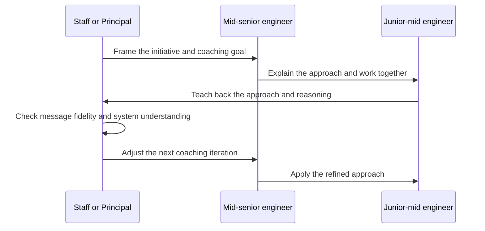
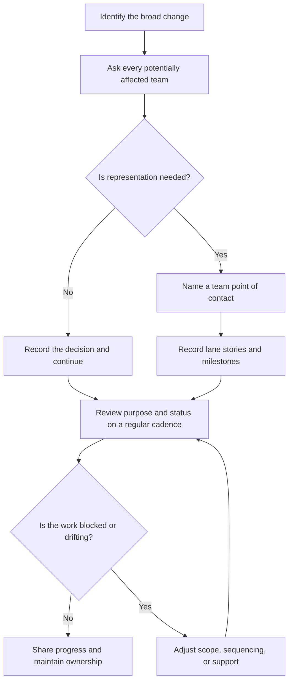
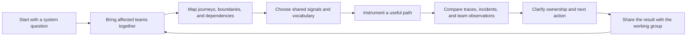
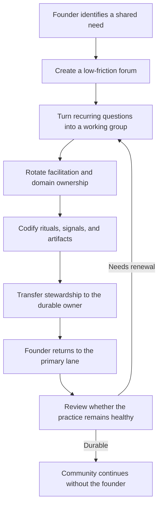
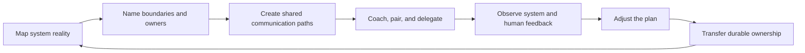
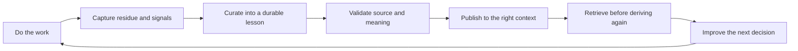

# Field Lessons: Engineering Principles in Practice

This plan turns recurring engineering principles from Mike Hall's archive into
material lessons from the field. It is an editorial plan, not a claim that all
listed pieces are written or publication-ready.

## Editorial thesis

Principal engineering includes designing the communication system around the
software. The work involves mapping reality, naming owners, creating feedback
paths, validating shared understanding, and transferring responsibility without
losing context.

The central lesson is:

> Build the human communication layer with the same care as the technical
> layer: clear interfaces, distributed ownership, useful signals, and durable
> handoffs.

The deeper systems principle is reciprocal causality: cause becomes effect, and
effect becomes the next cause. An organization's communication patterns shape
the systems it builds. Those systems then constrain and redirect the next set
of conversations. A useful intervention changes both sides of that loop and
observes what the new relationship produces.

## Audience and goals

The primary audience is Staff and Principal engineers, engineering managers,
technical leads, and people responsible for changing mature systems. The
secondary audience is engineers learning how to mentor, coordinate, and create
communities without becoming a permanent bottleneck.

The program should:

- make invisible Staff+ work legible;
- give practitioners language for coordination problems they already feel;
- connect technical mechanisms to human outcomes;
- create searchable guidance and shareable field stories;
- preserve a clear boundary between public evidence and private context.

## Content pillars

### 1. Mentorship as a feedback system

This pillar explains mentorship as mutual learning, teach-back, and progressive
ownership. The key insight is the mentorship relay: a Principal or Staff
engineer coaches a mid-senior engineer, observes their work with a junior-mid
engineer, and uses the junior engineer's explanation of the lesson as a signal
about whether the message arrived intact.



The teach-back is a signal, not an exam. It reveals where context was lost and
gives the three people a concrete starting point for the next iteration.

### 2. Communication architecture for organizational change

This pillar covers team boundaries, SMEs, named points of contact, milestone
tables, office hours, and non-punitive review cadences. It explains how to
distribute context and cognitive load when several teams must change together.



The loop keeps a change visible across backlogs. Its purpose is coordination
and support, not surveillance.

### 3. Observability as shared understanding

This pillar treats OpenTelemetry and system mapping as ways to create technical
conversation. It shows how teams discover dependencies, clarify ownership, and
make hidden problems discussable before full observability exists.



The first useful output may be a better question or a newly visible dependency.
Complete coverage is not required before the feedback loop starts producing
value.

### 4. Durable systems and durable communities

This pillar connects legacy modernization, Conway's Law, Reverse Conway, team
topology, community lifecycle, and ownership handoff. It focuses on changing
from a current state to a target state through workable intermediate steps.



Durability is demonstrated by continued participation, clear ownership, and
useful outcomes after the founding engineer steps back.

## Hub and spoke map

```text
HUB: Programming the Human Communication Layer
|
|-- Mentorship relay: teach, observe, teach back, adjust
|-- Coordination loop: map teams, name owners, review signals, unblock
|-- System legibility: map journeys, state, dependencies, and boundaries
|-- Observability conversation: instrument, compare, learn, standardize
|-- Durable handoff: grow stewards, codify rituals, transfer ownership
|-- Organizational topology: align communication patterns with system shape
```

The hub should be written last as a synthesis. The concrete field lessons come
first and provide its evidence.

## Combined operating model

The four pillars form one control loop. System discovery supplies evidence.
Communication design routes the evidence. Mentorship and communities grow the
people who can act on it. Handoff makes the change durable.



The loop applies to technical principals, event-driven systems, domain
boundaries, incident review, security work, governance, and Communities of
Practice. The domain changes. The operating pattern remains recognizable.

## Inspiration inbox: additional lesson candidates

The private inspiration inbox adds a useful companion thread. It describes the
same engineering discipline at the level of knowledge systems: capture a signal,
curate it, validate it, make it retrievable, and use the result to improve the
next decision. These are source ideas, not public claims. They should be rewritten
from Mike's field evidence before publication.

### 5. Knowledge systems as feedback systems

This pillar connects the human communication layer to the tools that preserve
context between sessions, teams, and organizational changes.



The important design choice is the curation gate. Raw capture is valuable because
it preserves evidence, but raw material is not automatically useful context. A
lesson becomes durable when its source, scope, and meaning are clear enough for
another person to retrieve and apply.

### Additional article candidates

| Priority | Working title | Format | Core lesson | Diagram | Publication note |
| --- | --- | --- | --- | --- | --- |
| P0 | **Retrieve Before You Derive** | Field lesson | Re-deriving a solved answer is a coordination failure. Search and provenance are part of engineering work. | Retrieval loop | Use public archive examples and avoid private system details. |
| P0 | **The Curation Gate** | Practical guide | Capture quickly, curate deliberately, and keep raw residue separate from trusted context. | Work to lesson pipeline | Strong bridge between AI-assisted work and ordinary incident or design practice. |
| P1 | **Make the Negative Path Visible** | Observability essay | No-op paths, empty results, fallbacks, and absence are signals that ordinary success metrics omit. | Positive and negative activity paths | Connect to entry, exit, and error without claiming complete coverage. |
| P1 | **When a Bug Is a Load-Bearing Constraint** | Legacy systems essay | An awkward asymmetry may encode a business, regulatory, or operational invariant. Preserve the reason before simplifying the code. | Constraint discovery flow | Pair with the Strangler Fig article as a pre-extraction safety check. |
| P1 | **The Metric Needs a Question** | Measurement guide | A number without a definition, denominator, or date is not yet evidence. | Metric provenance chain | Natural companion to baseline normal and delta measurement. |
| P1 | **Mechanize the Convention** | Engineering systems guide | Every rule enforced only by attention is a bus-factor risk. Generators and validators transfer knowledge into the system. | Convention to validation pipeline | Keep examples generic and grounded in public tooling patterns. |
| P2 | **Feedback at the Page Boundary** | Architecture note | Corrections should attach to the thing being corrected and flow back to the authoritative source. | Source, projection, feedback loop | Useful bridge between documentation, search, and operational systems. |
| P2 | **Local Environment Parity Is Part of the Product** | Short essay | A workflow cannot be trusted when the documented toolchain and the runnable environment disagree. | Source to runtime parity map | Position as a field observation, not a platform advertisement. |

These candidates extend the existing plan rather than creating a separate AI
content track. The strongest sequence is to publish the human operating model,
show it in migration and community cases, then use knowledge-system lessons to
explain how the practice remains durable between interactions.

### Diagram and validation requirements

Every lesson with a process claim should include one small diagram that shows
the sequence, ownership, or feedback relationship. The source diagram remains
plain Mermaid in Markdown so it is reviewable. The site renders it for readers,
while retaining readable source text if client-side rendering is unavailable.

Before publication:

1. Check that the diagram has one clear purpose and no unexplained actor.
2. Verify Mermaid syntax during the site build or browser smoke check.
3. Confirm the prose explains the diagram instead of repeating every node.
4. Run Markdown, YAML, prose, and link validation on the changed surface.

## Priority lesson backlog

| Priority | Working title | Audience | Format | Purpose | Evidence source | Status |
| --- | --- | --- | --- | --- | --- | --- |
| P0 | **The Teach-Back Test: Mentoring the Mentor** | Staff+ engineers and managers | First-person field lesson | Shareable and searchable | Current firsthand clarification; mentorship goals in `Mid-Year Review Summary`; `Sarmad's Performance Review` | Needs human draft |
| P0 | **The Communication Layer Is Part of the Architecture** | Principal engineers and engineering leaders | Hub essay | Shareable thought leadership | `Panoramic View Analysis`; `Work Ambition Assessment`; current synthesis | Needs human draft |
| P0 | **OpenTelemetry Starts With a Conversation** | Platform, SRE, and application engineers | Case study | Searchable and shareable | `OTel WG Readout`; `OTel Collaboration Value`; `Geekfest@OMF sessions recap` | Existing related drafts need human revision |
| P0 | **How to Hand Off a Working Group Without Losing Its Purpose** | Community founders and platform leaders | Case study | Searchable | `OTel WG sunset plan`; `Geekfest@OMF sessions recap`; public OTel outcomes | Existing related draft needs human revision |
| P1 | **The Mentorship Relay in ACQ Enablement** | Technical leads and managers | Anonymous case study | Shareable | Current firsthand clarification; `Applicant PII Remediation Summary`; `Mid-Year Review Summary` | Evidence review required |
| P1 | **SME Delegation: Representing a Team Without Becoming Its Bottleneck** | Staff+ engineers and managers | Practical guide | Searchable | `Mid-year review discussion`; `OMF Technical Leadership Overview`; current clarification | Evidence review required |
| P1 | **The Weekly Coordination Loop for Broad Changes** | Initiative owners and delivery leads | Playbook excerpt | Searchable | `Capture Successful Project Processes`; `Work Ambition Assessment` | Needs human draft |
| P1 | **Panoramic View Before Target State** | Architects working in mature systems | Case study | Searchable and shareable | `Panoramic View Analysis`; public system cartography material | Existing related material |
| P1 | **When Conway's Law Describes the Incident** | Architecture and organization leaders | Essay | Shareable | `Tao and Reverse Conway`; `Work Ambition Assessment` | Existing related draft needs human revision |
| P2 | **ACQ Enablement as a Boundary Team** | Platform and product engineering leaders | Case study | Searchable | Public `onemain.yml`; public retrospective; `OMF LinkedIn Update Review` | Existing public material |
| P2 | **A Community Lifecycle: Catalyst, Working Group, Stewardship** | Engineering community organizers | Framework | Searchable | `Geekfest@OMF sessions recap`; public OTel material | Existing related draft needs human revision |
| P2 | **AI Is Useful, but Humans Still Make Systems Legible** | Broad engineering audience | Short LinkedIn essay | Shareable | `OTel WG Readout`; current archive synthesis | Needs human draft |

## Recommended sequence

### Phase 1: Establish the operating model

Publish the mentorship relay, communication layer, and coordination loop. These
pieces define the method in plain language before introducing a specific tool or
organizational case.

### Phase 2: Prove it in field cases

Publish the ACQ Enablement, Panoramic View, and OpenTelemetry pieces. Each case
should follow the same structure:

1. What changed or became unsafe?
2. Which communication pattern was missing?
3. What technical and human mechanism was introduced?
4. What evidence showed that the mechanism worked?
5. What remained incomplete or uncertain?

### Phase 3: Show durability

Publish the SME delegation and handoff lessons. These demonstrate that the
operating model is not a heroic personal workflow. It is successful when more
people can carry the context and make sound decisions.

### Phase 4: Synthesize the larger claim

Publish the hub essay, **Programming the Human Communication Layer**, after the
spokes establish the evidence. Link each abstract principle to at least one
field case and one concrete practice.

## Evidence and publication rules

### Public-safe evidence currently available

- Geekfest@OMF ran as a weekly peer-sharing forum for more than a year.
- The OpenTelemetry Working Group reached 40+ cross-lane engineers.
- The observability effort became three communities with dedicated focus areas.
- Two full-time observability roles were established after the handoff.
- The archive records a six-month mentorship and transition period where the
  evidence is still being reviewed for exact wording.
- The mentorship goal explicitly called for enabling at least two engineers to
  assume ownership through pairing, design facilitation, and feedback.

### Claims requiring verification before publication

- Exact dates for each transition.
- Exact attendance totals by period.
- Whether the three communities should be named or described generically.
- The specific ACQ Enablement participants and their responsibilities.
- Any business, customer, security, or incident metric not already present in
  the public canon.
- Any statement that attributes a decision or reaction to a named colleague.

### Publication classification

The source archive is private context. A public article becomes canonical only
after human review, fact checking, and deliberate publication. AI-assisted
exploration belongs in the quarantined synthesis category until Mike rewrites
and approves the prose. Do not present a generated first-person narrative as
an organic essay.

## Editorial workflow

1. **Mine:** Gather user-authored archive statements and existing public
   evidence. Exclude private names, internal links, sensitive data, and raw
   workplace conflict.
2. **Separate:** Mark each statement as verified public fact, current firsthand
   recollection, interpretation, or open question.
3. **Draft:** Write one lesson around one mechanism and one field outcome.
4. **Humanize:** Rewrite in Mike's voice. Use direct language, short sections,
   and concrete examples. Remove generic leadership claims.
5. **Fact check:** Verify dates, counts, titles, metrics, and causality against
   the public canon. Downgrade or remove unsupported claims.
6. **Review:** Run the prose humanity audit and the zero em-dash check. Confirm
   that the piece does not expose private archive material.
7. **Publish:** Add the piece to the appropriate public surface only after
   human approval. Link it to the hub and related spokes.
8. **Measure:** Track useful signals such as qualified replies, interview
   questions prompted, meaningful peer discussion, and whether readers reuse
   the practices. Do not optimize only for page views.

## Reusable lesson template

```text
Title:
Field situation:
What was easy to miss:
Communication failure or missing interface:
Mechanism introduced:
Feedback signal:
Observed result:
What remained incomplete:
Lesson for another Staff or Principal engineer:
Evidence and publication status:
```

## Editorial guardrails

- Keep the public title anchor as **Principal Software Engineer**.
- Use canonical names such as OpenTelemetry, OTel WG, ACQ Enablement, and
  Geekfest@OMF.
- Do not invent metrics or turn an assistant's inference into historical fact.
- Do not include internal ticket URLs, private names, confidential systems, or
  sensitive customer details.
- Preserve uncertainty. A lesson can be valuable while still stating that the
  work is incomplete.
- Keep every article focused on a mechanism that another practitioner can
  inspect, adapt, or challenge.
