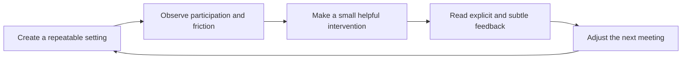
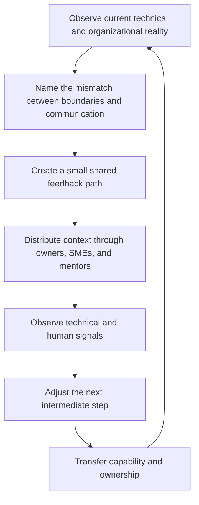
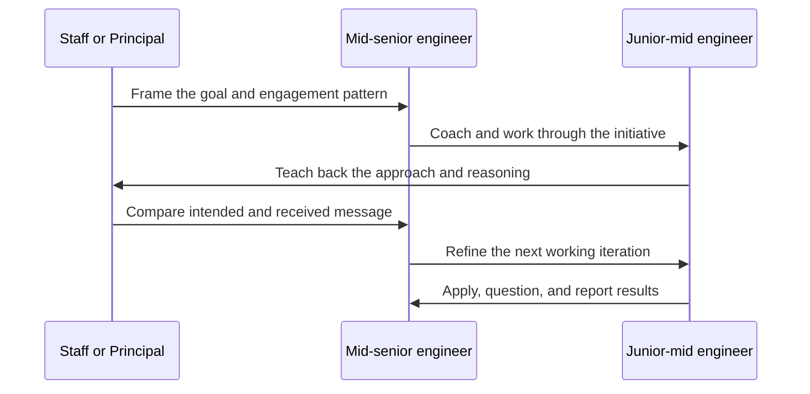
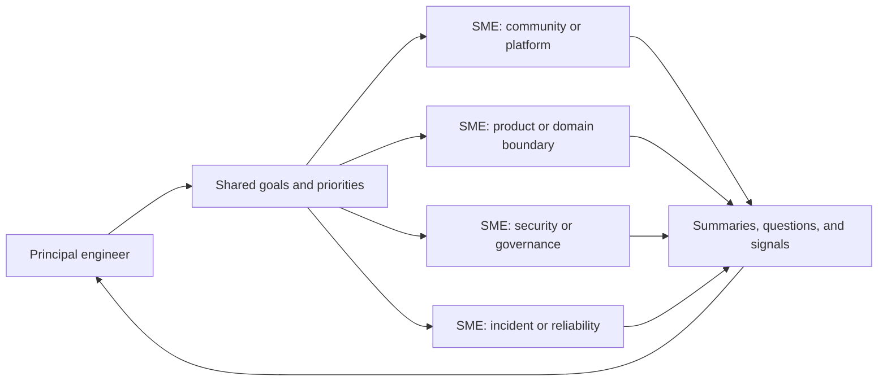
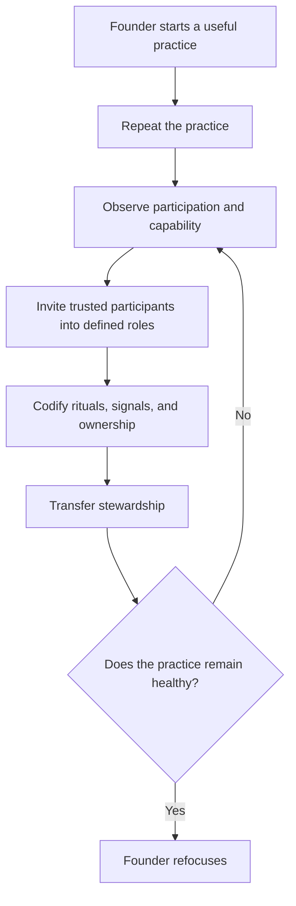

# The Organizer's Perspective: Programming the Human Communication Layer

The most important lesson in my PechaKucha presentation, *Teach Yourself
Beginning Community in 24 Months*, is easy to miss if the transcript is read as
a checklist for starting a user group.

The checklist is the entry point. The real subject is the organizer's
perspective: learning to observe a system while participating in it, making
small interventions, reading the response, and changing the next iteration.

That is also how I approach Staff and Principal engineering work. The system is
larger than the code. It includes team boundaries, incentives, ownership,
vocabulary, meeting structures, feedback paths, and the people who carry
context from one part of the organization to another.

## Orienteering before the metaphor

The orienteering metaphor is not something I invented to describe my work after
the fact. I learned to navigate through changing conditions long before I
worked with software systems.

I became an Eagle Scout. At sixteen, with my mother's permission, I enlisted in
the Illinois Army National Guard. She would not approve a combat role, so I
chose 91B, a mechanic role that also gave me a path to EMT-A certification
through Advanced Individual Training. I completed that training with a 92.7
average.

At seventeen, I attended Basic Training at Fort Leonard Wood in the summer of
1993. I loved it. The work was demanding, the objectives were concrete, and the
feedback was immediate. I was not the best at everything, but I leaned in,
finished what was put in front of me, and tried to bring the soldier behind me
forward when I could.

That experience taught me something I still use: clarity is not the absence of
difficulty. Clarity is knowing the objective, the constraints, the available
signals, and the next action.

## Learning to test a system without breaking its purpose

During an opposing-force exercise, I found smoke grenades and received
permission from the Drill Sergeant to use them. I pulled my group together,
flanked the line, coordinated movement, created confusion with the smoke and a
false gas alarm, and led the group through the opening.

In another exercise, I was effective at making the opposing soldiers trigger
their training equipment before they could trigger mine. I hid beneath an
obstacle in the mud and surprised soldiers as they crossed it.

The Drill Sergeant corrected me. The exercise was meant to give those soldiers
a fighting chance to complete the obstacle and learn from the encounter. My
approach was effective against the exercise, but it was not calibrated to the
exercise's training purpose.

That correction became part of my engineering method. When I encounter a
system, I look for the boundary where a small intervention reveals how the
system actually behaves. Then I ask whether the intervention is producing the
learning the system needs. The goal is not merely to defeat the current
configuration. The goal is to make the next iteration more capable.

## The painted rock is a control point

This is why I think about AI-assisted engineering as orienteering. I may know
the destination without knowing every turn. I set a bearing, move toward a
visible landmark, check my position against the terrain, and choose the next
leg.

When an automated workflow starts moving faster than I can understand, I do not
treat slowing down as failure. I use an interactive conversation as a map
check. It gives me time to recover context, test assumptions, inspect confidence
signals, and choose the next marker.

I think of those markers as painted rocks on a trail. I place one far enough
ahead to make progress, move to it, walk until I catch my breath, then place the
next one. The rhythm is:

1. Set a bearing from the intended outcome.
2. Move quickly while the route and signals remain clear.
3. Stop before the workflow outruns human integration.
4. Reconcile the map with the terrain and the evidence.
5. Establish the next visible marker.

The principle is simple: bias toward clarity over momentum. Automation should
accelerate work only while intent, context, and confidence remain legible.

This is the same loop I use in architecture discovery, mentorship, community
handoffs, and system migration. The terrain changes. The navigation discipline
does not.

## The transcript is a field lesson, not an interview

The source is a single-speaker transcription of my 2013 PechaKucha presentation.
The transcript describes five practical steps:

1. Pick a topic.
2. Find a place.
3. Pick a schedule.
4. Tell people.
5. Repeat it 24 times.

The fifth step changes the meaning of the first four. Repetition creates enough
contact with reality to reveal what the organizer could not know in advance:
who participates, who is isolated, which speakers need support, which topics
draw people in, and which routines can survive ordinary life.

The presentation then moves from operating the event to observing the event.
The organizer is an emcee, a participant, a host, and a feedback instrument.
The job is to help the audience and speaker communicate, then use what happens
to decide what to do next.

## The Organizer's Perspective loop

The loop has four movements: establish a repeatable setting, observe the
interaction, intervene with care, and use the response to shape the next
iteration.

The intervention is deliberately small. Sit with an isolated attendee. Ask a
question when a speaker loses the room. Make it easier for the audience to
respond. The aim is not to control every interaction. The aim is to restore a
useful communication path and then see what the system does.

This distinction matters. An organizer who only delivers the scheduled event
can report that the meeting happened. An organizer who watches the system can
learn whether the meeting worked.

## From community organizer to Principal engineer

I use the same loop when the system is an engineering organization in
transition. A mature organization can have legacy systems that reflect an old
communication structure. Teams may have moved, responsibilities may have
changed, and incentives may be in flux while the architecture still assumes
the previous arrangement.

That mismatch produces a familiar pattern: people apply techniques that worked
in the former system, the outcomes no longer follow, and everyone experiences
the result as friction or failure. The answer is not to issue a stronger
mandate. The system needs a map from its current state to a desired state, with
intermediate steps that let people learn new responsibilities and new ways to
coordinate.

The technical form changes by situation. It might be a working group for
OpenTelemetry, an SME network for Communities of Practice, a boundary team for
ACQ Enablement, an incident review loop, or a coordination mechanism around an
event bus, a domain gateway, governance, or security remediation.

The operating principle remains stable: create a communication structure that
can carry the information the technical system needs.

## Mentorship is another observation loop

This is why I treat mentorship as an engineering mechanism rather than a
one-way transfer of advice. I coach a mid-senior engineer on how to engage with
a junior-mid engineer. Then I work with the junior-mid engineer under the
mid-senior's supervision.

The junior-mid engineer's teach-back gives me a signal. It shows what arrived,
what was interpreted differently, and what context was lost between the
original coaching conversation and the working relationship. That signal lets
the mid-senior and me adjust the next iteration together.

The teach-back is not an exam for the junior-mid engineer. It is an observability
signal for the coaching system. It helps locate a boundary where understanding
changed shape.

## Distributed ownership is cognitive-load design

The same reasoning leads to SME delegation. A Staff or Principal engineer may
be engaged with several communities, technical initiatives, and organizational
concerns at once. Trying to personally attend every conversation creates a
bottleneck and eventually reduces the quality of attention.

Instead, each meaningful domain gets a person with a clear responsibility,
allocated time, and a path back to the team. That person represents the team's
interests, returns with relevant context, and surfaces decisions or risks in a
shared cadence. Office hours and regular summaries make the network observable
without requiring the Principal engineer to be present everywhere.

This is not delegation as disappearance. It is delegation with feedback. The
goal is to distribute cognitive load while preserving enough signal to make
good decisions and protect the concerns of the teams involved.

## Design for the handoff while the work is still alive

The final lesson from the PechaKucha is durability. Repetition is not only a
test of persistence. It creates relationships, trust, shared habits, and the
evidence needed to identify people who can carry the work forward.

That is how a working group can become durable. Participants take on roles,
run meetings, coordinate efforts, report findings, and eventually become
stewards. The founding engineer can then return to a primary lane without
leaving the community dependent on one person.

The handoff is part of the architecture from the beginning. It is not a
ceremony at the end.

## What I mean by programming the human communication layer

Conway's Law is often used as a warning that communication patterns will show
up in system design. I use it as a design constraint. When an organization is
changing, the existing system may encode yesterday's relationships while the
organization is trying to establish tomorrow's.

The work of a Principal engineer is partly to make that transition legible and
workable. That means:

- mapping what is actually happening before proposing the target state;
- making boundaries and ownership explicit;
- building feedback loops that validate whether a message arrived intact;
- distributing context through mentorship, SMEs, and communities;
- using technical and human signals to choose the next step; and
- making the new capability durable through a deliberate handoff.

The code is still important. So are Kafka topics, GraphQL boundaries, traces,
incident records, security controls, and governance decisions. But none of
those mechanisms can compensate for a communication system that cannot carry
the necessary context.

The Organizer's Perspective is the habit of seeing both systems at once. Set
up a repeatable interaction. Watch what happens. Help the system communicate.
Learn from the response. Change the next iteration. Then grow enough shared
capability that the work can continue without you.

That is the loop I first learned by running communities. It is still the loop
I use to build engineering organizations that can learn.

## Source note

This article is derived from Mike Hall's single-speaker PechaKucha
transcription, *Teach Yourself Beginning Community in 24 Months*, recorded in
2013. The article extends the presentation's organizer lesson into a broader
engineering operating model. Specific workplace examples should be fact
checked against the public record before publication.
