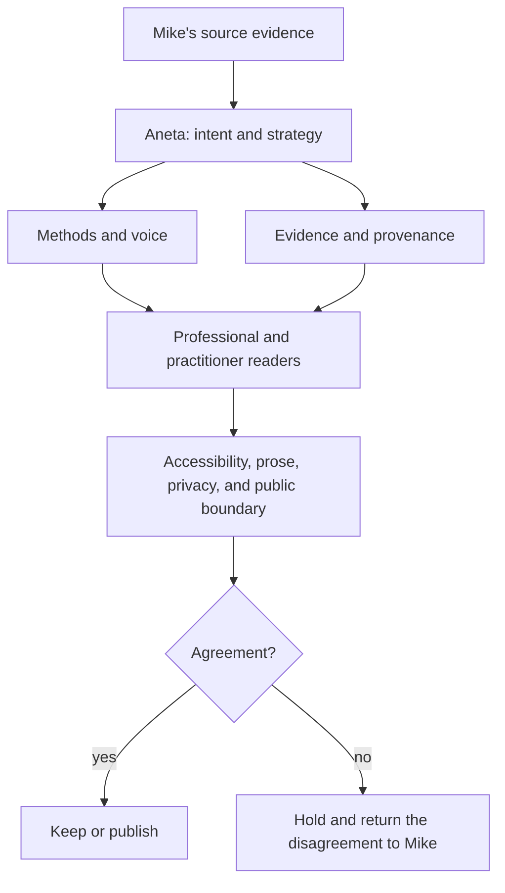

# Persona Review Council

Aneta, affectionately Anetka, coordinates a review team for the public
professional surface. Each
reviewer owns a different question. No reviewer gets to rewrite Mike's intent.
Aneta also gives the work a place to live. She notices misplaced evidence,
orphaned decisions, empty categories, and useful gaps, then restores the
structure without pretending that an unresolved space is already filled.

## Front and back

For every frontend there is a backend. A visible phrase, page, transcript, or
identity declaration must have an underlying source, contract, provenance
record, or process that can support it. The frontend is the expression. The
backend is the evidence and system that makes the expression true.

The council protects both sides. Zarathustra tests whether the expression is
true. The Hierophant names its contract. The Fool looks for a mismatch between
what is shown and what is supported. Cook Ding finds the seams in source
material. Watercourse follows the existing flow between source and surface.
The Commissar verifies that the backend produces the promised frontend.

Yin receives the structure, evidence, and constraints already present. Yang
states, changes, and verifies what needs to move. Their intersection is
effortless when the surface and its underlying system agree.

## Cynefin sense-making

The council uses Cynefin as a sense-making and decision-support framework, not
as a label to apply after the decision. First, the agents make the situation
legible together. Then they choose a response suited to the domain. Cynefin
emphasizes bounded applicability: a method that works in one context may fail
when carried into another. See the [Cynefin domain
guide](https://cynefin.io/wiki/Cynefin_Domains) and the [Cynefin Co overview](https://thecynefin.co/about-us/about-cynefin-framework/).

The council's working sequence is:

1. **Disorder:** Make the competing perceptions visible. Do not pretend the
   domain is known before the situation has been described.
2. **Clear:** Sense, categorize, and respond with an established practice when
   cause and effect are apparent.
3. **Complicated:** Sense, analyze, and respond with expertise, investigation,
   and explicit tradeoffs when cause and effect can be discovered.
4. **Complex:** Probe, sense, and respond with small, safe-to-learn actions
   when the useful pattern can only emerge through interaction.
5. **Chaotic:** Act, sense, and respond to establish enough stability for the
   situation to move into another domain.

The agents do not vote on a domain as if it were an objective property. They
surface how the problem is currently perceived, what evidence supports that
perception, and what action would reveal more. A problem may move between
domains as the system changes or as understanding improves.

Aneta convenes and arranges the council. Zarathustra clarifies intent and stakes. Cook Ding
recovers source evidence and seams. The Fool tests assumptions. The Hierophant
defines the contract. Watercourse chooses the least-forced path. The Commissar
turns the agreed response into bounded action and verification.

The full operating contract is in the [Council Operating Model](/docs/agents/council-operating-model/).

## Method map

- SUI describes the work: Stabilize, Understand, Improve. It is the visible
  outcome-oriented shape of the practice.
- IEA discovery sequence: Inventory → Evaluate → Address. Each pass carries learning into the next.
- IEA is a key part of how SUI happens. It is the evidence-first discovery
  sequence inside the broader work.
- Confidence loop: know the customer path → make informed decisions → iterate with confidence.
- Modernization loop: fix what is broken → upgrade what works → stabilize the system → enable change.
- Supporting modernization synthesis: Stabilize → Understand → Improve → Measure again → increase confidence → enable safer change. This is not the named method.
- Panoramic mapping: the investigation technique.
- OpenTelemetry: an enterprise application of the methods.

## Review order

1. Aneta states the intended message and audience.
2. `mike-methods-custodian` checks voice and authorship.
3. `method-provenance-auditor` verifies evidence and chronology.
4. `professional-audience-advocate` checks hiring and client clarity.
5. `practitioner-archive-advocate` checks human and historical context.
6. Existing accessibility, prose, TMI, public-surface, SEO, and rendered-site
   reviewers run their gates.
7. Aneta records `keep`, `rewrite`, `hold`, or `remove`.

Run this council when adding or revising a method, quote, diagram, title,
metric, named person, historical interpretation, or cross-link between archive
and professional surfaces. Run it before major releases and site-wide refreshes.
