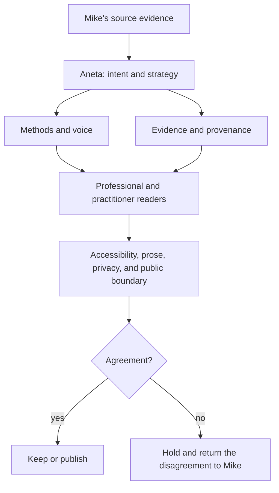

# Persona Review Council

Aneta coordinates a review team for the public professional surface. Each
reviewer owns a different question. No reviewer gets to rewrite Mike's intent.

## Method map

- IEA discovery loop: Inventory → Evaluate → Address.
- Confidence loop: know the customer path → make informed decisions → iterate with confidence.
- Modernization loop: fix what is broken → upgrade what works → stabilize the system → enable change.
- Supporting modernization synthesis: Stabilize → Understand → Improve → Measure again → increase confidence → enable safer change. This is not the named method.
- Panoramic mapping: the investigation technique.
- OpenTelemetry: an enterprise application of the methods.

## Review order

1. Aneta states the intended message and audience.
2. `mike-methods-custodian` checks voice and authorship.
3. `method-provenance-auditor` verifies evidence and chronology.
4. `professional-audience-advocate` checks hiring and client clarity.
5. `practitioner-archive-advocate` checks human and historical context.
6. Existing accessibility, prose, TMI, public-surface, SEO, and rendered-site
   reviewers run their gates.
7. Aneta records `keep`, `rewrite`, `hold`, or `remove`.

Run this council when adding or revising a method, quote, diagram, title,
metric, named person, historical interpretation, or cross-link between archive
and professional surfaces. Run it before major releases and site-wide refreshes.
