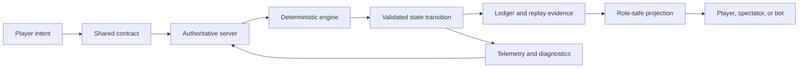
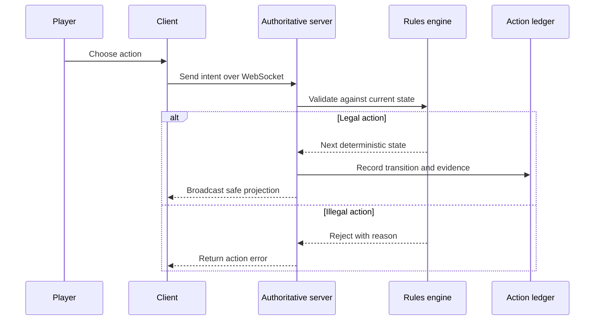
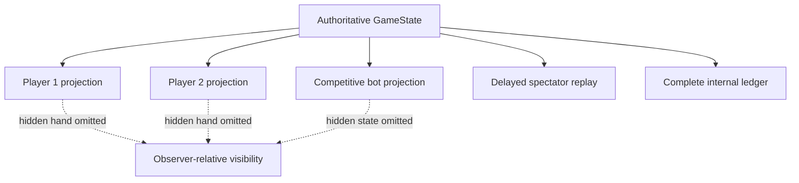
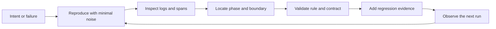
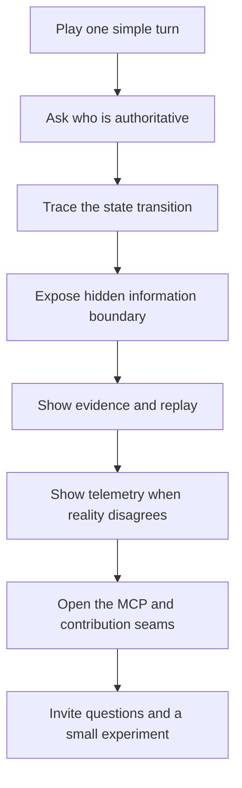

# Phalanx Duel User-Group Presentation Series Plan

This plan is based on the public-safe structure and documentation in the
Phalanx Duel repositories, especially the TypeScript monorepo's README, package
map, development and testing guides, and the architecture and gameplay wiki.
It is a plan for an upcoming user-group presentation, not a claim that every
planned article has already been written.

## The through-line

Phalanx Duel is a 1v1 tactical card game and a working architecture laboratory.
The presentation should let the audience see both at once:

The central question is: how do you build a game where the rules, network,
clients, evidence, and operational feedback can all agree about what happened?

## Article and talk sequence

### 1. The Game as a Systems Laboratory

Introduce the game, the tactical 1v1 format, and the reason a small game can
carry serious architectural lessons.

**Diagram:** system context with player, client, server, engine, database,
observer, and telemetry.

**Audience takeaway:** constraints make boundaries visible.

### 2. Server Authority and the Meaning of a Move

Walk through the difference between a client expressing intent and a server
accepting an action.

### 3. A Match Is a State Machine

Explain deployment, attack, resolution, cleanup, reinforcement, draw, end of
turn, and game over as a phase machine.

**Diagram:** state machine based on the documented phase graph.

**Discussion prompt:** Which transitions are player actions, and which are
system advances? Where can a match stall?

### 4. Determinism Is Necessary but Not Sufficient

Use the gameplay assurance material to distinguish deterministic computation
from demonstrated correctness. Identical wrong logic can still be deterministic.

Discuss versioned rules, named operands, calculation provenance, rule IDs,
replay fingerprints, and bounded proof claims. Be precise about what the finite
verification does not prove, including balance, generalized custom geometry,
network availability, or future rules.

### 5. Hidden Information and Role-Safe Projections

Show how the server can maintain an internal authoritative state while players,
bots, and spectators receive different projections.

### 6. The Protocol Is Part of the Game

Cover `createMatch`, `joinMatch`, `watchMatch`, `action`, and `authenticate`,
then trace server responses such as `gameState`, `actionError`, reconnect
events, and spectator events.

**Diagram:** protocol surface mapped to client behavior and server handlers.

**Audience takeaway:** a game rule is not complete until its contract can be
carried across the boundary.

### 7. Observability as a Debugging Instrument

Show the local OpenTelemetry path, health checks, logs, spans, and regression
workflow. Connect this to the broader method of instrumenting seams before
changing them.

### 8. MCP and the AI Access Boundary

Explain the tiered MCP surface. Engine tools can work without the database.
Additional data and analysis capabilities are opt-in. Local model analysis is
the default documented path in the development guide.

The ethical point belongs here: an AI agent can inspect a game through an
explicit tool boundary, but the tool profile determines what it may see and
what it may do. The model is not the authority. The engine and server remain
the authority.

### 9. QA as a Truth Gate

Cover property tests, rules checks, replay verification, playthroughs, schema
checks, boundary checks, and production contract checks. Show how an end-to-end
playthrough turns a claim about the game into inspectable evidence.

### 10. Build in the Open, Keep Claims Bounded

Close with the project history, public commits, known limitations, and the
difference between stable and experimental claims. Invite the group to play,
read the rules, inspect the engine, or contribute a targeted test.

## Proposed presentation flow

## Questions to resolve before publication

These are intentional prompts, not guesses:

- Which version and release state should the user-group presentation name?
- Should the live demonstration use a browser match, an engine-only example,
  or a recorded playthrough?
- Which architecture claims should be demonstrated in the room rather than
  described from documentation?
- Do you want the presentation framed primarily as game architecture,
  deterministic systems, OpenTelemetry practice, or AI tool boundaries?
- Which screenshots, captures, or public repository links are approved for the
  final slides and articles?

## Ethical and source boundary

The eventual articles will be AI-augmented, human-led material. A human will
guide the AI through the source selection, interpretation, corrections, and
final approval. The repository documentation and source code provide the
technical evidence. The AI may organize and diagram that evidence, but it must
not invent gameplay behavior, performance numbers, contributor stories, or
project history. Any ambiguity that changes the meaning stays visible until the
author resolves it.
