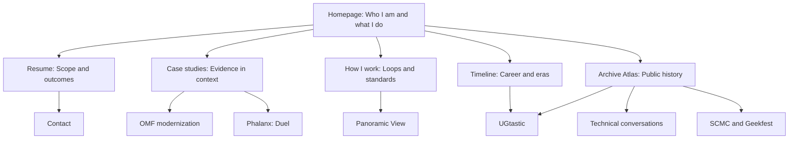

# Professional Public Topology Plan

The site should present one person with a consistent way of working, not a collection of unrelated frameworks or employer summaries.

## Public promise

> I build, repair, explain, and preserve software systems.

The professional surface expands that promise:

> I make complicated systems understandable, help teams act on what they learn, and leave a clearer path for the next change.

This is a synthesis of recurring work across software engineering, technical communities, system modernization, and historical preservation. It is not an OMF-only identity.

## The site topology



## One job per page

### Homepage: identity and orientation

Route: `/`

Answer three questions quickly:

1. Who is Mike?
2. What kind of problems does he work on?
3. Where should a visitor go next?

The homepage should lead with the identity sentence, then show four proof paths:

- Build
- Repair
- Explain
- Gather and preserve

The homepage should not attempt to summarize every employer, technology, archive, or role archetype.

### Resume: scope and outcomes

Route: `/resume/`

The resume should answer: “What has Mike been trusted to do?”

Use evidence-led bullets. Keep personal identity and methodology brief. Link outward to case studies for explanation.

### Case studies: evidence in context

Route: `/case-studies/`

Each case study should follow this order:

1. Condition: what was unclear, fragile, or difficult to change.
2. Mike's responsibility: what he personally led, built, mapped, or repaired.
3. Working loop: the smallest relevant loop, not every framework on the site.
4. Intervention: what changed in the system or team.
5. Result: what became clearer, safer, faster, or easier to operate.
6. Evidence boundary: what is documented, recollected, inferred, or still unknown.

OMF is one major case. It should not stand in for the whole identity.

### How I work: methods and standards

Routes: `/panoramic-view/` and the methodology section of `/`

Use the following public method map. These are Mike's methods, applied in
different contexts. Do not collapse them into one invented master framework.

### Discovery

> Inventory → Evaluate → Address

IEA is the discovery loop used in the Acquisition Technical Architecture
Initiative.

### Related synthesis

The following sequence is a later synthesis across the work. It is useful as an
interpretive guide, but it is not the named method Mike documented in the ACQ
initiative:

> Stabilize → Understand → Improve → Measure again → increase confidence → enable safer change

Measure again, increased confidence, and safer change describe what the work can
produce and enable. They should not be presented as a separate method authored
by Mike.

### Investigation

Panoramic mapping is the investigation technique: define the premise or state,
perform the action, identify the layers crossed, find the subject-matter expert
when blocked, repeat, bind action to result, document the state change, and
follow the consequences.

### Enterprise application

OpenTelemetry is an enterprise application of these methods. It is evidence and
correlation infrastructure, not the methodology itself.

Each method page should include:

- the question the method answers;
- the artifacts it produces;
- the decision gate;
- one or more case studies that prove its use;
- the limits of the claim.

### Timeline: career and eras

Route: `/timeline/`

The timeline should connect eras rather than display a list of jobs:

```text
Early engineering and craftsmanship
  → community formation and shared learning
  → UGtastic and technical conversations
  → enterprise architecture and platform work
  → observability and modernization
  → current systems, tools, and archive preservation
```

Each era needs a short description, representative artifacts, and links to the relevant professional or archive page.

### Archive Atlas: public history

Route: `/archive-atlas/`

The atlas should explain how to navigate the archive. It should not compete with the professional homepage.

Use it to connect interviews, videos, talks, communities, recovered artifacts, and uncertainty markers.

### UGtastic: a distinct historical project

Route: `/ugtastic/`

UGtastic should remain about user-groups, practitioners, interviews, production choices, branding, music, and preservation. It can link back to the professional identity through the Gather and preserve proof path.

It should not carry the OMF modernization method as if it were a UGtastic subject.

## The four proof paths

### Build

Evidence includes Ruby and Rails systems, RubyGems, open-source work, Clojure contributions, Phalanx: Duel, and current tools.

### Repair

Evidence includes legacy platform remediation, data cleanup, Rails modernization prerequisites, operational defects, and safer migrations.

### Explain

Evidence includes OpenTelemetry, logging standards, diagrams, talks, teaching, architecture mapping, and documentation.

### Gather and preserve

Evidence includes SCMC, Geekfest, UGtastic, interviews, community archives, and the practice of making technical knowledge available to others.

## Voice rules for every professional page

- Lead with what happened.
- Use “I” for Mike's work and “we” for team outcomes.
- Name the system, constraint, decision, and result.
- Use one claim followed by one proof.
- Keep the boundary of the evidence visible.
- Prefer plain verbs over framework nouns.
- Keep jokes and texture on archive pages unless they clarify the work.
- Expand internal terminology on first use or remove it from the professional surface.
- Do not publish private conflict, health context, family detail, or workplace gossip to establish authority.

## Recommended page pattern

```text
Claim
  What I did and why it mattered.

Method
  How I approached the problem.

Evidence
  Artifact, date, result, or surviving record.

Boundary
  What the evidence does not establish.

Next step
  A link to the relevant case, method, resume, or archive.
```

## Implementation order

1. Establish the homepage identity and four proof paths.
2. Reorder the case-study page so personal responsibility precedes framework vocabulary.
3. Make Panoramic View the method hub and connect each loop to evidence.
4. Rebuild the timeline around eras and transitions.
5. Connect UGtastic, communities, and interviews to the Gather and preserve path.
6. Add evidence-boundary labels to claims that come from recollection or synthesis.
7. Run public-surface, TMI, prose, accessibility, and link checks after each slice.

## Historical anchors

- [2023-Q1] *Geekfest interests*, conversation `51e353af-10ce-41b0-b15b-11c4e9620861`, Mike-authored record of recurring technical community work.
- [2023-Q4] *Resume Improvement with GPT*, conversation `27555ea2-dca6-469d-b3de-d7ebba540755`, Mike-authored description of craftsmanship, collaboration, user-groups, and Geekfest.
- [2023-Q4] *Acquisition Technical Architecture Initiatives*, conversation `5f2e7f02-0633-402c-b1bf-5818a74b835b`, documented architecture and confidence work.
- [2024-Q2] *OTel WG Lane Data*, conversation `30e0f497-d7be-480f-a74e-8b4e3a4fba95`, contemporaneous observability working record.
- [2025-Q1] *Resume Entry Update*, conversation `678c7493-1308-8003-9471-8af7c73423f8`, Mike-authored account of UGtastic's scale and historical importance.
- [2025-Q4] *Disruptive tech impact*, conversation `691ef4e0-bb94-8328-8367-be04185b3927`, Mike-authored retrospective recollection of the modernization statement.

## Definition of done

The professional surface is coherent when a visitor can move from identity to method to proof to history without encountering a new competing description of who Mike is.

The site should leave the visitor with this understanding:

> Mike builds and repairs systems, makes them understandable, helps people learn how they work, and preserves enough context for the next person to continue.
