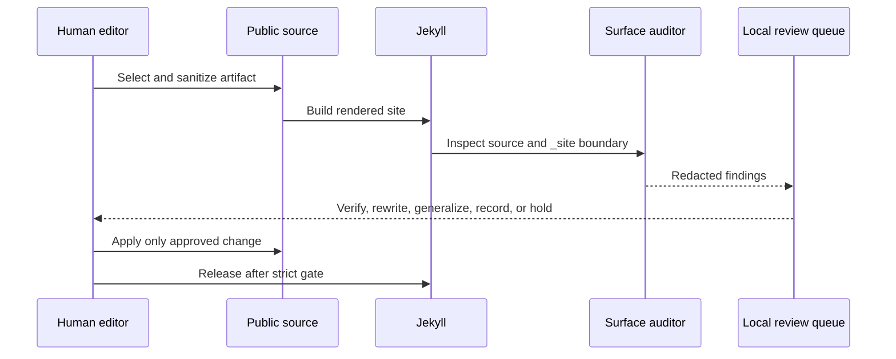

# Public Surface Audit

The public site is an edited surface, not a mirror of the working repository.
The audit makes that boundary visible before release.

## What it checks

The auditor scans public-content sources and the generated `_site/` output for
credential-shaped values, direct personal data, health and family context,
private workplace details, uncertain recollections, local paths, internal
project files, backlog routes, and AI pages missing quarantine metadata.

It redacts matched values in its local report. It never reads environment files,
credentials, private handoffs, dependency trees, or build caches.

The release suite also runs `validate_public_positioning.rb`. That smaller
deterministic gate protects reader-facing titles and terminology from drifting
back toward opaque internal names during artifact generation. It does not scan
or rewrite historical transcripts.

## The release loop



## Operator commands

```sh
ruby bin/audit_public_surface.rb --help
ruby bin/audit_public_surface.rb --json
ruby bin/audit_public_surface.rb --strict
ruby bin/audit_public_surface.rb --man
ruby bin/validate_public_positioning.rb
```

The report lives under `tmp/public-surface-audit/` and is intentionally local.
The strict gate is a pause point, not an instruction to publish under pressure.
