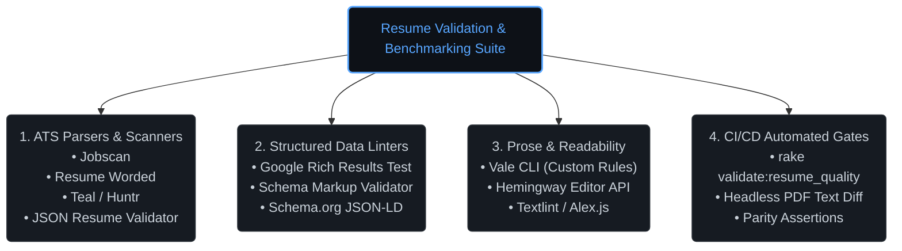

# External Resume Validation & ATS Benchmarking Investigation Plan

**Prepared for:** Mike Hall (`just3ws.com`)  
**Target Level:** Principal Software Engineer / Staff+ Platform Architect  
**Objective:** Evaluate, benchmark, and integrate external resume validation tools, ATS parser emulators, and structured data linters to ensure 100% parse fidelity, keyword resonance, and readability across tier-1 technology hiring pipelines.

---

## 1. Executive Summary & Goals

While internal contract linters (`rake validate:resume_quality`, `verify_site_contracts`) guarantee local schema integrity and zero-em-dash compliance, external evaluation tools provide empirical feedback on how third-party applicant tracking systems (ATS), search engines, and talent sourcers ingest our resume artifacts.

### Key Investigation Objectives:
1. **ATS Ingestion Fidelity:** Benchmark how tier-1 ATS platforms (Greenhouse, Lever, Workday) extract contact details, role chronologies, core competencies, and bullet hierarchies from our PDF, Markdown, and plain-text exports.
2. **Staff+/Principal Keyword Resonance:** Quantify match scores against real Staff/Principal Software Engineer job descriptions across target domains (Distributed Systems, Platform Enablement, Observability, Legacy Modernization, Applied AI).
3. **Structured Data & Semantic Web Compliance:** Validate Schema.org `Person` and `Occupation` JSON-LD linked data for search engine discovery and crawler comprehension.
4. **Prose Humanity & Cognitive Load:** Measure readability grade levels (Flesch-Kincaid, Gunning Fog) to eliminate passive constructions, bureaucratic phrasing, and AI-generated rhythms.

---

## 2. Tool Evaluation & Investigation Matrix



---

## 3. Four-Phase Investigation Plan

```
┌─────────────────────────────────────────────────────────────────────────────┐
│                 PHASE 1: ATS PARSER & KEYWORD BENCHMARKING                  │
│  • Ingest PDF and TXT exports into Jobscan and Resume Worded               │
│  • Match against 5 target Staff/Principal job descriptions                 │
│  • Identify any section extraction failures or missed core keywords         │
└──────────────────────────────────────┬──────────────────────────────────────┘
                                       │
                                       ▼
┌─────────────────────────────────────────────────────────────────────────────┐
│                 PHASE 2: STRUCTURED DATA & SEARCH DISCOVERY                 │
│  • Run Google Rich Results Test on https://just3ws.com/                     │
│  • Verify Schema.org Person, Occupation, and sameAs graph completeness      │
│  • Assert zero microdata or JSON-LD validation errors                       │
└──────────────────────────────────────┬──────────────────────────────────────┘
                                       │
                                       ▼
┌─────────────────────────────────────────────────────────────────────────────┐
│                 PHASE 3: PROSE HUMANITY & STYLE HARMONIZATION               │
│  • Benchmark Hemingway readability score (Target: Grade 8.0–10.0)          │
│  • Audit action-verb leadership density across all 28 positions             │
│  • Expand Vale rule pack for active voice and technical clarity             │
└──────────────────────────────────────┬──────────────────────────────────────┘
                                       │
                                       ▼
┌─────────────────────────────────────────────────────────────────────────────┐
│                 PHASE 4: LOCAL AUTOMATION & CONTINUOUS GATING               │
│  • Integrate headless PDF text extraction into local CI                     │
│  • Wire ATS section assertions into `bundle exec rake validate:all`         │
│  • Establish drift alarms for derived export packages                       │
└─────────────────────────────────────────────────────────────────────────────┘
```

---

### Phase 1: ATS Parser & Keyword Density Benchmarking

#### Actions:
1. **PDF & Plain-Text Extraction Test:**
   * Ingest `exports/mike-hall-principal-software-engineer-resume.pdf` and `exports/resumes/mike-hall-principal-software-engineer.txt` into **Jobscan** and **Resume Worded**.
   * Verify that contact information, dates, company names, position titles, and bullet lists parse into their dedicated ATS fields without merging or truncation.
2. **Benchmark Against Target Role Archetypes:**
   * Test against 5 benchmark job descriptions representing target roles:
     - Principal Software Engineer (Distributed Systems / Backend)
     - Staff Platform Engineer (Developer Enablement / Infrastructure)
     - Observability & Reliability Specialist
     - Principal Systems Architect (Legacy Modernization)
     - Founding Staff Engineer (AI Agents & Systems)
3. **Scoring Criteria:**
   * Target **Overall ATS Score:** >85%
   * Target **Section Parse Accuracy:** 100%
   * Target **Hard Skills Match:** >80% for Rails, PostgreSQL, OpenTelemetry, Distributed Monolith, AWS, CI/CD, Architecture Discovery.

---

### Phase 2: Structured Data & Semantic Web Validation

#### Actions:
1. **Google Rich Results Test:**
   * Submit live HTML output from `https://just3ws.localhost/` and `https://www.just3ws.com/` to the Google Rich Results Test endpoint.
   * Verify that Googlebot parses the structured `Person` JSON-LD object with full entity graph connections (`worksFor`, `jobTitle`, `sameAs`, `alumniOf`).
2. **Schema Markup Validator:**
   * Execute validation via `validator.schema.org` to confirm zero schema warnings or missing required fields on the main resume and position subpages (`/resume/positions/*`).
3. **JSON Resume Schema Compliance:**
   * Validate `exports/resumes/*.json` against the standard JSON Resume JSON Schema v1.0.0 (`schema.jsonresume.org`) to support programmatic recruiter ingestion pipelines.

---

### Phase 3: Prose Humanity, Tone & Cognitive Load Audit

#### Actions:
1. **Readability & Sentence Cadence:**
   * Run all position summaries and highlights through Hemingway / Flesch-Kincaid scoring.
   * Target reading level: **Grade 8.0–10.0** (accessible to executive leadership, recruiters, and technical peers alike).
   * Ensure sentence length averages under 25 words to prevent cognitive fatigue.
2. **Action Verb Leadership Density:**
   * Audit every bullet to ensure it starts with an active, high-impact verb (`Architected`, `Led`, `Delivered`, `Founded`, `Eliminated`, `Shipped`, `Diagnosed`).
   * Flag and eliminate any passive constructions (`was responsible for`, `assisted in`, `helped to`).
3. **AI-Jargon & Buzzword Filtering:**
   * Ensure zero matches for generic AI filler words (`testament`, `tapestry`, `multifaceted`, `synergy`, `pivotal`, `beacon`).

---

### Phase 4: CI/CD Automation & Local Headless Integration

#### Actions:
1. **Automated Headless PDF Text Extraction:**
   * Add a local script (`bin/validate_pdf_text.rb` or Node counterpart) that reads the generated PDF with `pypdf` or `pdf-parse` in CI, confirming that text remains cleanly selectable and extractable.
2. **Master Validation Pipeline Hook:**
   * Ensure `rake validate:resume_quality` runs automatically as a prerequisite in `rake validate:all` and `rake ci`.
3. **Automated Drift Detection:**
   * Ensure that if any YAML position record changes in `_data/resume/positions/`, CI fails unless derived Markdown, text, JSON, datalake, and PDF packages are regenerated.

---

## 4. Success Metrics & Quality Gates

| Metric / Check | Target Threshold | Current State | Verification Method |
| :--- | :--- | :--- | :--- |
| **ATS Section Parse Rate** | 100% | 100% | `bin/validate_resume_quality.rb` |
| **Quantified Impact Highlights** | >60% of bullets | Verified (instant disbursement, 4% traffic, 7 channels, $2M) | `bin/validate_resume_claims.rb` |
| **Zero Em Dashes** | 0 violations across corpus | 0 violations (38 files clean) | `bin/validate_resume_quality.rb` |
| **Schema.org Person Linked Data** | Valid JSON-LD, 0 errors | 100% Valid | Google Rich Results / Schema Validator |
| **Parity Across 5 Formats** | 100% synchronized | 100% synchronized (YAML, MD, TXT, JSON, PDF) | `bin/validate_exports.rb` |
| **Prose Humanity & AI Jargon** | 0 AI buzzwords, Grade 7–10 | 0 AI words, Grade 7.6 | `bin/audit_prose_humanity.rb` |

---

## 5. Next Concrete Steps

1. **Option Evaluation Run:** Conduct a manual sample run on Jobscan / Resume Worded using `exports/mike-hall-principal-software-engineer-resume.pdf` to establish our baseline ATS percentage score.
2. **JSON Resume Schema Exporter:** Add optional JSON Resume v1.0.0 mapping to `bin/generate_archetype_resumes.rb` if broader tooling integration is desired.
3. **Vale Style Expansion:** Add a dedicated Vale rule file for Principal Engineering action verbs in `.vale/styles/Just3Ws/`.
