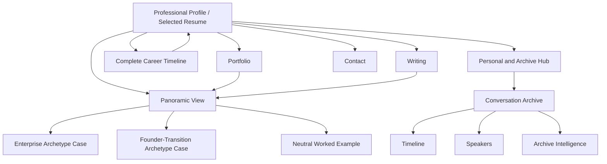

# Panoramic View Positioning and Publication Brief

**Status:** Approved-public-artifact draft for the just3ws.com refresh  
**Audience:** Site maintainers, copywriters, designers, and reviewers  
**Last updated:** 2026-08-10

This brief translates private, provenance-tagged research into a public-safe narrative foundation. It intentionally omits private source paths, internal platform labels, coworker names, client details, and operational specifics. A statement appearing here is eligible for drafting, not automatically approved for publication in every context; the claim ledger remains the gate.

## Positioning decision

**Primary identity:** Hands-on Director of Engineering.

**Operating promise:** Mike makes complex systems understandable, engineering teams more capable, and consequential change safer to deliver.

**Operating sequence:** Stabilize. Understand. Innovate.

The sequence should be made concrete wherever it appears:

1. **Stabilize what is fragile.** Establish safe boundaries, restore visibility, clarify ownership, and reduce immediate operational risk.
2. **Understand the whole system.** Connect the actor's journey, business decisions, code paths, infrastructure, data changes, human knowledge, and runtime evidence.
3. **Innovate with confidence.** Modernize architecture, delivery, tooling, and team practices from an evidence-backed model rather than an aspirational diagram.

Panoramic View is the method that runs through all three phases. It is not only an observability practice and not only the middle “Understand” step.

## Master career narrative

Mike Hall is a hands-on Director of Engineering who steps into complex systems and transitions, stabilizes delivery, builds a shared evidence-backed understanding of how the product and organization actually work, and helps teams modernize with confidence. Across regulated enterprises, growing product companies, and small founder-led systems, he has combined deep debugging, architecture, observability, team design, and knowledge recovery rather than treating them as separate disciplines. He created Panoramic View, a system-cartography methodology that follows an actor's journey from left to right and traces each interaction from browser to backend and back, connecting business decisions, code paths, data changes, infrastructure, telemetry, and the resulting experience. His leadership preserves uncertainty and provenance instead of manufacturing confidence, giving teams a durable foundation for safer change.

## Proof hierarchy

Use evidence in this order. A lower tier may support a higher-tier claim but must never be promoted into a stronger source category.

1. **Mike's direct, dated statements and public work.** Highest authority for authorship, intent, career experience, talks, and operating philosophy.
2. **Timestamped historical records.** Establish chronology and the evolution of Panoramic View; earliest exported evidence is later than the recalled origin.
3. **Repository or runtime evidence.** Establishes that an artifact, behavior, or implementation existed at a point in time.
4. **Corroborating human testimony.** Useful for leadership and team effects when the speaker has direct knowledge and publication consent.
5. **Prior AI synthesis accepted into a working repository.** Useful but derivative; never present it as Mike's own wording or independent proof.
6. **Current synthesis and inference.** Use to organize the story, clearly label uncertainty, and never convert absence into certainty.

## Resume-ready achievement language

These bullets are deliberately free of invented business-impact metrics. Employer names and dates belong in the résumé's conventional employment record; the achievement language itself should remain focused on the problem, action, and bounded result.

### Current leadership identity

- Created Panoramic View, an evidence-led system-cartography methodology that connects user journeys and business decisions to code paths, infrastructure, data changes, telemetry, ownership, and known unknowns.
- Leads as a hands-on engineering director across system architecture, production diagnosis, modernization, team operating design, and cross-functional decision-making.
- Turns fragmented technical and organizational evidence into a shared, navigable model that Product, Engineering, Operations, Security, and Quality can use to plan safer change.

### Regulated enterprise application

- Reconstructed business-critical journeys from interface through application, middleware, data, and downstream services, giving multiple teams a shared model for incident response, risk review, and change planning.
- Introduced distributed tracing and structured operational evidence as inputs to a broader system-cartography practice, improving cross-system diagnosis without treating observability tooling as the end goal.
- Created an engineering enablement function and transitioned ownership after the practices became self-sustaining, protecting long-horizon platform work from competing delivery pressure.
- Served as a final technical escalation point for consequential incidents, converting each investigation into better instrumentation, clearer ownership, and reusable system knowledge.

### Small-company founder transition

- Led engineering continuity during a post-acquisition founder transition, converting knowledge-transfer sessions, source history, live-system evidence, and team expertise into a navigable field guide, owned risk model, and stabilization roadmap.
- Established visible collaboration and decision rhythms for a distributed, cross-cultural engineering team, moving work from isolated execution toward shared ownership and self-direction.
- Built a read-only engineering intelligence and operational-visibility layer for a regulated, multi-tenant legacy platform, surfacing dependencies and modernization risks without adding production mutation risk.
- In 52 working days, established the communication rhythms, shared visibility, and decision structure needed to move a distributed team toward collaborative self-direction; this describes what was established, not a claim of long-term durability.
- Held a clear safety boundary around production change: delivery could proceed when the organization could validate it, while unresolved test and infrastructure risks remained explicit rather than being converted into unsupported confidence.

### Selected earlier evidence

- Led hands-on upgrades and operational modernization across long-lived, high-traffic product systems while maintaining continuity under production load.
- Used incremental replacement patterns to separate new capabilities from tightly coupled legacy platforms, reducing rewrite risk and preserving delivery.
- Guided a developer-community product from proprietary operation to open-source stewardship while simplifying its data and background-processing architecture.
- Built engineering onboarding, mentorship, user groups, conferences, and a public interview archive that preserve technical context and help practitioners learn from one another.

### Recent-role explanation

Use only when context is required:

> Joined as Development Manager during a post-acquisition founder transition and assumed responsibility for engineering continuity. The role concluded after the transition when the parent organization consolidated engineering leadership at the VP level.

Do not call the role a contract, fixed-term assignment, or pre-defined bridge role. The written job description describes a direct hire. “Joined during a transition” is supported; “hired specifically for a time-boxed transition” is not established by the available written evidence.

## Homepage and project-card copy

### Recommended hero

**Eyebrow:** Hands-on Director of Engineering

**Headline:** Stabilize what is fragile. Understand what is real. Move forward with confidence.

**Subheadline:** I lead teams through complex systems and consequential change. My work connects deep technical investigation, shared system understanding, and the operating structures people need to modernize safely.

**Primary action:** Review my experience

**Secondary action:** Explore Panoramic View

### Headline alternatives

- **Make the system legible. Make the team capable.** Strongest plain-language expression of the two-sided technical and organizational promise.
- **Engineering leadership for systems that cannot afford guesswork.** Best for regulated and mission-critical positioning, but narrower in tone.
- **See the whole system. Change it with confidence.** Best bridge into the Panoramic View methodology, but says less about team leadership.

### Panoramic View project card

**Title:** Panoramic View

**Summary:** A system-cartography methodology that reconciles interested-party understanding, the implemented domain model, and observed runtime behavior. It follows any actor's complete journey—including a human or agentic AI system—and traces each interaction through business process, system boundaries, data changes, evidence, and response with the same fidelity.

**Action:** See the method

### Meta content

**Homepage title:** Mike Hall | Hands-on Director of Engineering

**Homepage description:** Mike Hall is a hands-on Director of Engineering who stabilizes complex systems, builds capable teams, and created Panoramic View, an evidence-led method for safer modernization.

**Methodology title:** Panoramic View | System Cartography by Mike Hall

**Methodology description:** Panoramic View maps business process to system operation, tracing journeys from browser to backend across runtime evidence, data changes, and ownership.

## Panoramic View methodology-page outline

### 1. The short definition

Panoramic View reconciles a system as interested parties understand it with the implemented domain model and the runtime evidence of how it actually behaves. It follows any actor's journey from left to right while tracing every interaction through the system and back with the same fidelity, locating where business process, domain concepts, technical behavior, and the data lifecycle intersect.

The unit of inquiry is the intersection of business process and system operation. As time and mandate permit, the map can extend beyond an interface path to upstream supply chain, external partners, operational controls, retention, and archival cold storage.

An actor is any participant pursuing a goal through a system: a human customer or employee, an external organization, an automated service, or an agentic AI system. Each encounters an interface that enacts a business process—whether a screen, API, tool, event, or protocol.

The flagship applications centered on complex Rails platform systems, then traversed beyond Rails itself through actor-facing interfaces, domain rules, services, integrations, infrastructure, data changes, and return paths with the same evidence discipline. Rails is the primary proving ground, not an applicability boundary.

The governing questions are:

1. What do the interested parties understand the system to do?
2. Which business process and goal is the actor pursuing through the interface?
3. How does the implemented domain model encode those concepts, rules, and state changes?
4. What does runtime evidence show the system actually does—and where is the delta?

Panoramic View maps the correspondences and gaps among interested-party understanding, the implemented domain model, and observed runtime behavior. The goal is a complete-enough account for the defined decision scope without discarding contradictions, hiding unknowns, or manufacturing certainty.

### 2. The founding insight

- Systems are normally viewed as disconnected documents, diagrams, dashboards, tickets, and specialist knowledge.
- The visible interface is only the horizon; every actor choice creates a vertical wave through technical and organizational layers.
- The complete view must show both the journey across time and the repeated descent and return of each interaction.
- The practical boundary is organizational scope and available time: the same model can continue upstream into supply chain and downstream through the complete data lifecycle.
- The method was conceived circa 2021–2022; the earliest timestamped exported evidence is from September 2023.

### 3. The two-dimensional model

- **Horizontal axis:** the actor enters stage left, moves through a business process, pauses or branches, and exits stage right.
- **Vertical axis:** each interaction descends from interface to edge, application, services, integrations, and data, then returns as the next presented state.
- **Evidence layer:** correlated traces, logs, recordings, source history, state differences, and subject-matter knowledge.
- **Meaning layer:** business decisions, ownership, confidence, contradictions, and explicit unknowns.

### 4. The Simple Loop of Discovery

1. Define the premise and starting state.
2. Traverse the next interaction through every observable layer.
3. Cross a knowledge or ownership boundary with the relevant subject-matter expert.
4. Capture runtime evidence, state changes, transformations, decisions, and absences.
5. Synthesize the model, mark confidence and gaps, and repeat until the required path is navigable.

### 5. What the model produces

- Actor and business-process views.
- System inventory and relationship maps.
- Incident and failure topography.
- Architecture and modernization views.
- Ownership and knowledge-risk views.
- Security, compliance, quality, and decision-governance projections.
- AI-ready context with provenance and uncertainty attached.

The model is primary. Every diagram, inventory, report, or AI context window is a projection of it.

### 6. Tools are subordinate

Explain that browser recordings, structured logs, OpenTelemetry, error tracking, database inventories, source history, visualization, and AI-assisted analysis provide evidence or projections. None of them is Panoramic View by itself.

### 7. Where it has been applied

Describe organization archetypes rather than naming implementation sites:

- A regulated, multi-team enterprise with business-critical customer journeys crossing many technology and ownership boundaries.
- A small acquired healthcare software organization facing founder departure, concentrated knowledge, a distributed team, and an undocumented multi-tenant legacy platform.
- Earlier product and platform modernization work that supplied the diagnostic, incremental-replacement, logging, and systems-thinking foundations.

### 8. Honest maturity and limits

- The methodology and several supporting practices have been used repeatedly.
- Some visualization and trace-correlation capabilities were implemented in a later application.
- Absence instrumentation and decision-asset governance remain explicit gaps.
- A designed high-dimensional system model must not be described as shipped without further evidence.
- A complete run against production traffic is not confirmed by the supplied extraction.

### 9. Future work

- Generalize the underlying evidence and relationship schema.
- Complete absence and decision-governance capture.
- Make projections regenerable from the canonical model.
- Publish a neutral worked example that demonstrates the method without proprietary source material.

## Case-study outline

The methodology page should teach the general method. Case studies should prove portability by describing the kind of organization, situation, need, questions, evidence, and limits.

### Case A: Regulated enterprise system cartography

**Organization type and scale:** Large regulated financial-services enterprise; many engineering, product, architecture, security, and operational stakeholders; business-critical customer journeys under continuous production load.

**Situation:** A single user journey crossed legacy web applications, services, middleware, data stores, and team boundaries. Each group could describe its own piece, but no durable shared model connected the complete experience to system execution.

**Need:** Reduce incident and modernization risk by replacing partial narratives with a correlated, evidence-backed account of what happened across the whole path.

**Questions being answered:**

- Where does the actor enter and what outcome marks exit?
- Which interface choices create each request-response wave?
- What calls what across application and ownership boundaries?
- Where is data read, transformed, persisted, or transmitted?
- Which identifiers can correlate disconnected evidence?
- Which business and system decisions cause the path to branch?
- What evidence is absent, and how confident is each part of the map?
- Who can explain or own the next boundary?

**Evidence and action:** Browser evidence, structured logs, distributed traces, source inspection, incident records, and subject-matter interviews fed one working model. That model supported incident response, instrumentation standards, modernization planning, and clearer ownership.

**Durability signal:** Years later, on two separate occasions, colleagues who did not know Mike had created the material used documentation produced from the model to train him on the system. This is practical evidence that the knowledge had become useful independent of its author.

**Limit:** Do not name the enterprise, internal platform, proprietary identifiers, team names, or implementation repositories on the methodology page. The conventional résumé may name the employer separately.

### Case B: Small-company founder transition

**Organization type and scale:** Small acquired healthcare software product company; distributed cross-cultural engineering team; regulated, multi-tenant legacy platform; knowledge concentrated in the departing founder; parent-company matrix organization.

**Situation:** The system had to remain operational while its primary source of architectural history was leaving. Documentation, testing knowledge, ownership, deployment confidence, infrastructure visibility, and transition authority were incomplete or fragmented.

**Need:** Preserve knowledge, create a safe operating picture, help the team work as a cohesive unit, and give leadership a sequenced stabilization and modernization path.

**Questions being answered:**

- What does the product actually do for each actor and business process?
- Which source, schema, infrastructure, and external boundaries support those paths?
- Where is knowledge concentrated and what will disappear at transition?
- Which risks have evidence, owners, mitigations, and unresolved dependencies?
- What can be observed safely without mutating production?
- What must be true before a release can be validated responsibly?
- Which communication and decision rhythms help the distributed team act collectively?

**Evidence and action:** In 52 working days, the work established structured knowledge capture, a navigable system and domain map, an owned risk model, read-only operational visibility, team and cross-functional rhythms, and a sequenced stabilization path.

**Limit:** “Established” is the correct durability claim. Do not claim the organization or platform was fully transformed, that every proposed capability shipped, or that long-term outcomes were observed. Exact artifact, customer, tenant, infrastructure, vendor, and certification details remain generalized pending line-item approval.

## Public/private claim ledger

| Claim area | Public-safe treatment | Provenance and confidence | Publication rule |
|---|---|---|---|
| Panoramic View authorship | “Mike Hall created Panoramic View.” | Mike's direct statements plus consistent historical and implementation records; high | Publish |
| Origin date | “Conceived circa 2021–2022; earliest timestamped exported evidence is September 2023.” | Recalled origin differs by about one year across two evidence packages; high for range, not exact year | Publish the range; do not claim a more precise date without stronger evidence |
| General method | Reconciles interested-party understanding, the implemented domain model, and observed runtime behavior through an actor journey plus repeated system traversals | Mike's descriptions and dated evolution; high | Publish in plain language |
| Actor scope | Actors may be people, organizations, automated services, or agentic AI systems; each pursues a goal through an interface enacting a business process | Mike's direct conceptual clarification; high | Publish; avoid reducing “actor” to only a human user or customer |
| Three-model reconciliation | Maps interested-party understanding to the implemented domain model and observed runtime behavior so their delta is explicit | Mike's direct conceptual clarification; high | Publish; qualify completeness by decision scope and available evidence |
| Rails proving ground | Flagship applications centered on complex Rails platforms and traversed adjacent system layers with the same fidelity | Mike's direct career statement plus public career record; high | Publish at technology/archetype level; do not imply the method is Rails-specific |
| Boundary-to-boundary scope | The map can extend from upstream supply chain through runtime operation and the data lifecycle to archival cold storage, as time and mandate permit | Mike's direct conceptual clarification; high | Publish with the scope and time qualification intact |
| Simple Loop of Discovery | Premise, traversal, boundary crossing, evidence capture, iterative synthesis | Authorship ledger identifies Mike as originator; high | Publish with Mike attribution |
| OpenTelemetry relationship | A subordinate evidence and correlation tool, not the methodology | Direct Mike correction; high | Publish; avoid making OTel the headline |
| Panoramic View versus customer analytics | The visible customer journey is the horizon; system cartography must connect it to underlying execution | Direct Mike correction; high | Publish |
| “Electric Panoramic” | Name for the sequential-visualization pillar, not the whole method | Doctrine and implementation records; high | Publish only when explaining the visualization; do not reproduce song lyrics |
| Supporting traversal tooling | Mike designed route/log traversal tooling to help regenerate maps | Historical record; private implementation details unavailable; medium-high | Describe the capability, not private code, repository, or shipped scope |
| Fault Topography name | A supporting error-cartography practice; Mike originated the requirement and adopted an assistant-suggested name | Authorship ledger; high | Do not claim Mike independently coined the name |
| Enterprise application | Applied in a regulated, multi-team enterprise to map business-critical flows and support diagnosis and modernization | Mike statements and career evidence; high at archetype level | Generalize organization and platform on methodology pages |
| Enterprise knowledge durability | Years later, colleagues unaware of Mike's authorship used documentation produced from the model to train him on two separate occasions | Mike's direct account; user-attested | Publish only in anonymized form; describe this as a durability signal, not a business-impact metric |
| Small-company application | Applied during a founder transition at a small acquired healthcare software organization | Private evidence package; high for situation and artifacts | Generalize organization, people, customers, topology, and vendors outside the résumé |
| 52-working-day scope | The later application established knowledge, visibility, risk, and team operating structures within 52 working days | Dated role evidence; high | Publish as a bounded-velocity claim; never imply long-term durability |
| Distributed-team effect | Established communication, visibility, and decision rhythms that moved a cross-cultural team toward collaboration and self-direction | Mike statement plus operating artifacts; medium-high; long-term persistence unobserved | Use “toward” and “established”; seek a direct recommendation for stronger outcome language |
| Exact implementation counts | Numerous artifacts and views were documented | Private extraction; high as artifact counts, not business outcomes | Hold for line-item review; prefer qualitative scope or conservative ranges |
| Recent-role conclusion | Parent organization consolidated engineering leadership at VP level after the transition | Mike's direct account; no supplied separation document | Use as a concise interview or résumé context line; do not claim fixed-term or contract status |
| High-dimensional system model | Designed as a computable system representation | Design evidence exists; shipped status unconfirmed | Label as design or future work; do not call it operational |
| Production-traffic validation | Not established by the supplied extraction | Explicit unknown; high confidence that status is unknown | Omit any positive production-run claim |
| Absence instrumentation | Important part of the method; not implemented in the later extraction | Doctrine and repeated gap records; high | Publish as an explicit limitation and future direction |
| Decision-asset governance | Defined extension; registry and complete implementation not confirmed | Doctrine and absence search; medium-high | Publish as developing work, not shipped capability |
| AI contribution | AI accelerated analysis, synthesis, and artifact production; Mike supplied the operating judgment and originated the methodology | Mike statement plus repository process evidence; high at general level | Publish concretely; avoid “AI thought leader” language |
| Internal politics, layoffs, testing disputes, and named individuals | Not necessary to prove the method | Private first-person account and internal material | Omit from the public site |
| Private paths, repositories, tools, infrastructure, customers, and vendors | Not necessary to prove portability | Private source material | Omit or generalize by class |

## Content strategy

### Pillar 1: Panoramic View and system legibility

**Purpose:** Own the distinctive method and give evaluators language for Mike's breadth.

**Core content:** Methodology hub, neutral worked example, Simple Loop of Discovery, actor/wave model, evidence and provenance, maps as products, and explicit unknowns.

### Pillar 2: Stabilization and modernization

**Purpose:** Connect deep diagnosis to business-safe change.

**Core content:** Legacy ownership, incident learning, strangler-style modernization, observability as evidence, safe production boundaries, and stabilization-to-migration sequencing.

### Pillar 3: Engineering leadership and team capability

**Purpose:** Prevent the methodology from reading as a solo-architect identity.

**Core content:** Distributed-team communication, self-direction, knowledge transfer, engineering enablement, cross-functional operating models, mentoring, and ownership handoff.

### Pillar 4: Technical lineage and durable learning

**Purpose:** Turn the archive from competing material into corroboration of curiosity, community leadership, and long-term relevance.

**Core content:** Software craftsmanship, community formation, conference work, technical interviews, and current reflection on durable ideas.

### Priority content

| Content | Intent | Role in hiring journey | Priority |
|---|---|---|---|
| Panoramic View methodology | Shareable and identity-defining | Differentiation and technical judgment | Highest |
| Hands-on Director résumé | Decision | Role fit, chronology, evidence | Highest |
| Small-company transition case | Decision and shareable | Speed, team leadership, judgment under ambiguity | High |
| Enterprise cartography case | Decision and shareable | Scale, cross-team influence, technical depth | High |
| Neutral worked example | Searchable and educational | Makes the method understandable without confidential evidence | High |
| “The map is a product” essay | Shareable thought leadership | Explains why understanding precedes modernization | Medium |
| Technical archive pathways | Searchable and evidentiary | Demonstrates community history and continuing curiosity | Existing supporting pillar |

## Site architecture

The existing route contract should survive the refresh. Root remains the hiring-decision surface and canonical résumé; the complete chronology remains one click deeper.

```text
Professional Profile / Selected Resume (/)
├── Panoramic View (/panoramic-view/)
│   ├── Enterprise system-cartography case (/panoramic-view/enterprise-systems/)
│   ├── Founder-transition case (/panoramic-view/founder-transition/)
│   └── Neutral worked example (/panoramic-view/worked-example/)
├── Portfolio (/portfolio/)
├── Complete Career Timeline (/history/)
├── Writing (/writing/)
├── Personal and Archive Hub (/home/)
├── Public Conversation Archive (/interviews/)
│   ├── Timeline (/timeline/)
│   ├── Speakers (/speakers/)
│   └── Archive intelligence and status surfaces (existing routes)
├── About (/about/)
└── Contact (/contact/)
```



### URL map

| Page | URL | Parent | Navigation | Priority |
|---|---|---|---|---|
| Professional profile and selected résumé | `/` | — | Header: Resume | Highest |
| Panoramic View | `/panoramic-view/` | `/` | Header: Method | Highest |
| Enterprise archetype case | `/panoramic-view/enterprise-systems/` | `/panoramic-view/` | Contextual | High |
| Founder-transition archetype case | `/panoramic-view/founder-transition/` | `/panoramic-view/` | Contextual | High |
| Neutral worked example | `/panoramic-view/worked-example/` | `/panoramic-view/` | Contextual | High |
| Portfolio | `/portfolio/` | `/` | Header | High |
| Complete career timeline | `/history/` | `/` | Résumé subnav and contextual | High |
| Writing | `/writing/` | `/` | Header | Medium |
| Personal and archive hub | `/home/` | `/` | Brand or footer | Medium |
| Conversation archive | `/interviews/` | `/home/` | Header: Archive | Medium |
| About | `/about/` | `/` | Footer | Medium |
| Contact | `/contact/` | `/` | Header CTA | High |

### Navigation specification

Recommended primary navigation, kept to six choices:

1. Resume
2. Panoramic View
3. Portfolio
4. Writing
5. Archive
6. Contact

Move the current “Intelligence” grouping into the Archive dropdown or footer. It is valuable archive infrastructure but weak hiring language. Preserve every existing intelligence URL.

### Internal linking plan

- Root résumé links to Panoramic View beside the original-method claim, to selected portfolio proof, and to `/history/` after selected experience.
- Panoramic View links back to résumé experience and outward to both anonymized cases, the worked example, relevant writing, and contact.
- Each case links to the general methodology before implementation detail and to the résumé after outcomes.
- Portfolio highlights Panoramic View as current professional work and retains community/game/archive projects as evidence of range.
- About connects the professional mission and public archive rather than describing them as two unrelated sites.
- Archive and writing pages link back only when a piece directly supports systems leadership, craftsmanship, or knowledge preservation; avoid site-wide promotional repetition.
- Footer preserves direct access to complete history, exports, archive status, and public-source information.

## Diagram and artifact recommendations

### 1. The Panoramic Wave

**Purpose:** Explain the method in one view.

Use a neutral actor completing a generic service request. The horizontal axis shows entry, successive choices, pauses, and exit. At each choice, a smooth vertical wave descends through interface, edge, application, services, data, and external boundaries, then rises with the response. Small evidence markers attach to each layer. The visual must still make sense as a static image and in reduced-motion mode.

### 2. One model, many projections

**Purpose:** Show why the map is a product rather than a diagram.

Place the evidence-backed relationship model at the center. Project outward to actor journey, developer dependency view, incident timeline, modernization risk, ownership/knowledge, security/compliance, quality/test surface, and executive decision view.

### 3. Evidence, confidence, and unknowns overlay

**Purpose:** Demonstrate the intellectual discipline.

Use the same small path three times: asserted documentation, observed runtime evidence, and reconciled model. Give each node a source and confidence marker; show contradictions and gaps explicitly instead of fading them out.

### 4. Portability across scale

**Purpose:** Demonstrate enterprise and small-business applicability without naming either implementation site.

Show two silhouettes using the same method: a regulated enterprise with many teams and systems, and a small acquired product company with concentrated knowledge and fewer people. The number of boxes differs; the questions and discovery loop remain consistent.

### Artifact constraints

- Use neutral, invented labels and data.
- Do not reproduce proprietary architecture, screenshots, dashboards, repositories, customer counts, vendor names, or internal taxonomies.
- Avoid screenshots as proof when a redrawn abstraction communicates the method.
- Provide alt text and a prose equivalent for every diagram.
- Motion may illustrate sequence, but never carry information unavailable in the static state.
- Treat every numeric annotation as a claim requiring provenance and publication approval.

## Delivery sequence

1. Refresh the résumé narrative and selected experience from this brief.
2. Publish the methodology definition and neutral Panoramic Wave artifact.
3. Add anonymized enterprise and small-company case evidence after line-item review.
4. Recompose the root hiring surface and shared navigation around the approved copy.
5. Update About, Portfolio, and contextual archive links so the whole site reinforces one professional identity.
6. Regenerate résumé exports and validate Jekyll, internal links, accessibility, mobile navigation, structured metadata, and browser behavior after each bounded slice.
