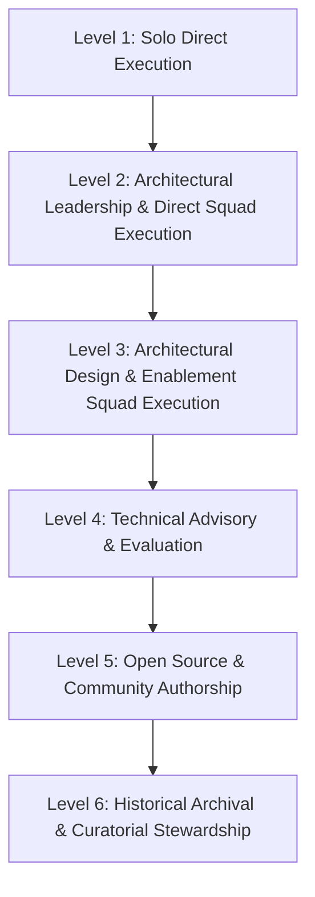
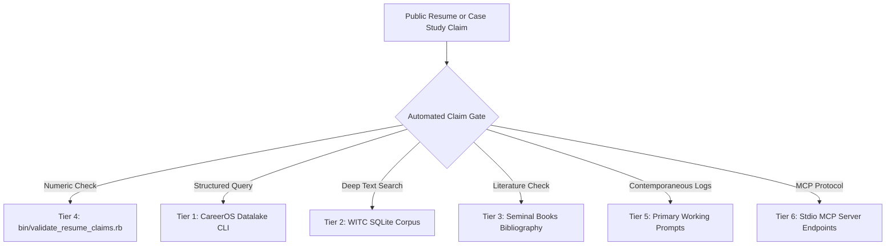
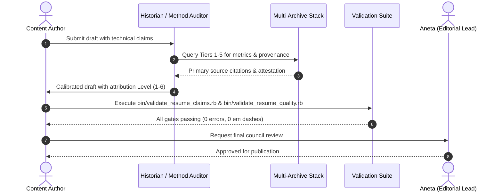

# SME Working Group Delegation & Multi-Archive Claim Verification Playbook

This playbook defines the Subject Matter Expert (SME) working group delegation model and the comprehensive multi-archive claim verification procedures for this repository. It codifies the operational pattern developed during complex legacy modernizations (such as OneMain Financial) and equips repository agents, notably the Historian and Method Provenance Auditor, to verify technical claims against canonical historical sources.

---

## 1. The SME Working Group Delegation Model (Conceived & Proven at OneMain Financial)

### Conceived, Pitched, and Executed by Mike Hall

When facing complex legacy platform modernizations, core ledger extractions, and multi-region database migrations at OneMain Financial (OMF), Mike Hall recognized that large-scale platform evolution cannot succeed as a monolithic top-down mandate or an isolated individual contributor bottleneck. Mike conceived and pitched this exact operating strategy to OMF engineering leadership: establishing empowered, specialized Subject Matter Expert (SME) working groups:

1. **Architecture and Cartography:** Mapping distributed state, boundaries, and dependencies.
2. **Core Ledger and Persistence:** Verifying data integrity, transaction safety, and schema invariants.
3. **Reliability and Telemetry:** Tracing transactions, monitoring error budgets, and quantifying baseline latency.
4. **Governance and Compliance:** Auditing regulatory boundaries, data protection, and external audit readiness.

Each working group operated with deep domain authority. They verified ground truth from primary artifacts before reporting findings up to technical steering. Mike's strategy decentralized investigation while maintaining rigorous architectural coherence across multiple squads.

### The ADKAR Change Management Foundation

The SME working group model succeeded because Mike paired deep technical systems design with the ADKAR change management framework (Awareness, Desire, Knowledge, Ability, Reinforcement):

- **Awareness:** Cartography and OpenTelemetry made hidden runtime failure modes visible across service boundaries.
- **Desire:** Geekfest@OMF built grassroots engineering excitement for craftsmanship and shared learning.
- **Knowledge:** Working groups produced actionable RFCs and lightweight IEA sequences.
- **Ability:** Enablement squads paired directly with delivery teams to implement changes safely.
- **Reinforcement:** Automated CI assertions, observability baselines, and SRE handoffs ensured changes endured.

### Persona Review Council 7-Pillar SME Delegation

The Persona Review Council (`docs/persona-review-council.md` and `docs/agents/agent-raci-matrix.md`) mirrors this exact structure across seven specialized operational pillars:

| Pillar | SME Persona | Focus Domain | Key Artifacts and Interfaces |
| :--- | :--- | :--- | :--- |
| **1. Strategic Direction** | **Aneta** | Public narrative, editorial authority, and strategic alignment | `docs/persona-review-council.md`, `CODEX.md` |
| **2. System Cartography** | **Pavel / System Cartographer** | 4D cartography, legacy modernization, and topology mapping | `panoramic-view/`, `_data/case_studies.yml` |
| **3. Historical Archive** | **Forensic Archivist / Cook Ding** | Primary source extraction, oral history corpus, and community records | `lake/witc/corpus.db`, `bin/query_witc_corpus.rb` |
| **4. Method Provenance** | **Method Provenance Auditor** | Quantitative claim verification, metrics audit, and literature links | `bin/validate_resume_claims.rb`, `_data/books_bibliography.json` |
| **5. Market Leveling** | **Career Strategist / Professional Advocate** | Staff IC calibration, recruiter clarity, and ATS benchmarks | `bin/benchmark_ats_keywords.rb`, `bin/validate_resume_quality.rb` |
| **6. Boundary Safety** | **Public Surface Auditor / TMI Auditor** | Privacy gates, quarantine enforcement, and PII/PHI prevention | `bin/audit_public_surface.rb`, `rake audit:tmi` |
| **7. Quality & Verification** | **The Commissar / CI Fixer / Build Operator** | Deterministic pipeline builds, contract assertions, and link integrity | `bin/pipeline`, `bundle exec rake test` |

When a major revision, claim addition, or new case study is evaluated, each SME persona audits its respective surface before Aneta delivers the final editorial release decision.

---

## 2. The 6-Level Claim Attribution Matrix

To avoid inflated architectural claims and preserve trust with hiring committees, all technical outcomes must be attributed using this strict six-level hierarchy:



1. **Level 1: Solo Direct Execution**
   - *Definition:* Built, tested, deployed, and operated entirely by Mike Hall.
   - *Examples:* Tooling engines in this repository, personal open-source libraries, standalone prototypes.
   - *Allowed Verbs:* Designed, authored, implemented, built, released.

2. **Level 2: Architectural Leadership & Direct Squad Execution**
   - *Definition:* Architected the solution and led a dedicated squad directly doing the implementation.
   - *Examples:* Phalanx Duel platform rewrites, WWWorkRemote core matching engine.
   - *Allowed Verbs:* Spearheaded, architected and led, co-developed, directed execution.

3. **Level 3: Architectural Design & Enablement Squad Execution**
   - *Definition:* Formulated the architecture, produced cartography, and guided cross-functional squads who implemented the changes across the enterprise.
   - *Examples:* OneMain Financial database archaeology, OpenTelemetry observability rollout, credit ledger extraction.
   - *Allowed Verbs:* Architected, formulated strategy, designed migration path, enabled execution squads to deliver. Never claim solo execution for team-delivered enterprise outcomes.

4. **Level 4: Technical Advisory & Evaluation**
   - *Definition:* Assessed systems, identified critical failure modes, and recommended strategic intervention paths without direct delivery accountability.
   - *Examples:* Engineering advisory retainers, architectural due diligence.
   - *Allowed Verbs:* Evaluated, audited, advised, identified structural risks.

5. **Level 5: Open Source & Community Authorship**
   - *Definition:* Created or contributed to public tools, specifications, and communal discussions.
   - *Examples:* Jekyll plugins, rubygems, developer tool configurations.
   - *Allowed Verbs:* Contributed to, created public tools for, published.

6. **Level 6: Historical Archival & Curatorial Stewardship**
   - *Definition:* Conducted oral history interviews, captured developer reflections, and curated practitioner history.
   - *Examples:* The 207-interview WITC oral history corpus, community podcast archives.
   - *Allowed Verbs:* Interviewed, curated, recorded, preserved, synthesized. Never claim subject domain achievements belonging to interviewees.

---

## 3. The Historian's Multi-Archive Query Playbook

The Historian (`.claude/agents/forensic-archivist.md` and `.claude/agents/method-provenance-auditor.md`) leverages a six-tier evidence stack to ground technical narratives in verifiable primary records.



### Tier 1: CareerOS Structured Datalake (`bin/query_career_datalake.rb`)

The primary command-line engine for structured career history: 29 positions, 136 skills, 156 articles, 207 oral history interviews, 4D case studies, and 402 knowledge graph nodes.

```bash
# Display full interactive manual and query guide
ruby bin/query_career_datalake.rb --man

# Query technology adoption history and chronological provenance
ruby bin/query_career_datalake.rb --tech "OpenTelemetry"
ruby bin/query_career_datalake.rb --tech "DynamoDB"

# Query full position dossier for an employer
ruby bin/query_career_datalake.rb --company "onemain"

# Query archetype positioning and leadership narrative
ruby bin/query_career_datalake.rb --archetype "principal_systems_architect"

# Emit raw structured JSON for automated tool consumption
ruby bin/query_career_datalake.rb --tech "PostgreSQL" --json
```

### Tier 2: Deep Historical WITC Corpus (`lake/witc/corpus.db`)

The complete developer oral history archive preserved in a 117MB SQLite full-text search (FTS5) database. Queried via `bin/query_witc_corpus.rb` or native SQLite.

```bash
# Check corpus volume and document distribution
ruby bin/query_witc_corpus.rb --stats

# Run full-text search across all transcripts and metadata
ruby bin/query_witc_corpus.rb --search "distributed tracing" --limit 10

# Filter search by source kind (transcript, source, documentation, metadata)
ruby bin/query_witc_corpus.rb --search "database migration" --kind transcript

# Emit machine-readable JSON for subagent ingestion
ruby bin/query_witc_corpus.rb --search "event sourcing" --json

# Direct SQLite query for specific transcript passages
sqlite3 lake/witc/corpus.db \
  "SELECT d.title, snippet(documents_fts, 0, '[MATCH]', '[/MATCH]', '...', 15) \
   FROM documents d JOIN documents_fts f ON d.id = f.rowid \
   WHERE documents_fts MATCH 'chaos engineering' LIMIT 5;"
```

### Tier 3: Seminal Literature Bibliography (`_data/books_bibliography.json`)

Cross-references 13 foundational software engineering texts against practitioner interviews conducted by Mike Hall:

- *Continuous Delivery* (Jez Humble, David Farley)
- *Clean Code* / *Clean Architecture* (Robert C. Martin)
- *Release It!* (Michael Nygard)
- *Working Effectively with Legacy Code* (Michael Feathers)
- *Building Microservices* (Sam Newman)

When citing architectural methodologies, verify that quotes and concepts map accurately to these bibliography entries.

### Tier 4: Automated Resume Claims Gate (`bin/validate_resume_claims.rb`)

Ensures that every quantitative percentage, multiplier, and scale claim on public surfaces matches an attested record in `_data/resume/` or `_data/case_studies.yml`.

```bash
# Run strict gate (exits non-zero if unattested numbers exist)
ruby bin/validate_resume_claims.rb

# Run automated AI semantic adjudication on pending findings
ruby bin/validate_resume_claims.rb --explain
```

Allowlisted claims and metrics under review are tracked in `_data/resume_claim_allowlist.yml`.

### Tier 5: Contemporaneous Working Prompts Archive

Located at `/Volumes/Dock_1TB/chatgpt-dump-2026-03/career_search.py`. Contains primary source prompt logs and problem-solving sessions from actual engineering work.

**Safety Rule:** Always query with `--role user` to extract Mike's actual questions, specifications, and architecture decisions. Never cite LLM assistant responses as factual evidence of Mike's personal experience or technical opinions.

```bash
# Query prompt archive for historical debugging sessions
python3 /Volumes/Dock_1TB/chatgpt-dump-2026-03/career_search.py \
  --query "DynamoDB session migration" \
  --role user \
  --limit 5
```

### Tier 6: Stdio MCP Server Protocol Endpoints (`mcp.json`)

AI agents connect to archive services via stdio MCP tools:
- `career-datalake` MCP server: Tools `query_career_history`, `get_technology_provenance`, `get_position_dossier`, `get_archetype_strategy`, `query_oral_history`.
- `ugtastic-archive` MCP server: Full-corpus transcript access and semantic indexing tools.

---

## 4. Verification Workflow for Content Changes

Whenever a case study, resume update, or technical claim is authored:



1. **Step 1: Metric Verification**
   Verify all numbers against `_data/resume/` or add to `_data/resume_claim_allowlist.yml` with source notes.
2. **Step 2: Attribution Calibration**
   Confirm the verb matches the appropriate Level (1 through 6) in the Attribution Matrix.
3. **Step 3: Automated Quality Gate**
   Execute `ruby bin/validate_resume_claims.rb`, `ruby bin/validate_resume_quality.rb`, and `bin/audit_public_surface.rb --strict`.
4. **Step 4: Council Review**
   Present calibrated draft to Aneta and the Persona Review Council for final sign-off.
