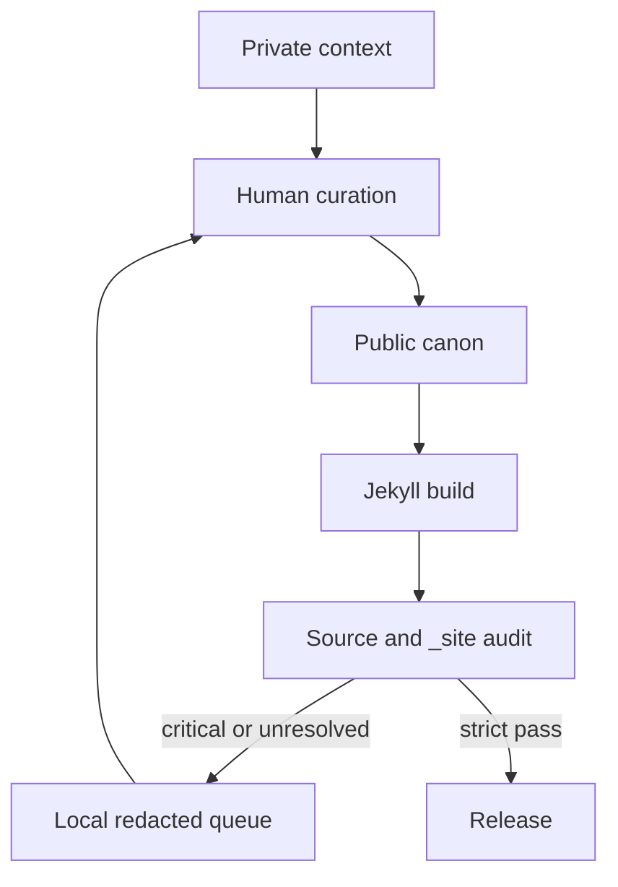

# Engineering Tooling & Operational User Guide

This guide provides clear instructions on **why** and **how** to use the primary executable tools and AI skills in this repository to accomplish common platform tasks.

---

## 1. Executive Pitch Brief Generator (`bin/generate_executive_brief.rb`)

### Why Use It
When applying for Staff/Principal Engineer or Platform Architect roles, engineering leadership and recruiters respond far more effectively to a tailored 1-page executive pitch than a generic resume. This tool reads canonical YAML data (`_data/resume/`) and generates a custom executive brief mapping your 4D System Cartography case studies (OneMain Financial, Phalanx Duel, WWWorkRemote) directly to the target company's platform scaling challenges.

### How to Use It
```bash
# View CLI usage and options
ruby bin/generate_executive_brief.rb --help

# Generate a brief for a specific company and role
ruby bin/generate_executive_brief.rb "Stripe" "Principal Software Engineer"
ruby bin/generate_executive_brief.rb "Datadog" "Staff Platform Architect"
```

**Output Location:** `tmp/executive_briefs/brief_<company_name>.md`

---

## 2. Job Lead Evaluator & Match Bridge (`bin/evaluate_job_lead.rb`)

### Why Use It
Evaluates active job leads from `wwworkremote.localhost` against your canonical resume data (`_data/resume/`) and personal OS strategy guidelines (`zdots-ctx`). Fits match scoring via `bin/wwwr match` (`LLM::ProfileMatcher`) in `wwworkremote/core` and generates calibrated 1-page executive pitch briefs.

### How to Use It
```bash
# View CLI usage and options
ruby bin/evaluate_job_lead.rb --help

# Evaluate a specific lead or job posting by ID
ruby bin/evaluate_job_lead.rb --posting 5048
ruby bin/evaluate_job_lead.rb --lead 112

# Run a fresh LLM match scan via bin/wwwr
ruby bin/evaluate_job_lead.rb --posting 5048 --escalate
```

**Output Location:** `docs/executive-briefs/<company>_<role>.md`

---

## 3. Headless Chrome PDF Exporter (`bin/generate_pdf_resume.js`)

### Why Use It
Recruiters and hiring portals often require a traditional PDF attachment. Rather than manually exporting from a web browser, this automated Playwright script uses local Google Chrome to render a crisp, print-optimized 2-page PDF resume (`exports/resume.pdf`).

### How to Use It
```bash
# Generate the PDF export
node bin/generate_pdf_resume.js

# Validate PDF export integrity and file size budget in CI
ruby bin/validate_exports.rb
```

**Output Location:** `exports/resume.pdf`

---

## 4. Stdio MCP Protocol Verification Suite (`bin/verify_mcp_spec.js`)

### Why Use It
To maintain 100% self-verifying site integrity. This script connects directly to the repository's stdio MCP server (`bin/mcp_server.js`) to execute end-to-end schema validation (`validate_data.rb`), HTML link checking across 820+ pages (`html-proofer`), SEO metadata budget verification, and workspace skill manifest audits.

### How to Use It
```bash
# Execute full MCP verification suite
node bin/verify_mcp_spec.js
```

---

## 5. Unified Pipeline Runner (`bin/pipeline`)

### Why Use It
Provides a single, standardized entry point for all site build, test, and deployment workflows, preventing command drift between local development and GitHub Actions CI.

### How to Use It
```bash
# Build the production static site
./bin/pipeline build

# Run the complete test and validation suite
./bin/pipeline test

# Launch local development server on http://127.0.0.1:4000/
./bin/server

# Execute full CI parity check locally
./bin/pipeline ci
```

## 6. Public Surface Auditor (`bin/audit_public_surface.rb`)

The public site is an edited surface. This audit checks both the source content
roots and the generated `_site/` boundary before publication. It reports
credential-shaped values, personal and health context, uncertain recollections,
local paths, internal files, backlog routes, and AI pages missing quarantine
metadata. Reports are redacted and remain under `tmp/`.

```bash
# Inventory review candidates
ruby bin/audit_public_surface.rb --json

# Publication gate
ruby bin/audit_public_surface.rb --strict

# Inspect the operator surfaces
ruby bin/audit_public_surface.rb --help
ruby bin/audit_public_surface.rb --man
ruby bin/audit_public_surface.rb --completion zsh
```



The audit is a decision aid, not an automated consent or truth engine. When a
detail is uncertain, identifying, or not clearly yours to publish, hold it or
generalize it while preserving the useful lesson.

---

## 6. Registered Agent Skills (`.agents/skills/`)

### Why Use Them
Agents and subagents operating in this workspace rely on registered skills to perform specialized audits without manual instruction:

1. **`job-lead-evaluator`** (`.agents/skills/job-lead-evaluator/SKILL.md`): Evaluates job leads from `wwworkremote.localhost` against personal OS context and canonical resume data.
2. **`executive-brief-generator`** (`.agents/skills/executive-brief-generator/SKILL.md`): Formats 1-page executive pitch briefs for specific Principal Engineer opportunities.
3. **`system-cartographer`** (`.agents/skills/system-cartographer/SKILL.md`): Audits legacy codebases and structures 4-dimensional cartography breakdowns.
4. **`prose-humanity-auditor`** (`.agents/skills/prose-humanity-auditor/SKILL.md`): Audits technical writing across site Markdown, YAML data, and resume surfaces for plain language, cognitive load (<20 wps), and zero AI jargon.
5. **`no-em-dashes`** (`.agents/skills/no-em-dashes/SKILL.md`): Enforces em-dash-free writing across prose, case studies, briefs, and documentation.

These 5 are the only skills in this directory with real `SKILL.md` content. `site-refresh-builder`/`site-refresh-reviewer` and the other 13 skills AGENTS.md names under "Registered Skills" have no file here: they exist only as `.claude/agents/*.md` subagent personas (TASK-262), a different mechanism (a spawned subagent, not a loaded skill). Don't assume every AGENTS.md-named skill has a matching file in this directory.

---

## 7. Executive Brief PDF Exporter & Lightweight CI Parity (`bin/export_brief_pdfs.js`)

### Why Use It
Generates print-optimized 1-page PDF pitch briefs under `exports/briefs/pdfs/` for all executive briefs created in `exports/briefs/`. 

### CI Dependency Safety Pattern
To prevent CI pipeline build failures on lightweight containers (where Node browser dependencies like Playwright are not installed during the static compilation phase), headless exporter scripts wrap browser imports in a graceful fallback:

```javascript
let chromium;
try {
  ({ chromium } = require('playwright'));
} catch (err) {
  console.warn('⚠️ [Brief PDF Exporter] Playwright module not available in this environment. Skipping PDF re-rendering (pre-built PDFs in exports/ will be preserved).');
  process.exit(0);
}
```

This pattern ensures static site builds (`rake build`) remain 100% reliable on light CI jobs while preserving pre-rendered vector PDF artifacts tracked in git.

---

## 8. Automated Resume Quality & ATS Validator (`bin/validate_resume_quality.rb`)

### Why Use It
Simulates ATS plain-text parsing (Greenhouse, Lever, Workday), verifies action verb density, asserts Staff+/Principal competency keyword coverage, checks Schema.org `Person` JSON-LD linked data, and enforces strict `no-em-dashes` compliance and datalake parity.

### How to Use It
```bash
# View CLI options
ruby bin/validate_resume_quality.rb --help

# Run standalone resume quality and ATS parseability audit
ruby bin/validate_resume_quality.rb
bundle exec rake validate:resume_quality
```

---

## 9. ATS Benchmark & Keyword Density Engine (`bin/benchmark_ats_keywords.rb`)

### Why Use It
Evaluates plain-text and markdown resume exports against 5 target Staff+/Principal role requirement profiles (Huntress Rails/SOC, Coder Platform, Enterprise Telemetry, Fintech Modernizer, Founding Staff AI). Calculates composite match scores, section extraction rates, and hard skill coverage.

### How to Use It
```bash
# View CLI options
ruby bin/benchmark_ats_keywords.rb --help

# Run the benchmark suite interactively
bundle exec rake benchmark:ats

# Run with custom failure thresholds in CI
ruby bin/benchmark_ats_keywords.rb --fail-under=85.0 --min-archetype=75.0
bundle exec rake validate:ats_benchmarks
```

---

## 10. CareerOS Datalake Query Engine (`bin/query_career_datalake.rb`)

### Why Use It
Provides deterministic, instantaneous command-line search across 20+ years of technical history (29 positions, 136 skills, 156 articles, 211 oral history interviews, 4D case studies, and archetype positioning strategies).

### How to Use It
```bash
# View man page and comprehensive integration guide
ruby bin/query_career_datalake.rb --man

# Query technology provenance and timeline
ruby bin/query_career_datalake.rb --tech "OpenTelemetry"
ruby bin/query_career_datalake.rb --tech "PostgreSQL"

# Query full position dossier for a company
ruby bin/query_career_datalake.rb --company "onemain"

# Query archetype positioning strategy
ruby bin/query_career_datalake.rb --archetype "principal_systems_architect"

# Emit raw structured JSON for tool chaining or prompt injection
ruby bin/query_career_datalake.rb --tech "Rails" --json
```
