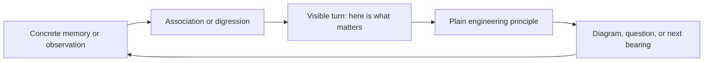

# Writing Voice and Quality Guide

This is the editorial contract for Mike Hall's public writing and AI-assisted
archive work.

## Voice

The writing is first-person, concrete, curious, and willing to follow an
association when the association reveals how an idea was learned. It may
contain a digression, a question, a fragment, a repeated phrase, or an
unexpected cultural reference. Those are not automatically defects.

The editor should reduce cognitive load without sanding away the person who is
thinking. Keep the physical detail, the honest uncertainty, and the visible
turn from story to principle. Prefer a shorter paragraph over a sentence that
tries to carry every relationship at once.

The preferred movement is:

## Human-led authorship

Public articles may be AI-augmented, but they are human-led. A human author
provides the source memories, public references, intent, corrections,
interpretation, and final approval. AI tools may search approved material,
group related evidence, propose structure, draft connective prose, and render
diagrams.

AI assistance is not a witness. It must not invent a missing date, name, role,
quote, causal connection, metric, or emotional conclusion. When ambiguity could
change the meaning, stop and ask the author. When a memory is approximate, say
so. When a claim depends on public evidence, check the source. Keep private
material outside the public canon.

## Tooling policy

Vale runs the bundled `write-good`, proselint, and Just3Ws rules. The project
configuration treats most findings as review suggestions. It disables rules
that would erase intentional first-person voice, contractions, and recurring
phrases such as “There is.”

The custom Just3Ws rules still enforce the boundaries that matter:

- no em dashes or machine-like double-hyphen pauses;
- no invented AI jargon or inflated claims;
- no unexplained header hierarchy skips;
- no vague link text;
- no silent conversion of uncertainty into certainty.

The prose humanity auditor adds a second pass for sentence length, passive
voice, jargon, punctuation, and readability. Markdown and YAML validators check
structure and syntax. These tools assist editorial judgment. They do not
replace it.

## Review questions

Before publication, ask:

1. Can a reader tell what happened, what I inferred, and what remains
   uncertain?
2. Does the article sound like a person who was there, rather than a generic
   technical content generator?
3. Does each diagram clarify a relationship, sequence, boundary, or feedback
   loop?
4. Does the article name the human judgment involved in producing it?
5. Did the edit make the path easier to follow without making the voice less
   alive?
